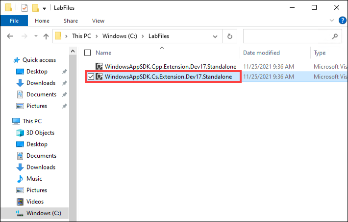
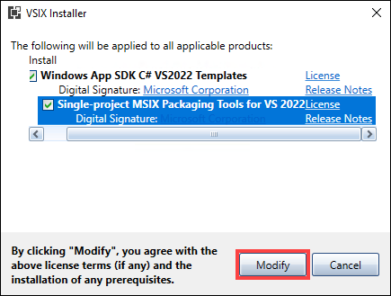
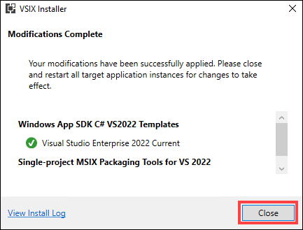
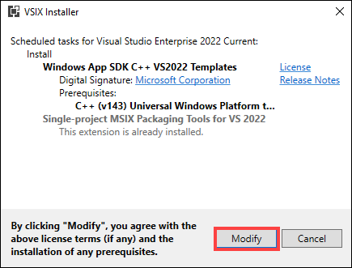
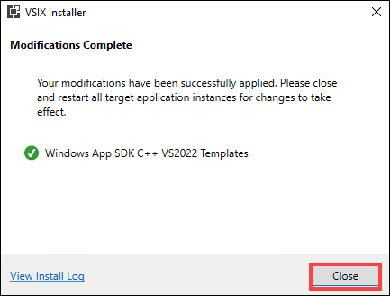

# Exercise 1: Install the C# and C++ Windows App SDK extension for Visual Studio 

In this exercise, you will install the C# and C++ Windows App SDK extensions that allow you to create the C# and C++ applications in Visual Studio.

> You can find more references about installing tools for developing Windows apps from here: `https://docs.microsoft.com/en-us/windows/apps/windows-app-sdk/set-up-your-development-environment?tabs=vs-2022`

1. From the Virtual Machine, open the file explorer and navigate to the path `C:\LabFiles` to select the C# extension file.

1. Double click on the **WindowsAppSDK.Cs.Extension.Dev17.Standalone** file to open the VSIX installer.

   

1. Wait until the VSIX installer is initialized, once it is done click on **Modify** to accept the license terms and installation of pre-requisites.

   

1. Once the extension is installed, click on **Close**the VSIX installer blade to close it.

   

   > Please note that the installation process takes 4-5 minutes to complete.
   
1. Navigate back to file explorer and double click on the **WindowsAppSDK.Cpp.Extension.Dev17.Standalone** file to open the VSIX installer of C++ extension.

   

1. Wait until the VSIX installer is initialized, once it is done click on **Modify** to accept the license terms and installation of pre-requisites.

   

1. Once the extension is installed, click on **Close**the VSIX installer blade to close it.

   
   
   > Please note that the installation process takes 4-5 minutes to complete.

### Summary
   
In this exercise, you have installed the C# and C++ Windows App SDK extensions to create the C# and C++ applications in Visual Studio.
