###  Getting started with Docker 

### Overview

A **Windows desktop application** is a software program that can be run on a standalone computer to perform a specific task by an end-user. **WinUI** is a user interface layer that contains modern controls and styles for building Windows apps.

The **Windows UI Library (WinUI) 3** is the latest and recommended user interface (UI) framework for **Windows desktop apps**, including managed apps that use C# and .NET and native apps that use C++ with the Win32 API. By incorporating the Fluent Design System into all experiences, controls, and styles, WinUI provides consistent, intuitive, and accessible experiences using the latest UI patterns.

**WinUI 3** is available as part of the Windows App SDK. The **Windows App SDK** provides a unified set of APIs and tools that can be used consistently by any C++ Win32 or C# .NET app on a broad set of target Windows OS versions.

In this lab, you have will learn how to build a sample **packaged C# Windows Desktop application** by installing the required Windows App SDK extensions. You will also learn to package the application into an MSIX package and then install the MSIX package on your local or remote machine for testing the behaviour of the application.

This lab includes the following exercises:

* [Exercise 1: Install the C# and C++ Windows App SDK extension for Visual Studio](##exercise-1-install-the-c-and-c-windows-app-sdk-extension-for-visual-studio)
* 
### Exercise 1: Install the C# and C++ Windows App SDK extension for Visual Studio

In this exercise, you will install the C# and C++ Windows App SDK extensions that allow you to create the C# and C++ applications in Visual Studio.

> You can find more references about installing tools for developing Windows apps from here: `https://docs.microsoft.com/en-us/windows/apps/windows-app-sdk/set-up-your-development-environment?tabs=vs-2022`


1. From the Virtual Machine, open the file explorer and navigate to the path `C:\LabFiles` to select the C# extension file.

1. Double click on the **WindowsAppSDK.Cs.Extension.Dev17.Standalone** file to open the VSIX installer.

   

1. Wait until the VSIX installer is initialized, once it is done click on **Modify** to accept the license terms and installation of pre-requisites.

   

1. Once the extension is installed, click on **Close**the VSIX installer blade to close it.

   

   > Please note that the installation process takes 4-5 minutes to complete.
   
1. Navigate back to file explorer and double click on the **WindowsAppSDK.Cpp.Extension.Dev17.Standalone** file to open the VSIX installer of C++ extension.

   

1. Wait until the VSIX installer is initialized, once it is done click on **Modify** to accept the license terms and installation of pre-requisites.

   

1. Once the extension is installed, click on **Close**the VSIX installer blade to close it.

   
   
   > Please note that the installation process takes 4-5 minutes to complete.

### Summary
   
In this exercise, you have installed the C# and C++ Windows App SDK extensions to create the C# and C++ applications in Visual Studio.

# Exercise 2: Build a sample C# WinUI 3 App 

**Packaged apps** are packaged using MSIX. MSIX is a package format that gives end-users an easy way to install, uninstall, and update their Windows apps using a modern UI.

In this exercise, you will build a packaged C# Windows Desktop application using the built-in template and configure it with two pages, buttons, event handlers, and navigation.

> You can find more references about building  packaged and unpackaged WinUI 3 apps from here: `https://docs.microsoft.com/en-us/windows/apps/winui/winui3/create-your-first-winui3-app?pivots=winui3-packaged-csharp`


1. Go to the **Start** button in the VM, search for **Visual Studio 2022** there and select **Visual Studio 2022 Current** to open it.

   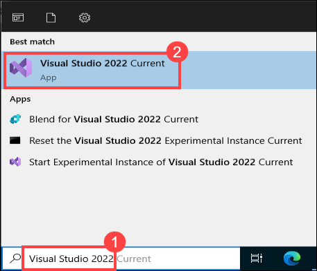

1. On the Sign in to Visual Studio click on **Sign in** and complete the Sign-in process by using the below credentials.

   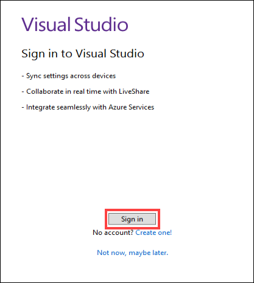

    * Azure Username/Email: <inject key="AzureAdUserEmail"></inject> 
    * Azure Password: <inject key="AzureAdUserPassword"></inject>

1. On the Visual Studio blade, click on **Start Visual Studio** to start the Visual Studio.

   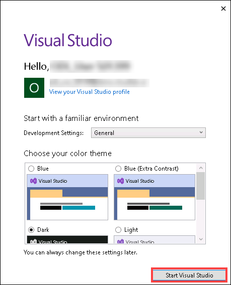

1. On the **Get Started** blade of Visual Studio, select **Create a new project** to create a new project. 

   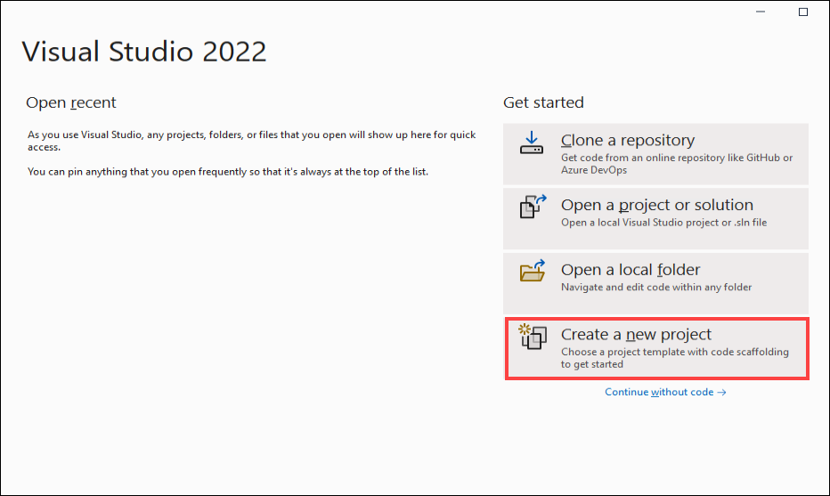

1. On the **Create a new project** blade, select **C# (1)** under **All languages**, **Windows (2)** under **All platforms**, and **WinUI (3)** under **All project types** from the project drop-down filters.

   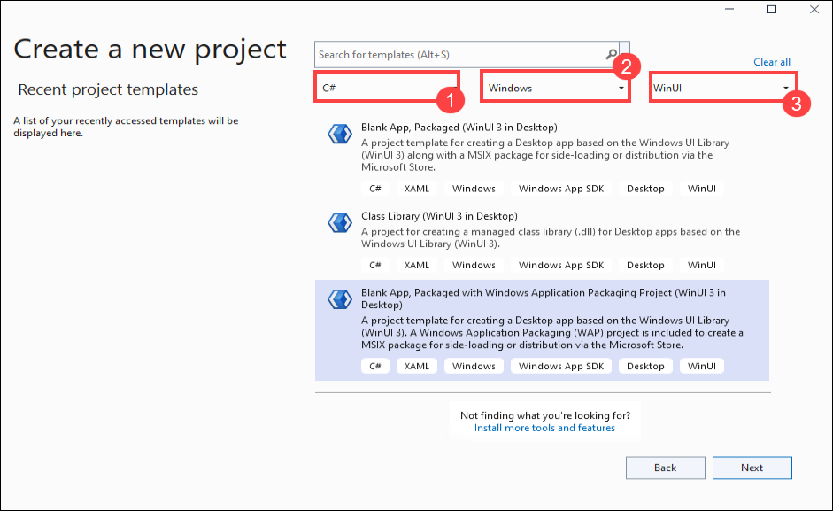

1. Select **Blank App, Packaged with Windows Application Packaging Project (WinUI 3 in Desktop)** template from the available project templates.

   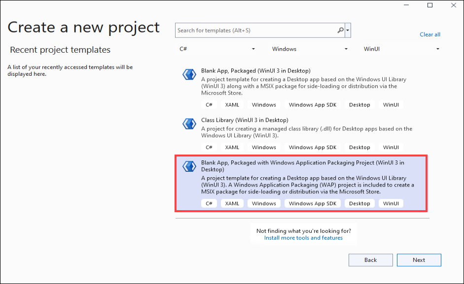

   >**Blank App, Packaged with Windows Application Packaging Project (WinUI 3 in Desktop)**: Creates a desktop C# .NET app with a WinUI-based user interface. The generated solution includes a separate Windows Application Packaging Project that is configured to build the app into an MSIX package.

1. Click on **Next** to enter the project details.

1. On the **Configure your new project** blade, enter the below value for **Project name (1)** field and click on **Create (2)**.

   ```
   DemoWindowsapp
   ```
   
   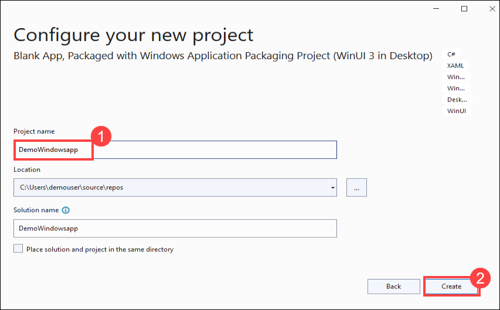

1. In the following dialog box, set the Target version to **Windows 10, version 2004 (build 19041) (1)** and Minimum version to **Windows 10, version 1809 (build 17763) (2)** and then click on **OK (3)**.

   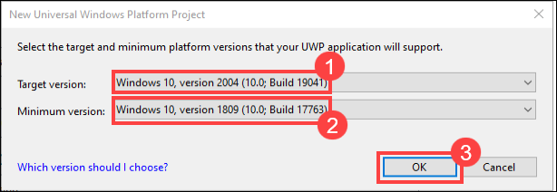

1. On the **Settings** tab, toggle the Developer mode to **On** to enable the Developer mode and click on **Yes** on the **Use Developer features** pop-up to allow installing and running apps outside of the Microsoft store.

   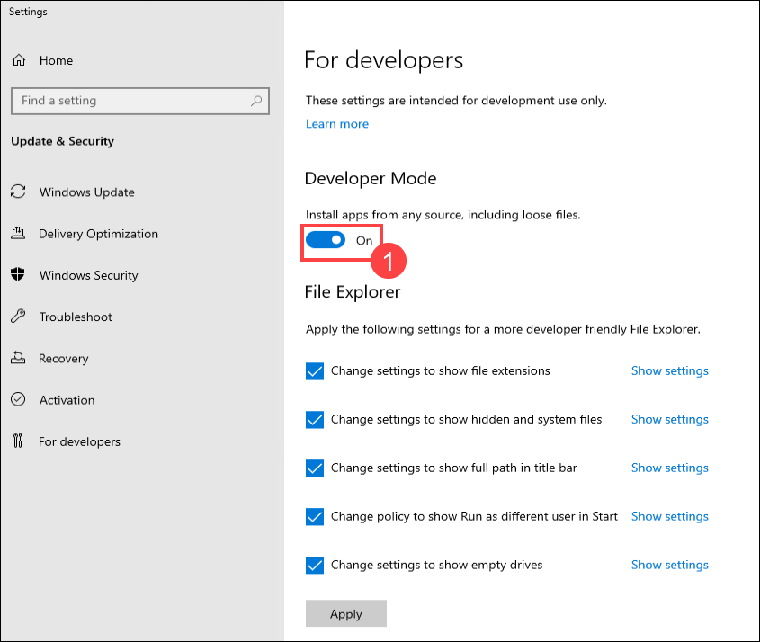
   
   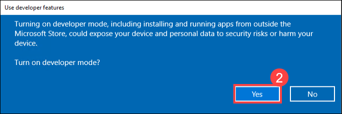

1. Close the **Settings** tab by clicking on **X** and review the **project** generated by Visual Studio.

   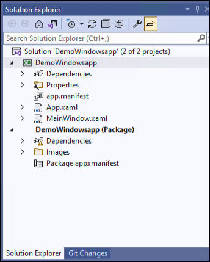

   > Info: This project is generated only if you use the **Blank App, Packaged with Windows Application Packaging Project (WinUI 3 in Desktop)** project template. This project is a Windows Application Packaging Project that is configured to build the app into an MSIX package. This project contains the package manifest for your app, and it is the startup project for your solution by default.

1. To add a new item to your app project, right-click the **DemoWindowsapp** project node in Solution Explorer and select **Add** then **New Item**.

   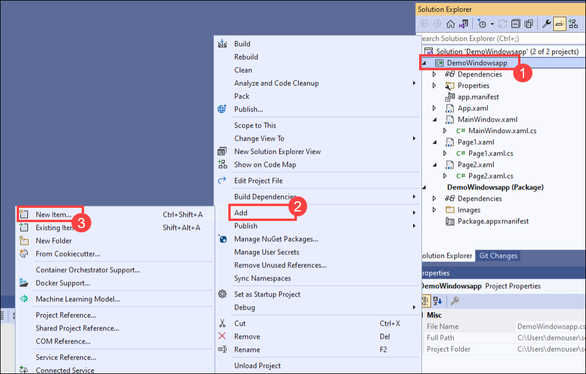
   
1. On the **Add New** Item dialog box, select the **WinUI** tab.

   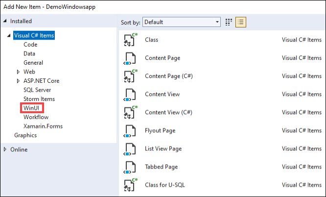

1. Select the **Blank Page (WinUI 3) (1)**, name it as **Page1.xaml (2)** and click on **Add (3)**.

   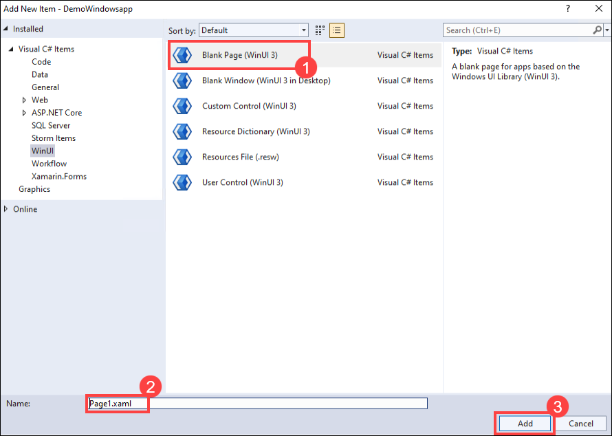

1. Once the **Page1** is added, the file will be opened by default. Replace the existing **Grid** section with the below content.

   ```
   <Grid 
    Padding="8,8,8,8"
    HorizontalAlignment="Center">
        <Grid.RowDefinitions>
            <RowDefinition Height="auto"/>
            <RowDefinition Height="*"/>
            <RowDefinition Height="auto"/>
            <RowDefinition Height="*"/>
        </Grid.RowDefinitions>
        <TextBlock
			Grid.Row="0"
			FontSize="36"
			FontWeight="Bold"
			TextAlignment="Center"
			TextWrapping="WrapWholeWords"                
			Text="Welcome to Page 1" />
        <Button 
			Grid.Row="2"
			HorizontalAlignment="Center"
			x:Name="page1Button" 
			Click="page1Button_Click">Go to Page 2</Button>
   </Grid>
   ```
   
   After adding the content, your screen will look like the below screenshot.

   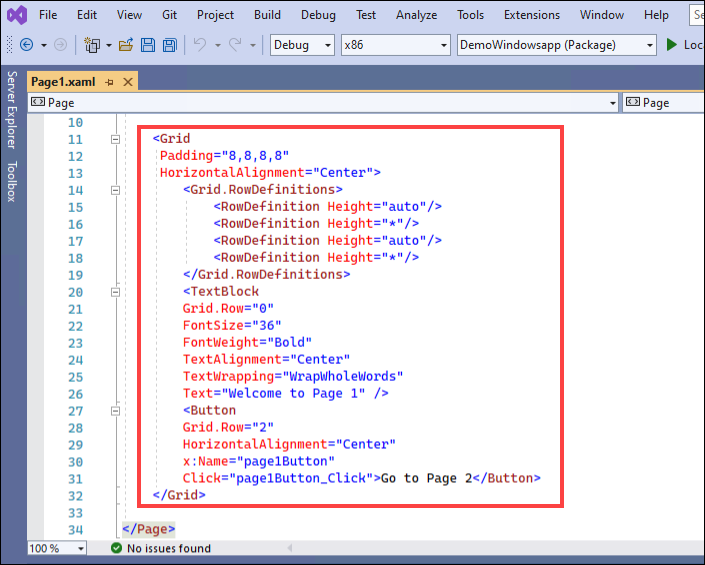

1. Open the file **Page1.xaml.cs** and enter the below content after **Page1** method inside the **Page1** class to create the method that navigates to Page2 when the Page1 button is clicked.

   ```
    private void page1Button_Click(object sender, RoutedEventArgs e)
        {
            this.Frame.Navigate(typeof(Page2));
        }
    ```    

    After adding the content, your screen will look like the below screenshot.
    
    
    
    > Info: The above method will navigate the current frame to Page2 when the Page1 button is clicked. You'll create a second page called Page2 and create the same layout and button click handler in the below steps. But this time navigate back to Page 1.


1. To add a second page to your app project, right-click the **DemoWindowsapp** project node in Solution Explorer and select **Add** then **New Item**.

   
   
1. In the Add New Item dialog box, select the **WinUI** tab.

   

1. Select the **Blank Page (WinUI 3) (1)**, name it as **Page2.xaml (2)** and click on **Add (3)**.

   

1. Once the **Page2** is added, the file will be opened by default. Replace the existing **Grid** section with the below content.

   ```
   <Grid 
    Padding="8,8,8,8"
    HorizontalAlignment="Center">
        <Grid.RowDefinitions>
            <RowDefinition Height="auto"/>
            <RowDefinition Height="*"/>
            <RowDefinition Height="auto"/>
            <RowDefinition Height="*"/>
        </Grid.RowDefinitions>
        <TextBlock
			Grid.Row="0"
			FontSize="36"
			FontWeight="Bold"
			TextAlignment="Center"
			TextWrapping="WrapWholeWords"                
			Text="Welcome to Page 2" />
        <Button 
			Grid.Row="2"
			HorizontalAlignment="Center"
			x:Name="page2Button" 
			Click="page2Button_Click">Go to Page 1</Button>
   </Grid>
   ```

   After adding the content, your screen will look like the below screenshot.

   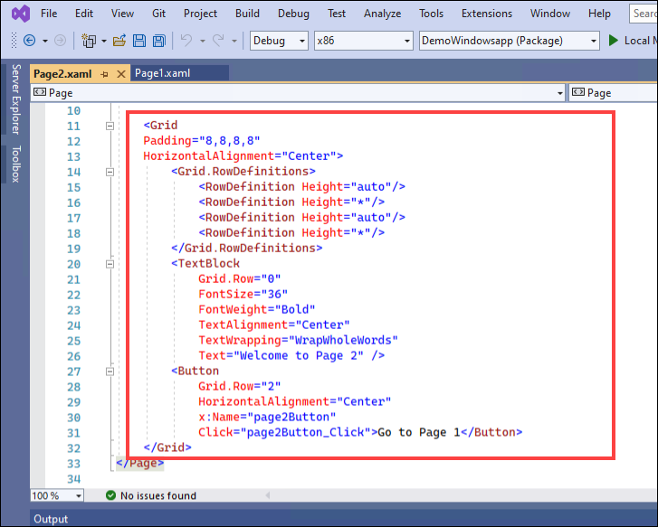
   
   
1. Open the file **Page2.xaml.cs** and enter the below content after **Page2** method inside the **Page2** class to create the method that navigates to Page1 when the Page2 button is clicked.

   ```
   private void page2Button_Click(object sender, RoutedEventArgs e)
   {
    this.Frame.Navigate(typeof(Page1));
   }
   ```
   
   After adding the content, your screen will look like the below screenshot.   
   
   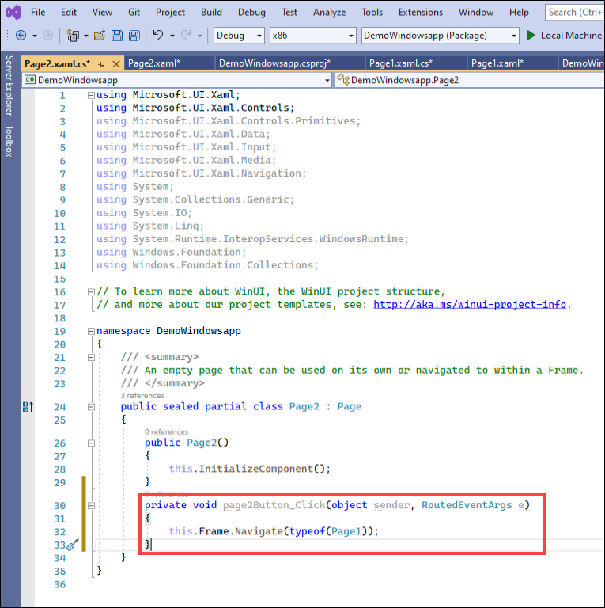
    
   > Next, modify the MainWindow layout to add the frame element referenced by our pages.

   
1. Open **MainWindow.xaml** and replace the existing **StackPanel** layout with the below content that adds a simple Frame element called **mainFrame**.

   ```
   <Grid>
    <Frame x:Name="mainFrame" />
   </Grid>
   ```
   
    After adding the content, your screen will look like the below screenshot.
    
    
 
1. Open **MainWindow.xaml.cs** and remove the method **myButton_Click**.

    

1. Finally, add the following line inside the **MainWindow** method to load Page1 into the mainFrame when the MainWindow is initialized.

    ```
    mainFrame.Navigate(typeof(Page1));
    ```    
    
    After adding the content, your screen will look like the below screenshot.   
    
    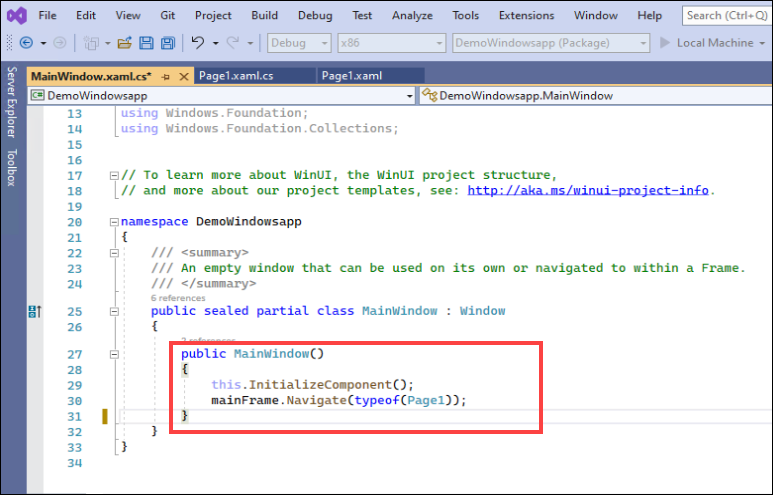

### Summary

In this exercise, you have built a packaged C# Windows Desktop application using the built-in template and configured it to navigate between the pages.

# Exercise 3: Build and run the application

In this exercise, you will build and run the application then navigate between the two pages Page1 and Page2.

1. Right-click the **DemoWindowsapp** project node in Solution Explorer and click on **Build** to build the application.
   
   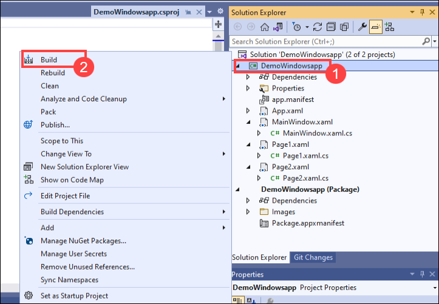

1. Once the build is succeeded, you will receive a **succeeded** message in the output window.

   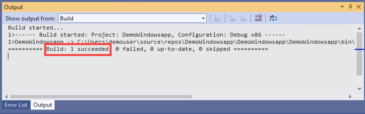

1. Press **F5** or select the **green Start arrow** button on the Visual Studio toolbar to run the application.

   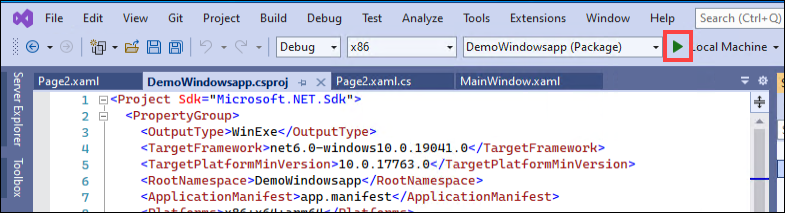

1. When the application is launched, Page1 will be loaded by default as you have configured the **MainWindow** method earlier to load Page1.

   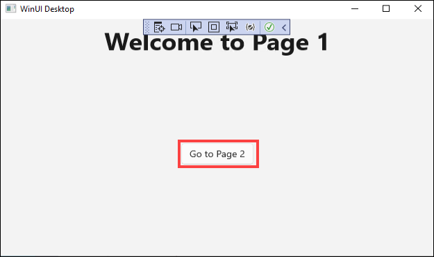

1. Now, click on the **Go to Page 2** button to navigate to Page2.

   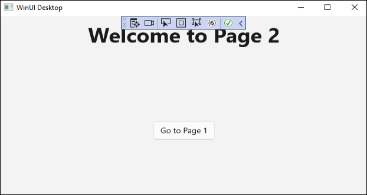

1. Next, Page2 will be loaded on the application. You can navigate back to Page1 by clicking the **Go to Page 1** button.

1. Click on **X** on the Page 2 to close the page and stop the application.

### Summary

In this exercise, you have built and run the application then navigated between the two pages Page1 and Page2.

# Exercise 4: Package the application and install it

By default, when you create a project using one of the built-in **WinUI project templates** that are provided with the Windows App SDK extension for Visual Studio, your project includes a **Windows Application Packaging** Project that is configured to build the app into an MSIX package.

> You can find more references about building  packaging and deploying the applications from here: `https://docs.microsoft.com/en-us/windows/msix/package/packaging-uwp-apps`

In this exercise, you will package the application that you have built earlier in task 2 then install it. You will also run the application after installing it and then test its behavior by navigating between the two pages.

## Task 1: Configure your project with the manifest designer

The app manifest file (Package.appxmanifest) is an XML file that contains the properties and settings required to create your app package. For example, properties in the app manifest file describe the image to use as the tile of your app and the orientations that your app supports when a user rotates the device.

The Visual Studio manifest designer allows you to update the manifest file without editing the raw XML of the file.

In this task, you will create an app manifest file that is used in the next task to create an app package.

1. In Solution Explorer, double-click the Package.appxmanifest file. If the manifest file is already open in the XML code view, Visual Studio prompts you to close the file.

1. Select the **Packaging** tab and enter the below value in the package name field. 

   ```
   DemoWindowsapp-package
   ```

   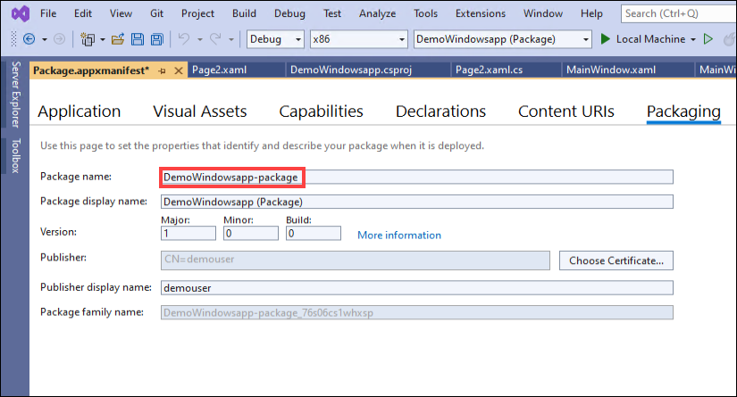

1. Leave other values as default and click on **File** then select **save Package.appxmanifest** to save the file.

   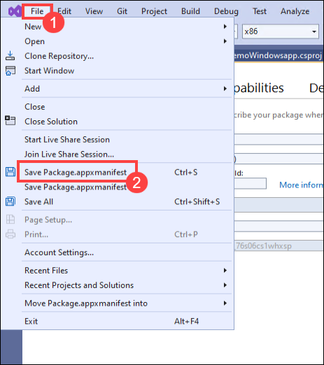
   

## Task 2: Generate an app package and install it

Apps can be installed without being published in the Store by publishing them on your Website, using application management tools such as Microsoft Intune and Configuration Manager, etc. You can also directly install an MSIX package for testing on your local or remote machine.

In this task, you will generate an app package and install it on your local or remote machine then test the behavior of the application.

1. Right-click on the **DemoWindowsapp (package) (1)** project and select **Publish (2)** then **Create App Packages (3)**.

   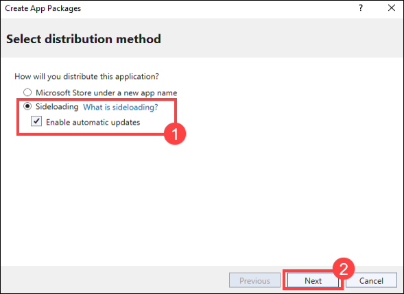

1. On the **Select distribution method** wizard, select **Sideloading (1)** and then click on **Next (2)**.

   

1. On the **Select signing method** page, select **Yes, select a certificate (1)** then **Select from File (2)**.
 
    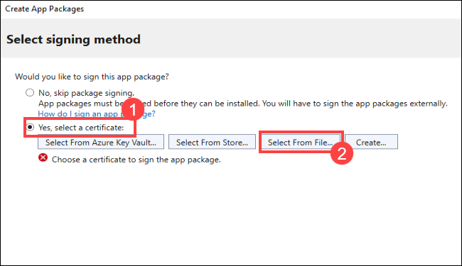

   > You can whether to skip packaging signing or select a certificate for signing. select a certificate from your local certificate store, select a certificate file, or create a new certificate. For an MSIX package to be installed on an end user's machine, it must be signed with a cert that is trusted on the machine.

1. Navigate to this path `C:\LabFiles` in the file explorer and select **UwpSigningCert.pfx (1)** then click on **Ok (2)**.

    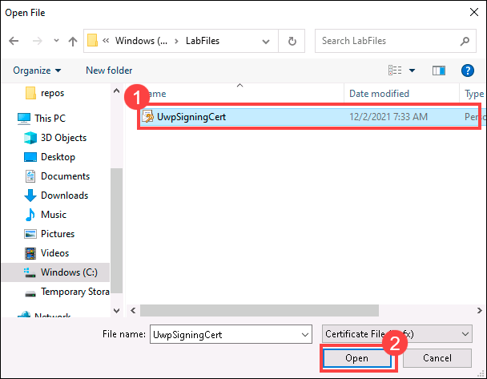

1. Now, enter the below password and click on **OK** to select the certificate.

    - Password: <inject key="Labvm Admin Password"></inject>

    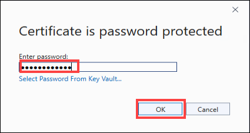

1. Click on **Next** on the **Select signing method** page.

    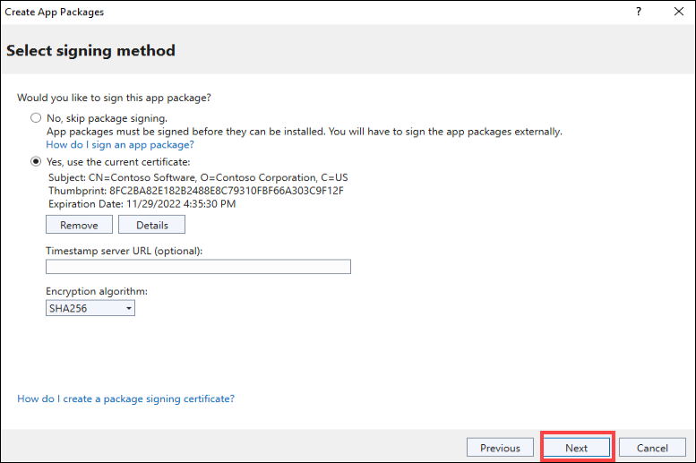

1. On the **Select and Configure Packages** dialog, select the architecture configurations **(x86, x64)** to ensure that your app can be deployed to the widest range of devices and click on **Next (2)**.

   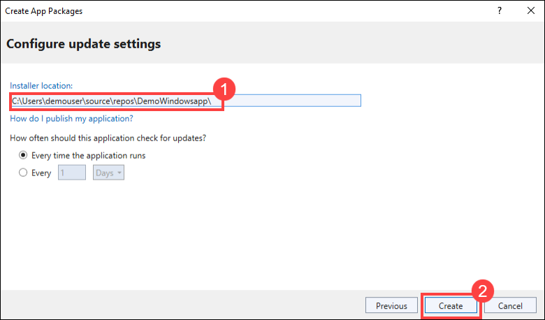

1. On the **Configure update settings** blade, enter the below value in the **Installer location** field and click on **Create**.

   ```
   C:\Users\demouser\source\repos\DemoWindowsapp\
   ```

   
   
1. Once the package is created you will be presented with the below page, click on **Close** to close the **Create App Packages** blade.

   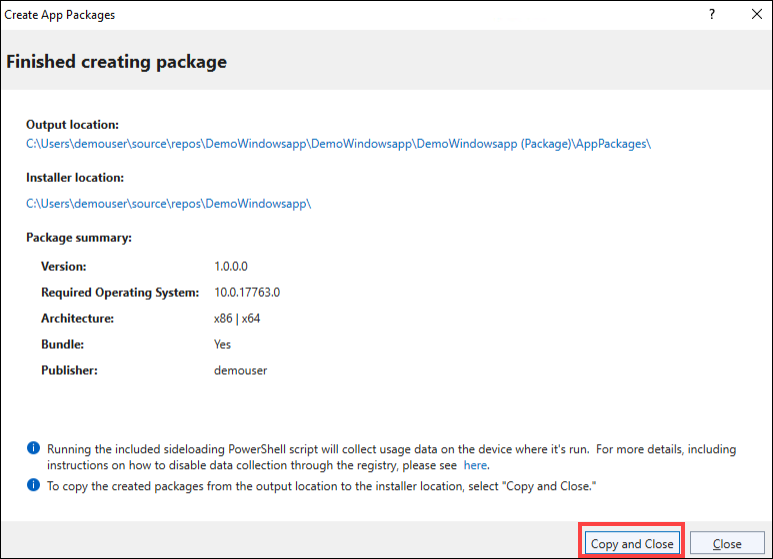

1. Wait until the package is created. When your app has been successfully packaged, you will be presented with the below page.

   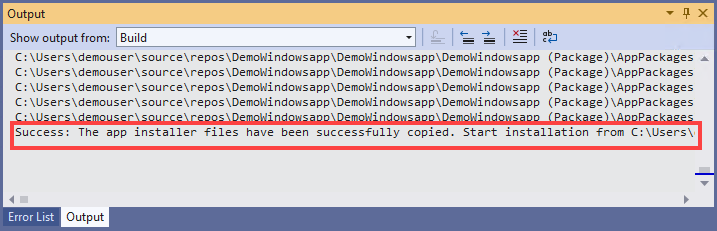


1. From the Virtual Machine, open the file explorer and navigate to the below path to locate the PowerShell script file that installs the app package.

   `C:\Users\demouser\source\repos\DemoWindowsapp\DemoWindowsapp\DemoWindowsapp (Package)\AppPackages\DemoWindowsapp (Package)_1.0.0.0_Debug_Test`
   
1. Right-click on the **Add-AppDevPackage.ps1** file. Choose **Run with PowerShell**. 

   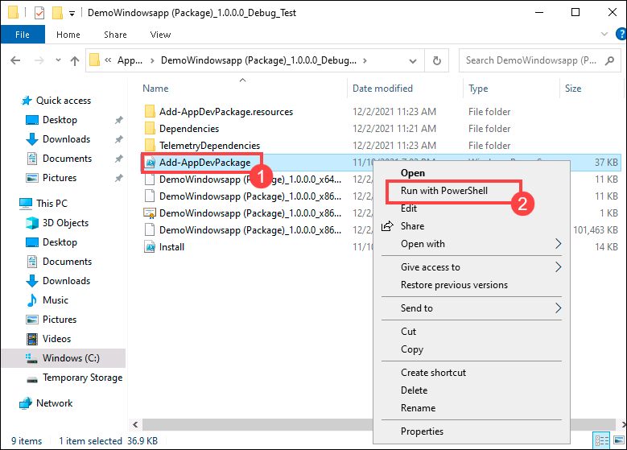

1. When prompted to confirm the installation of the certificate, enter **Y** and click **enter** to accept and continue the installation.

   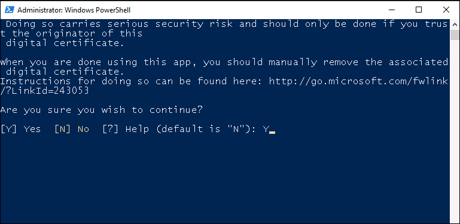

1. Once the app installation is done you will receive the below message, click **enter** again to close the PowerShell session.

   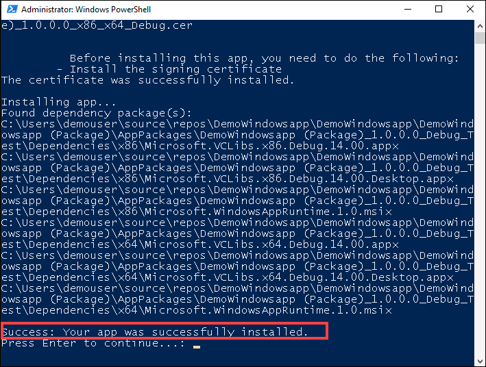

1. Go to the Start button in the VM, search for  **DemoWindowsapp**, and double-click on **DemoWindowsapp (package)** app to run the application.

   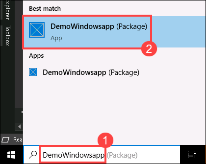
   
1. When the application is launched, Page1 will be loaded by default as you have configured the **MainWindow** method earlier to load Page1.

   

1. Now, click on the **Go to Page 2** button to navigate to Page2.

   

1. Click on **X** on the Page 2 to close the page and stop the application.


### Summary  
In this task, you have created an app manifest file that will be used to create an app package. You have also generated the app package and installed it on your local or remote machine then run the application to test its behavior.
