## Overview

Kubernetes is an open-source system for managing containerized applications across multiple hosts in a cluster. Kubernetes provides mechanisms for application deployment, scheduling, updating, maintenance, and scaling.

The following are the core concepts of Kubernetes:
   - **Containers** - A container image is a ready-to-run software package, containing everything needed to run an application.
   - **Nodes** - A Node is a worker machine in Kubernetes and may be either a virtual or a physical machine, depending on the cluster.
   - **Pods** - A Pod is a group of one or more containers, with shared storage and network resources, and a specification for how to run the containers. 
   - **Labels** - Labels are key/value pairs that are attached to objects, such as pods.
   - **Services** - Service is an abstraction which defines a logical set of Pods and a policy by which to access them.


Kubernetes aids in ensuring that containerized applications execute where and when you want them to, as well as assisting them in locating the resources and tools they require.

# Exercise 1: Creating a Cluster using Minikube

In this exercise, we will look at the cluster's nodes that can be used to host our applications. We will be using the Kubernetes command-line tool, kubectl, which allows to run commands against Kubernetes clusters.

By default, minikube start creates a cluster named **minikube**. If you would like to create a different cluster or change its name, you can use the --profile (or -p) flag, which will create a cluster with the specified name. Please note that we will be using the default cluster **minikube** in this lab.

1. Run the following command to start the pre-installed minikube inside lab VM.
   
   > Please note that the minikube can take upto 3 minutes to start. 
   
   ```
   minikube start
   ```
   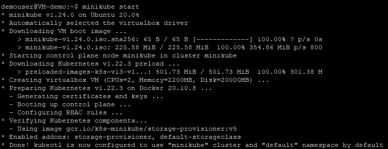
   
1. Execute the following command to check the pre-installed version of **kubectl**. You will use the Kubernetes command-line tool, kubectl, to conduct commands on Kubernetes clusters.
   
   ```
   kubectl version
   ```
   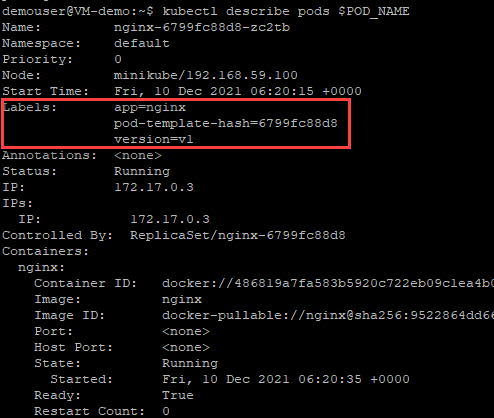
   
1. Run the below command to get the kubernetes cluster information. **kubectl cluster-info** command is used to display the cluster Info.
   
   ```
   kubectl cluster-info
   ```
   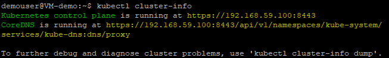
   
1. Execute the following command to pause the kubernetes inside minikube without affecting deployed applications.
   
   ```
   minikube pause
   ```
   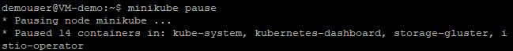
   
1. Run the below command to start the kubernetes inside minikube.
    
    ```
    minikube unpause
    ```
    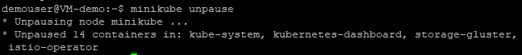
  
1. Execute the beow command to halt the kubernetes cluster.
   
   ```
   minikube stop
   ```
   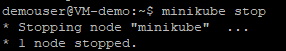
   
  
 Please run the minikube start command before going to further steps.
   
   ```
   minikube start
   ```
   
   
1. Run the below command and observe the catlog of easily installed Kubernetes services.
   
   ```
   minikube addons list
   ```
   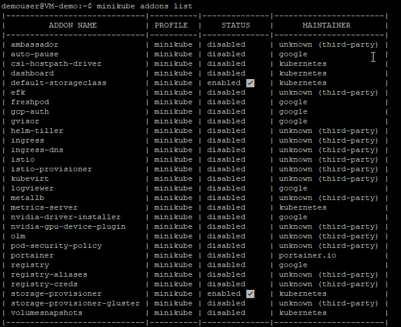
   
1. **minikube delete --all** command is used to delete all the clusters inside kubernetes. We are not using this command in the lab as we are using the cluster for further exercises.
  
### Summary

In this exercise, we explored on Kubectl commands which are used to interact and manage Kubernetes objects and the cluster.
  

# Exercise 2: Creating an nginx deployment 

We are going to create a sample deployment of NGINX using the NGINX image in this exercise. Run each command and observe the output before proceeding to next steps.

1. Run the below command to get the list of nodes inside the kubernetes cluster.

   ```
   kubectl get nodes
   ```
   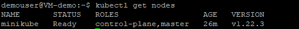
   
1. Execute the below query to to get the details about the node inside **minikube** and observe the node details from the output section.

   ```
   kubectl describe node minikube
   ```
   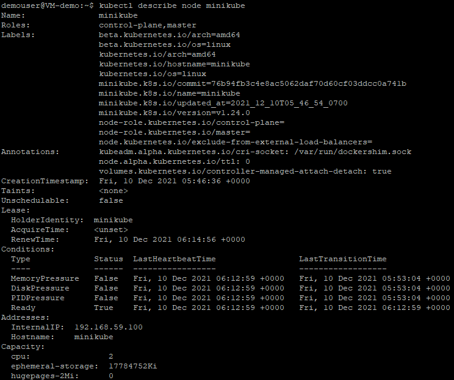
   
1. Run the below command to check the pods inside the cluster. **kubectl get pods** command is used to get all the pods inside the kubernetes.

   ```
   kubectl get pods
   ```
   After running the above command you will recieve an output message **No resources found in default namespace** as there are no pods created.

1. Execute the below command to create a deployment of NGINX using the NGINX image. Once the command ran successfully, you will prompted with an output message saying **deployment.apps/nginx created**
  
   ```
   kubectl create deployment nginx --image=nginx
   ```
   
   
1. Run the below query to expose the deployments inside the kubernetes. You will be prompted with an output message **service/nginx exposed** after running the command successfully.

   ```
   kubectl expose deployment nginx --port 80 --type=NodePort
   ```
   
   
1. By executing the following query you can now see the state of your deployment. Make sure that the deployment is in running state before proceeding to further steps.
   
   ```
   kubectl get deployments
   ```
   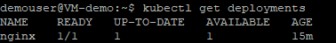
   
1. Execute the below command to get display information about the deployment.

   ```
   kubectl describe deployment nginx
   ```
   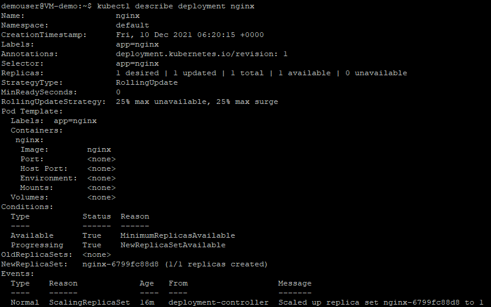
   
1. Run the below command to check the pods inside the cluster.

    ```
   kubectl get pods
   ```
   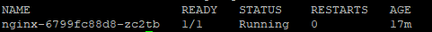
   
1. Execute the below command to list the Pods created by the **nginx** deployment.

   ```
   kubectl get pods -l app=nginx
   ```
   
   
1. Run the folloiwng command and observe the pd details from output. **kubectl describe pod** displays information about a Pod.

   ```
   kubectl describe pod
   ```
   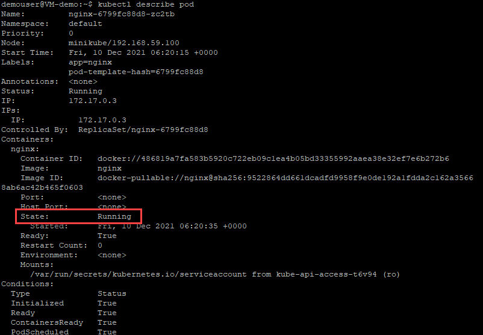
   
1. Run the **get svc** command to see a summary of the service and the ports exposed.

   ```
   kubectl get svc
   ```
   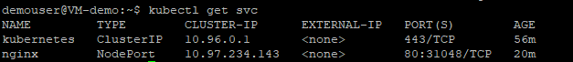
   
### Summary

In this exercise, we created a sample deployment and explored on checking the status of the nodes and pods inside kubernetes.
   
# Exercise 3: Using a Service to Expose Your App

In this Exercise, we are going to learn about a **Service in Kubernetes**, understand how labels objects relate to a service, expose an application outside a Kubernetes cluster and using a service.

A Kubernetes service is a logical abstraction for a deployed group of pods in a cluster which all perform the same function.

Since pods are ephemeral, a service enables a group of pods, which provide specific functions to be assigned a name and unique IP address (clusterIP). As long as the service is running that IP address, it will not change. Services also define policies for their access.

1. Execute the following command to list the current **Services** from our cluster inside kubernetes.

   ```
   kubectl get services
   ```
   Observe in the output window that we have a service called **kubernetes** that is created by default when minikube starts the cluster. 

   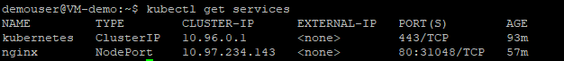
   
1. Run the following command to find out what port was opened externally. We will run the **Describe service** command to find the port.

   ```
   kubectl describe services/nginx
   ```
   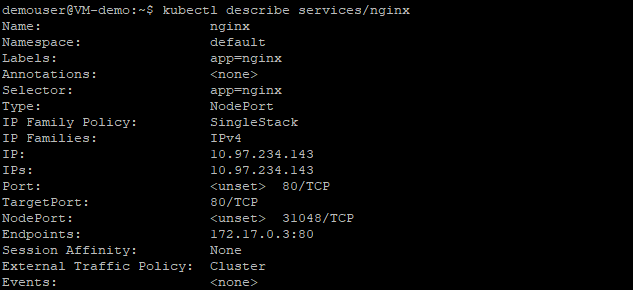
   
1. Run the below command to store the value of node port inside an environment variable. We are creating an environment variable called **NODE_PORT** that has the value of the Node port assigned.

   ```
   export NODE_PORT=$(kubectl get services/nginx -o go-template='{{(index .spec.ports 0).nodePort}}')
   ```
   Please note that the above command will not give any output after running successfully.
   
1. Execute the below command to see the value of **NODE_PORT**.
   
   ```
   echo NODE_PORT=$NODE_PORT
   ```
   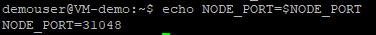
   
1. Execute the below command. we are using the following command to expose the app outside of the cluster using curl, the IP of the Node and the externally exposed port.

   ```
   curl $(minikube ip):$NODE_PORT
   ```
   
   
1. Run the below command to get the name of the Pod and store it in the **POD_NAME** environment variable.

   ```
   export POD_NAME=$(kubectl get pods -o go-template --template '{{range .items}}{{.metadata.name}}{{"\n"}}{{end}}')
   ```
   Please note that the above command will not give any output after running successfully.
   
1. Execute the following command to view the value of **POD_NAME**.

   ```
   echo Name of the Pod: $POD_NAME
   ```
   
   
1. Run the following command to apply a new label to the pods. we use the **label** command followed by the object type, object name and the new label to apply a label to the pods.

   ```
   kubectl label pods $POD_NAME version=v1
   ```
   
   
1. Execute the below command to view the new version of label to our **Pod**. We can check it with the **describe pod** command.

   ```
   kubectl describe pods $POD_NAME
   ```
   
   
1. Run the below command so that you can confirm that the app is still running with a curl inside the pod.

   ```
   kubectl exec -ti $POD_NAME -- curl localhost:80
   ```
   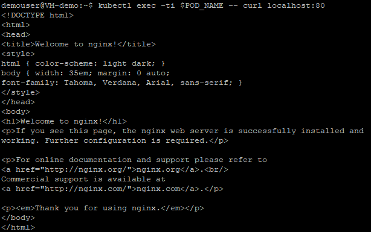
   
### Summary

In this exercise, we learned about how to expose an app using kubernetes services.
   
# Exercise 4: Scaling the App.

When traffic increases, we will need to scale the application to keep up with user demand. We've have learned about deployments and services, now lets learn about scaling.

we will use the **scale** command to scale the deployments. and we can check the status of scaling by using **get pods** command.

1. Run the below command and observe the list of your deployments using the **get deployments** command.

   ```
   kubectl get deployments
   ```
   
   
1. Execute the following command to see the **ReplicaSet** created by the deployment. A ReplicaSet ensures that a specified number of pod replicas are running at any given time.

   ```
   kubectl get rs
   ```
   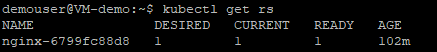
   
1. Run the below command to scale the deployments. Let’s scale the deployment to 4 replicas. We’ll use the **kubectl scale** command, followed by the deployment type, name and desired number of instances.

   ```
   kubectl scale deployments/nginx --replicas=4
   ```
   After running the above command, you will recieve an output message saying **deployment.apps/nginx scaled** as shown in the below screenshot.
   
   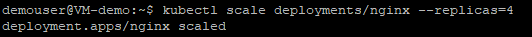
   
1. Execute the following command to see the updated **ReplicaSet** inside the deployment.

   ```
   kubectl get rs
   ```
   
   
1. Execute the following command. We can see the status of this scaling operation by using the **describe** command.

  ```
  kubectl describe deployments/nginx
  ```
  
  
1. Run the following command and observe that the changes were applied, and we have 4 pods of the application available in **Running** state.

   ```
   kubectl get pods
   ```
   
   
1. To scale down the service to 2 replicas, run the **kubectl scale** command again. We can use the same **scale** command to scale down the pods.

   ```
   kubectl scale deployments/nginx --replicas=2
   ```
   After running the above command, you will recieve an output message saying **deployment.apps/nginx scaled** as shown in the below screenshot.
   
   
   
1. Execute the below command to check if the change was applied using the **get deployments** command.

   ```
   kubectl get deployments
   ```
   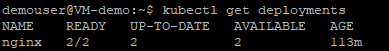
   
1. Run the following command and observe that the number of replicas decreased to 2. We can list the number of Pods using the **get pods** command.

   ```
   kubectl get pods
   ```
   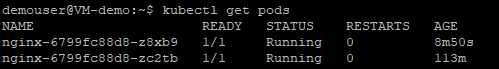
   
### Summary

In this exercise, we learned about how to use **scale** command to scale the deployments up and down.

# Exercise 5: Perform a rolling update on App

Users expect applications to be available all the time and developers are expected to deploy new versions of them several times a day. In Kubernetes this is done with rolling updates. Rolling updates allow **Deployments update** to take place with zero downtime by incrementally updating Pods instances with new ones. We are going to perform basic rolling update to our image in this exercise.

1. Execute the below command and observe the current image version of the app in the Image field. The **describe pods** command is sued to get the pod details.
   
   ```
   kubectl describe pods
   ```
   After running the above command, observe the version of the app in the **Image** section of the output.
   
   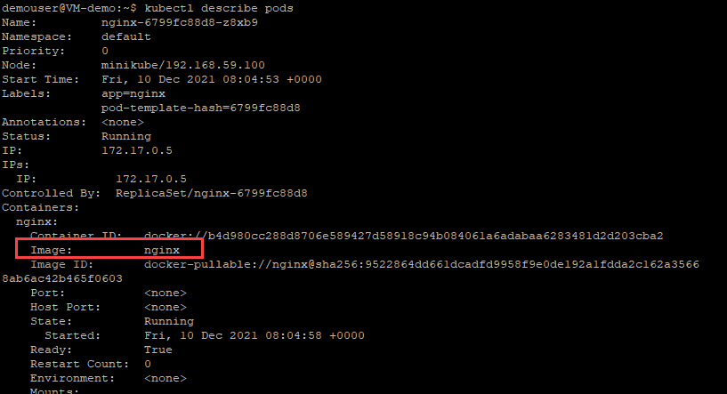
   
1. Run the following query to set the nginx pods to use the **nginx:v2** image instead of the nginx:v1 image.
   
   ```
   kubectl set image deployments/nginx nginx=jocatalin/kubernetes-bootcamp:v2
   ```
   After running the above query, you will recieve an output message saying **deployment.apps/nginx image updated** as shown in the below screenshot.
   
   
   
1. Execute the below command to find the exposed IP and Port. We are using **describe service** command to check the service details and notice that all Pods are running the latest version (v2).

   ```
   kubectl describe services/nginx
   ```
   After running the above command, observe the version of the app in the **Image** section of the output.
   
   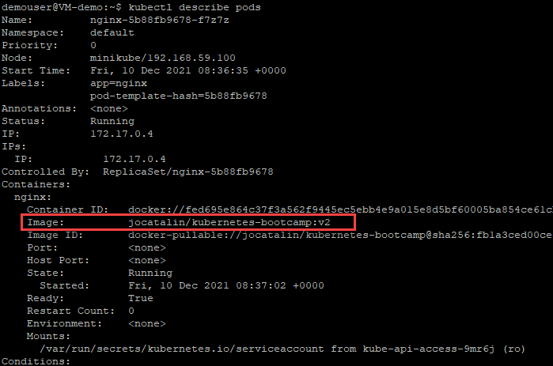
   
1. You can also confirm the updated image version by running the **rollout status** command as shown below. You can perform a rolling update to update the images, configuration, labels, annotations, and resource limits/requests of the workloads in your clusters.

   ```
   kubectl rollout status deployments/nginx
   ```
   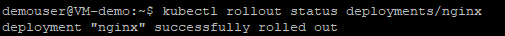
   
1. Run the below command to view the current image version of the app. Observe the output after running the command.

   ```
   kubectl describe pods
   ```
   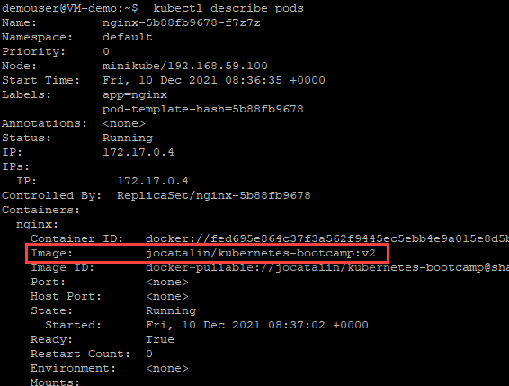
   
1. Run the below command. we are using the **rollout undo** command to roll back the deployment to your last working version.

   ```
   kubectl rollout undo deployments/nginx
   ```
   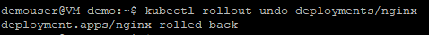
   
1. Run the following command to view the updated image version of the app. 

   ```
   kubectl describe pods
   ```
   
   
### Summary

In this Exercise, we learned about the **Rolling updates** which are designed to update your workloads without downtime.


