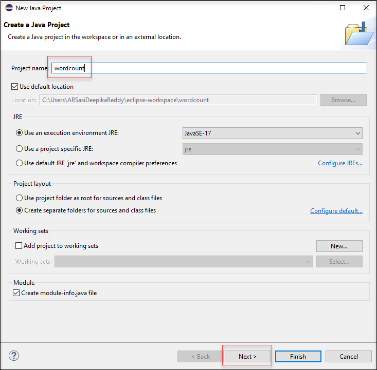
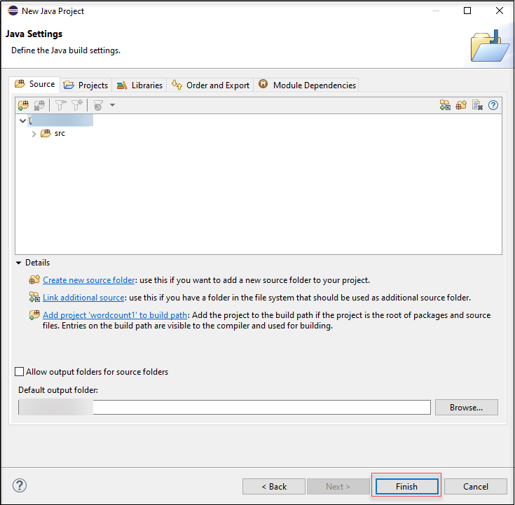
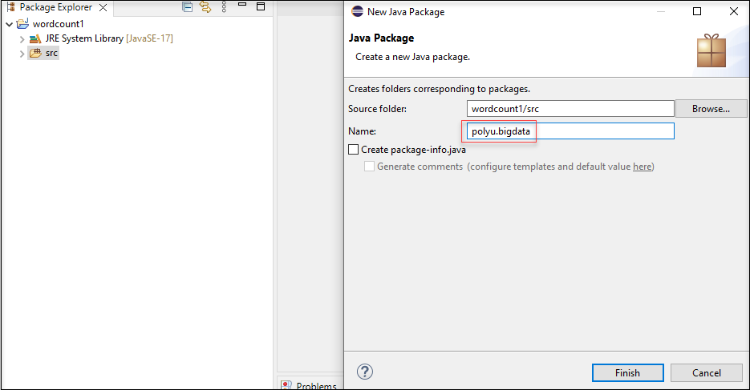
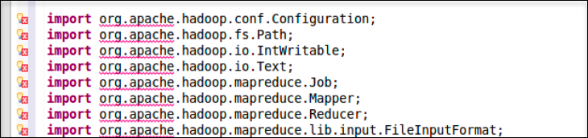
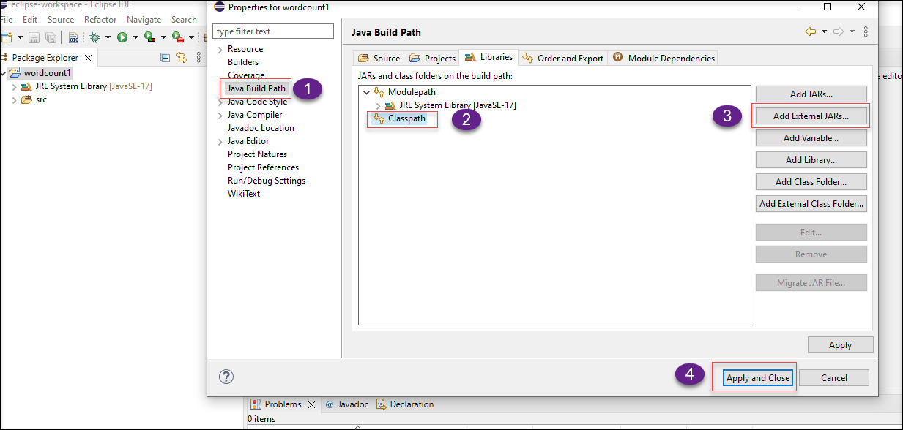
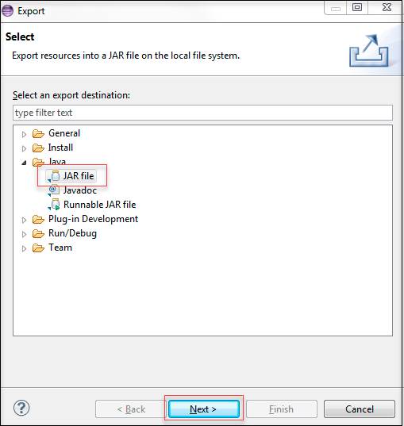
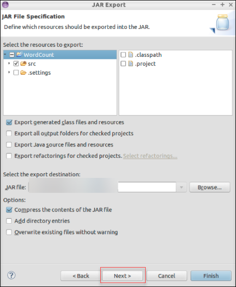

### Exercise 1 : Using Eclipse to Run a Hadoop Application

## Overview

In this walkthrough, we will be getting to know how to perform the Hadoop Application on Eclipse and learning more about Hadoop and MapReduce. In this Exercise, we will be learning how to execute WordCount Program using Hadoop and Eclipse.

## Hadoop and MapReduce

### Hadoop

Hadoop is an open-source framework and it is provided by Apache to process and analyze a very huge volume of data. It is written in Java and is currently used by Google, Facebook, LinkedIn Apache Hadoop is a system for storing and processing huge datasets with sizes ranging from gigabytes to petabytes of data.

Hadoop mainly consists of four modules, namely

1. Hadoop Distributed File System (HDFS) - A distributed file system that can run on low-cost or traditional hardware. In addition to strong fault tolerance and natural support for huge datasets, HDFS provides better data throughput than traditional file systems.

2. Yet Another Resource Negotiator (YARN) – Manages and tracks the use of cluster nodes and resources. 

3. Hadoop Common - Provides a common set of Java libraries that can be utilized by all modules.

4. MapReduce - MapReduce is a programming paradigm that enables massive scalability across hundreds or thousands of servers in a Hadoop cluster.

### MapReduce

A MapReduce is a data processing tool that is used to process the data parallelly in a distributed form. The MapReduce is a model which will be having two phases, the first phase is the  mapper phase, and the second is the reducer phase.  In the Mapper phase, the input is given in the form of a key-value pair. The reducer receives the Mapper's output as input. Only once the Mapper is finished then, the Reducer runs. The Reducer also takes the input in key-value format and provides the output of the Reducer and then the final output is produced in the Reducer phase.

### Task 1 : Getting Started With the Eclipse and Creating a Java Project.
In this task, you will get to know how to create a Java Project and solve the dependency errors.

1. On the environment provided, double-click on **Eclipse**. If a dialogue box appears to select workspace then select the default location and click on **Launch**. This will launch the workspace.

1. Once it is launched, on the top left corner, select **File**, select **New**, and then choose **Java Project**.

1. On the **New Java Project**, under Project name provide the name as **WordCount** and then click on **Next**.
  
     

1. Under **Source**, notice that a folder called **src** will be automatically created, which is used to store the source files, and click on **Finish**

     

1. On the top left corner, Select **File**, select **New** and then select **Package** and on the **New Java Package** page, provide the name as **polyu.bigdata** in the name dialogue box and click on **Finish**.

     

1. Create a class called **WordCount**, by selecting File **New** and **Class** and provide the name as **WordCount** in the  name dialogue box and then copy the code below to WordCount.java and save it.
    ```````
    package polyu.bigdata;

    import java.io.IOException;
    import java.util.StringTokenizer;

    import org.apache.hadoop.conf.Configuration;
    import org.apache.hadoop.fs.Path;
    import org.apache.hadoop.io.IntWritable;
    import org.apache.hadoop.io.Text;
    import org.apache.hadoop.mapreduce.Job;
    import org.apache.hadoop.mapreduce.Mapper;
    import org.apache.hadoop.mapreduce.Reducer;
    import org.apache.hadoop.mapreduce.lib.input.FileInputFormat;
    import org.apache.hadoop.mapreduce.lib.output.FileOutputFormat;

    public class WordCount {

      //Mapper which implement the mapper() function
      public static class TokenizerMapper extends Mapper<Object, Text, Text, IntWritable> {

        private final static IntWritable one = new IntWritable(1);
        private Text word = new Text();

        public void map(Object key, Text value, Context context) throws IOException, InterruptedException {
          StringTokenizer itr = new StringTokenizer(value.toString());
          while (itr.hasMoreTokens()) {

            word.set(itr.nextToken());
            context.write(word, one);
          }
        }
      }
      //Reducer which implement the reduce() function
      public static class IntSumReducer extends Reducer<Text, IntWritable, Text, IntWritable> {
        private IntWritable result = new IntWritable();

        public void reduce(Text key, Iterable<IntWritable> values, Context context) throws IOException, InterruptedException {
          int sum = 0;
          for (IntWritable val : values) {
            sum += val.get();
          }
          result.set(sum);
          context.write(key, result);
        }
      }
      //Driver class to specific the Mapper and Reducer
      public static void main(String[] args) throws Exception {
        Configuration conf = new Configuration();
        Job job = Job.getInstance(conf, "word count");
        job.setJarByClass(WordCount.class);
        job.setMapperClass(TokenizerMapper.class);
        job.setReducerClass(IntSumReducer.class);
        job.setOutputKeyClass(Text.class);
        job.setOutputValueClass(IntWritable.class);
        job.setMapOutputKeyClass(Text.class);
        job.setMapOutputValueClass(IntWritable.class);
        FileInputFormat.addInputPath(job, new Path(args[0]));
        FileOutputFormat.setOutputPath(job, new Path(args[1]));
        System.exit(job.waitForCompletion(true) ? 0 : 1);
      }
    }
    ```````
 
1. Now you will notice that there are some red wavy lines underneath imported packages, which indicates the error **Fail to import the class** and also  resembles the dependency errors. 
     
     
      
1. Right-click on the **WordCount project** and select **Properties**.

1. Once the dialog box opens, select **Java Build Path** and  then select **Libraries**, select **classpath** and select **Add External JARs**, navigate to the path **C:\labfiles\hadoop-common-2.6.3.jar** and select **Hadoop-common-2.6.3.jar** and navigate to **C:\labfiles\hadoop-mapreduce-client-core-2.6.3.jar** and select **Hadoop-mapreduce-client-core-2.6.3.jar** and select **Apply and Close**

     

1. Now you need to verify that red wavy lines should disappear now, which means the dependency errors are solved.

### Task 2 : Export the Jar Files

In this task, you will learn how to export jar files that are needed for this lab.

1. Now right-click **WordCount** project, then click **Export**, then expand **Java** folder and  select **JAR** and click on **Next**.
      
      
     
1. Make sure you select the choose all export destinations in src folder. Select the export destination to the location **C:\labfiles\bigdata** where you need to place the file and then click Finish, the jar file will be exported successfully.

      

### Task 3 : Start Hadoop, Check Hadoop status and Upload data to Hadoop File System(HDFS)

In this task, you will start the Hadoop and will verify the status of Hadoop, and download the output folder from HDFS 

1. To run the Hadoop application, the Hadoop system must be started first.
   ``````
   cd C:\labfiles\hadoop-3.2.1\sbin\start-all.sh
   ``````

1. In the virtual machine provided on the left side, open the Microsoft Edge and access the following URLs, to view the running status of Hadoop.
    ```````
    http://localhost:8088
    http://localhost:50070
    ```````
  
1. Before executing the word count program, we also need a text file to process, download this hadoop.txt from [File](http://www.cse.cuhk.edu.hk/~ericlo/teaching/bigdata/lab/2-HadoopMR/HadoopMR/hadoop.txt) and save the file locally in C:/labfiles/bigdata.

1. Create a folder for data on HDFS and run the commands in the terminal
     ``````
     cd C:\labfiles\hadoop-3.2.1\bin\hadoop fs -mkdir -p /C:/labfiles/bigdata/wordcount/input
     ``````

1. Upload the data to HDFS

    ```````
    cd C:\labfiles\hadoop-3.2.1\bin\hadoop fs -put ~/hadoop.txt /labfiles/bigdata/wordcount/input
    ```````
   
1. Execution Hadoop Application, to run the program
    ```````
     cd C:\labfiles\hadoop-3.2.1\bin\hadoop jar ~/wordcount.jar polyu.bigdata.WordCount /labfiles/bigdata/wordcount/input /labfiles/bigdata/wordcount/output
    ```````
    
1. Open Microsoft Edge and verify the status of Hadoop.
     ``````
     http://localhost:8088 
     ``````
1. To check the output, we need to first download the output folder from HDFS by using the command below.
     ``````
     cd C:\labfiles\hadoop-3.2.1\bin\hadoop fs -get /labfiles/bigdata/wordcount/output ~/
     ``````
     
The result is you will get the folder that is downloaded in Outputs folders which provides the word count of the entire text that you have provided while performing the lab

The final output of performing this lab is you will learn how to perform Hadoop Application through Eclipse.  
 

