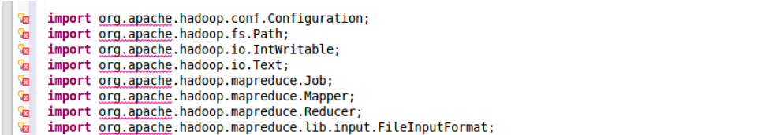
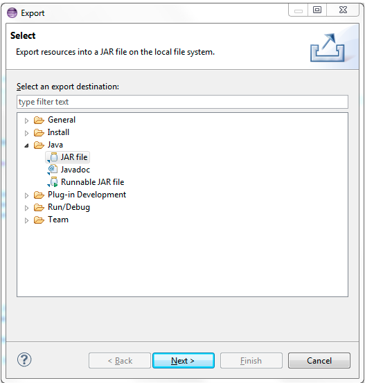
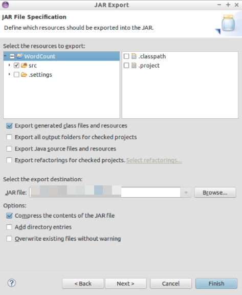

### Exercise 3 : Hadoop Application on Eclipse

### Task 1 : Running Hadoop Application

1. On the desktop vm, open eclipse. If it asks to select workspace then select the location and click on **launch**.

1. On the top left select **file**, select **New** and then choose **Java Project**.

1. In the dialogue box, provide the name **WordCount** under the project name and click on **Next**.

1. Notice that a folder called src will be automatically created, which is used to store source files and click on **Finish**

1. Create a package called **polyu.bigdata** under the src folder, by selecting **File** and select **New** and select **Package** and assigning name as polyu.bigdata in the dialogue box.

1. Create a class called WordCount, by selecting File **New** and **Class** and assigning name as **WordCount** in the dialogue box and then copy the code below to WordCount.java and save it.
    ```````
    package polyu.bigdata;

    import java.io.IOException;
    import java.util.StringTokenizer;

    import org.apache.hadoop.conf.Configuration;
    import org.apache.hadoop.fs.Path;
    import org.apache.hadoop.io.IntWritable;
    import org.apache.hadoop.io.Text;
    import org.apache.hadoop.mapreduce.Job;
    import org.apache.hadoop.mapreduce.Mapper;
    import org.apache.hadoop.mapreduce.Reducer;
    import org.apache.hadoop.mapreduce.lib.input.FileInputFormat;
    import org.apache.hadoop.mapreduce.lib.output.FileOutputFormat;

    public class WordCount {

      //Mapper which implement the mapper() function
      public static class TokenizerMapper extends Mapper<Object, Text, Text, IntWritable> {

        private final static IntWritable one = new IntWritable(1);
        private Text word = new Text();

        public void map(Object key, Text value, Context context) throws IOException, InterruptedException {
          StringTokenizer itr = new StringTokenizer(value.toString());
          while (itr.hasMoreTokens()) {

            word.set(itr.nextToken());
            context.write(word, one);
          }
        }
      }
      //Reducer which implement the reduce() function
      public static class IntSumReducer extends Reducer<Text, IntWritable, Text, IntWritable> {
        private IntWritable result = new IntWritable();

        public void reduce(Text key, Iterable<IntWritable> values, Context context) throws IOException, InterruptedException {
          int sum = 0;
          for (IntWritable val : values) {
            sum += val.get();
          }
          result.set(sum);
          context.write(key, result);
        }
      }
      //Driver class to specific the Mapper and Reducer
      public static void main(String[] args) throws Exception {
        Configuration conf = new Configuration();
        Job job = Job.getInstance(conf, "word count");
        job.setJarByClass(WordCount.class);
        job.setMapperClass(TokenizerMapper.class);
        job.setReducerClass(IntSumReducer.class);
        job.setOutputKeyClass(Text.class);
        job.setOutputValueClass(IntWritable.class);
        job.setMapOutputKeyClass(Text.class);
        job.setMapOutputValueClass(IntWritable.class);
        FileInputFormat.addInputPath(job, new Path(args[0]));
        FileOutputFormat.setOutputPath(job, new Path(args[1]));
        System.exit(job.waitForCompletion(true) ? 0 : 1);
      }
    }
    ```````
 
1. Notice that there are some red wavy lines underneath imported packages, which indicates the error Fail to import class. 
      
      
1. Right click on the WordCount project and select **Properties**.

1. Once the dialog box opens, select Java Build Path and select **Libraries**,select **Add External JARs**, select jars **hadoop-common-2.6.3.jar** and **hadoop-mapreduce-client-core-2.6.3.jar**.

1. Now verify that red wavy lines should disappear now, which means the dependency errors are solved.

### Task 2 : Export Jar Files

1. Now right click **WordCount** project, then click **Export**, then select **JAR** and click on **Next**.
      
      
      

1. Make sure you select the choose all export destination in src folder. Select the export destination to the location where you need to place the file and then click Finish, the jar file will be exported successfully.

### Task 3 : Start Hadoop, Check Hadoop status and Upload data to Hadoop File System(HDFS)

1. To run Hadoop application, the Hadoop system must be started first.
   ``````
   cd C:\Users\labuser\hadoop-3.2.1\sbin\start-all.sh
   ``````

1. On the microsoft edge in the desktop vm, and access the following urls, to view the running status of Hadoop.
    ```````
    http://localhost:8088
    http://localhost:50070
    ```````
  
1. Before executing the word count program, we also need a text file to process, download this hadoop.txt from [File](http://www.cse.cuhk.edu.hk/~ericlo/teaching/bigdata/lab/2-HadoopMR/HadoopMR/hadoop.txt) and save the file locally.

1. Create folder for data on HDFS and run the commands in the terminal
     ``````
     cd C:\Users\labuser\Downloads\hadoop-3.2.1\bin\hadoop fs -mkdir -p /user/bigdata/wordcount/input
     ``````
     >Note : Ensure that you are replacing the location where you need the input file to be created.

1. Upload the data to HDFS

    ```````
    cd C:\Users\labuser\Downloads\hadoop-3.2.1\bin\hadoop fs -put ~/hadoop.txt /user/bigdata/wordcount/input
    ```````
   
1. Execution Hadoop Application, to run the program
    ```````
     cd C:\Users\labuser\Downloads\hadoop-3.2.1\bin\hadoop jar ~/wordcount.jar polyu.bigdata.WordCount /user/bigdata/wordcount/input /user/bigdata/wordcount/output
    ```````
    >Note : Ensure that you are replacing the input and output destination folders

1. Open microsoft edge and verify the status of hadoop.
     ``````
     http://localhost:8088 
     ``````
1. To check the output, we need to first download the output folder from HDFS by using the command below.
     ``````
     cd C:\Users\labuser\Downloads\hadoop-3.2.1\bin\hadoop fs -get /user/bigdata/wordcount/output ~/
     ``````
 

