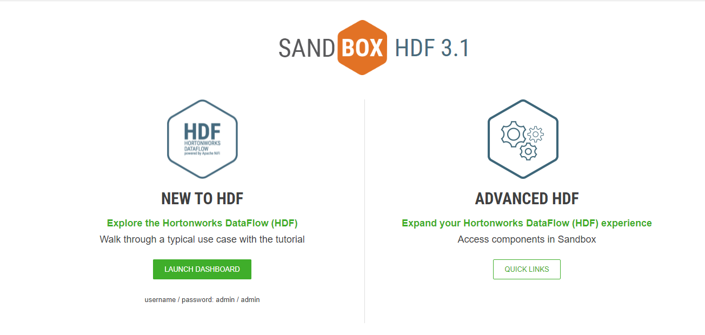
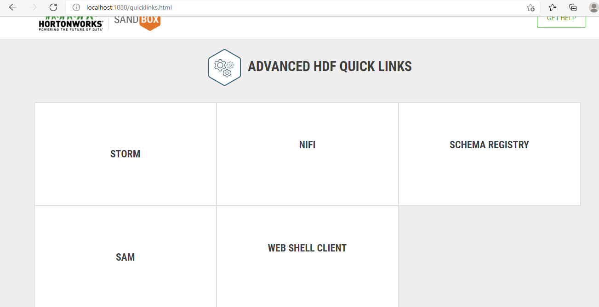
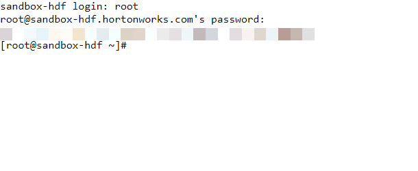
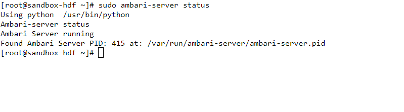

### Exercise 1 : Set up a lab for big data analytics using Docker deployment of HortonWorks DataFlow

This lab explains you to set up a big data analytics class. It assists the user in dealing with massive volumes of data and apply machine and statistical learning methods to obtain data insights. A key objective of this lab is to learn how to use data analytics technologies, such as Apache Hadoop's open-source software package, which provides tools for storing, managing, and processing massive data.

In this lab, we will use Hortonworks DataFlow (HDF), a popular commercial version of Hadoop provided by Cloudera. We are using HDF Sandbox 3.0.1, which is a free, simplified version of the platform that is used to design for learning and experimentation purpose. We may use either Windows or Linux virtual machines (VM) with HDF Sandbox deployed, but here we are using windows virtual machine to perform this lab.

### Task 1: Verifying the Pre-requisites of the lab

1. In the search Window, type windows features and select the windows features

1. In the **windows features** dialog box ensure that windows container and Hyper-V are turned on.
 
    
    
  >Note : If it is not enabled make sure that you are enabling it.
    
### Task 2 : Verfying the HDF Sandbox

1. On the Labvm desktop, select the **Git Bash**.

1. In the git bash, run the following to start the **HDF SandBox**

```
docker start sandbox-hdf

docker start sandbox-proxy

docker ps
```
   
### Task 3 : Connecting to the Ambari Dashboard

1. In the labvm desktop, select the microsoft edge icon.

1. In the browser, enter the following ip address 127.0.0.1:8080 or the local host. It navigates to the Ambari Signin Page.

1. By using the following credentials you can able to login to the Ambari Dashboard.

   |Setting|Value|
   |------|-------|
   |Username| admin|
   |Password| admin|

1. Once you have logged in, you can able to explore the various features of the Ambari Dashboard.

  

### Task 4 : Stop the HDF Sandbox

1. On the labvm, select git bash.

1. In the git bash, run the following commands to stop the **HDF Sandbox**

```
docker stop sandbox-hdf
docker stop sandbox-proxy
```

### Task 5 : To Restart the HDF Sandbox

1. On the labvm, select git bash.

1. In the git bash, run the following commands to restart the **HDF Sandbox** whenever it is required.

```
docker start sandbox-hdf
docker start sandbox-proxy
```

### Task 6 : Mapping SandBox IP to the desired hostname in the hosts file and the sandbox welcome page

1. Open the file explorer.

1. On the file explorer, navigate to the file located in C:\Windows\System32\drivers\etc and then select hosts file.

1. Select the hosts file, select open with and then select with **NotePad**.

1. On the hosts file, add the following {IP-Address} localhost sandbox-hdp.hortonworks.com sandbox-hdf.hortonworks.com

1. Replace the IP-Address with the following IP Address 127.0.0.1:8080.

1. Save the file.

1. In the browser, enter the localhost or 127.0.0.1:1080. The Sandbox Welcome Page is also known as the Splash Page.

   

1. On the welcome page, select launch dashboard.

1. It will be navigated to the signin page for the Ambari Dashboard. Login with the credentials provided.

   |Setting|Value|
   |------|-------|
   |Username| admin|
   |Password| admin|
   
### Task 7 : To check the Ambari server status

1. In the browser, enter the localhost or 127.0.0.1:1080. The Sandbox Welcome Page is also known as the Splash Page.

1. Under the **Advanced HDF**, select **Quick Links**. This will navigate to the **Advanced HDF Quick Links** Page

1. In the **Quick Links** page, select **Web Shell Client**.

     

1.  This will open a **Shell in a box** page.

1. Login with the credetials provided below.

   |Setting|Value|
   |------|-------|
   |Username| root|
   |Password| hadoop|
   
   
   
1. In the **Shell in a box** page, enter the following, to get the details of the Ambari server status

`````
sudo ambari-server status

`````
   
 
 ### Exercise 2 : 
 
 ## Task 1 : Setting up Hadoop
 
1. In the browser, navigate to the link provided, [Hadoop](https://archive.apache.org/dist/hadoop/common/hadoop-3.2.1/hadoop-3.2.1.tar.gz), that will automatically download hadoop version 3.2.1.

1. In the lab vm, select command prompt, Select the path where you have downloaded the file earlier.  
  `````
   cd C:\Users\labuser\Downloads
  `````
3. To Unzip the hadoop binary package, run the following command
  `````
   tar -xvf hadoop-3.2.1.tar.gz
  `````

## Task 2 : Install Hadoop native IO binary and configure environment variables

1. Navigate to the link [Hadoop binary files](https://github.com/cdarlint/winutils/tree/master/hadoop-3.2.1/bin) and download all the binary files.

1.  Once you have downloaded, copy the contents of hadoop-3.2.1/bin into the extracted location of the Hadoop binary package.

1. Open the Start Menu and type in 'environment' and press enter. Then select **Edit the system environment variables** and in the system properties page select **Environment variables**.

1. In the **User Variables for labuser**, select new.

1. Create a new User variable with the variable name as HADOOP_HOME and the value as C:\Users\labuser\Downloads\hadoop-3.2.1.
 
    >Note : The value should be the hadoop where you have downloaded.

1. Click Path and then Edit.

1. Click New on the top right.

1. Add C:\Users\labuser\Downloads\hadoop-3.2.1\bin.

## Task 3 : Configure Hadoop

Now  we need to configure hadoop configurations which involves Core, YARN, MapReduce, and HDFS configurations.

1. Now we need to configure hadoop files

1. Navigate to the location **C:\LabFiles\hadoop-3.2.1\etc\hadoop** and edit **core-site.xml** and replace the code between the <configuration> and </configuration>

    ```````
    <configuration>
     <property>
       <name>fs.default.name</name>
       <value>>hdfs://0.0.0.0:19000</value>
     </property>
   </configuration>

    ```````
 
1. On the desktop VM, select **file explorer** and navigate to the location **C:\LabFiles\hadoop-3.2.1** and create a folder named **Data** and create two folders inside **Data folder**, one for namenode directory and the another one for data directory.

1. Navigate to the location **C:\LabFiles\hadoop-3.2.1\etc\hadoop** and edit **hdfs-site.xml** and replace the code between the <configuration> and </configuration>
   ```````
   <configuration>
   <property>
     <name>dfs.replication</name>
     <value>1</value>
   </property>
   <property>
     <name>dfs.namenode.name.dir</name>
     <value>file://C:/LabFiles/hadoop-3.2.1/Data/data</value>
   </property>
   <property>
     <name>dfs.datanode.data.dir</name>
     <value>file://C:/LabFiles/hadoop-3.2.1/Data/name</value>
   </property>
   </configuration>
   ```````
   >Note : In the **value** under **name** replace the values accoriding to the files you have created in the previous step.

1. Navigate to the location **C:\LabFiles\hadoop-3.2.1\etc\hadoop** and edit **mapred-site.xml** and replace the code between the <configuration> and </configuration>
   ```````
    <configuration>
   <property>
     <name>mapreduce.framework.name</name>
     <value>yarn</value>
   </property>
   <property> 
     <name>mapreduce.application.classpath</name>
     <value>%HADOOP_HOME%/share/hadoop/mapreduce/*,%HADOOP_HOME%/share/hadoop/mapreduce/lib/*,%HADOOP_HOME%/share/hadoop/common/*,%HADOOP_HOME%/share/hadoop/common/lib/*,%HADOOP_HOME%/share/hadoop/yarn/*,%HADOOP_HOME%/share/hadoop/yarn/lib/*,%HADOOP_HOME%/share/hadoop/hdfs/*,%HADOOP_HOME%/share/hadoop/hdfs/lib/*</value>
   </property>
   </configuration>
    ```````
1. Navigate to the location **C:\LabFiles\hadoop-3.2.1\etc\hadoop** and edit **yarn-site.xml** and replace the code between the <configuration> and </configuration>
   ```````
   <configuration>
   <property>
    <name>yarn.resourcemanager.hostname</name>
    <value>localhost</value>
   </property>
   <property>
    <name>yarn.nodemanager.aux-services</name>
    <value>mapreduce_shuffle</value>
   </property>
   <property>
    <name>yarn.nodemanager.env-whitelist</name>
    <value>JAVA_HOME,HADOOP_COMMON_HOME,HADOOP_HDFS_HOME,HADOOP_CONF_DIR,CLASSPATH_PREPEND_DISTCACHE,HADOOP_YARN_HOME,HADOOP_MAPRED_HOME</value>
   </property>
   </configuration>
   ```````
1. To initialize the **HDFS** perform the following command in command prompt 
   ```````
    hdfs namenode -format
   ```````
   >Note : If you encounter any error while performing the above then perform the steps that is mentioned below.
1. Navigate to the [HDFS jar file](https://github.com/FahaoTang/big-data/blob/master/hadoop-hdfs-3.2.1.jar) and download it.
### Task 4 : Start HDFS and YARN daemons

1. 


     
