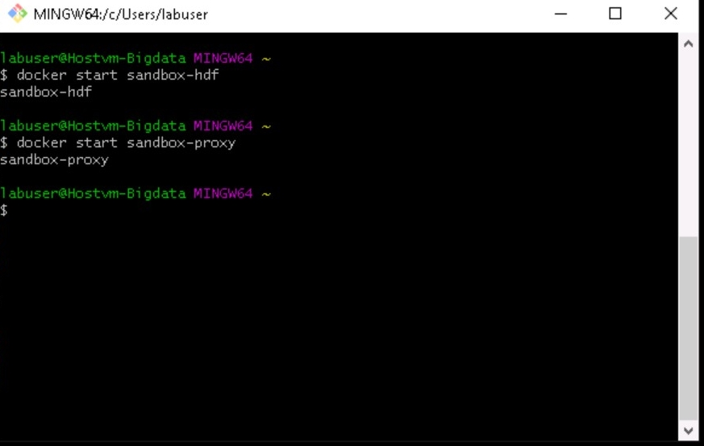
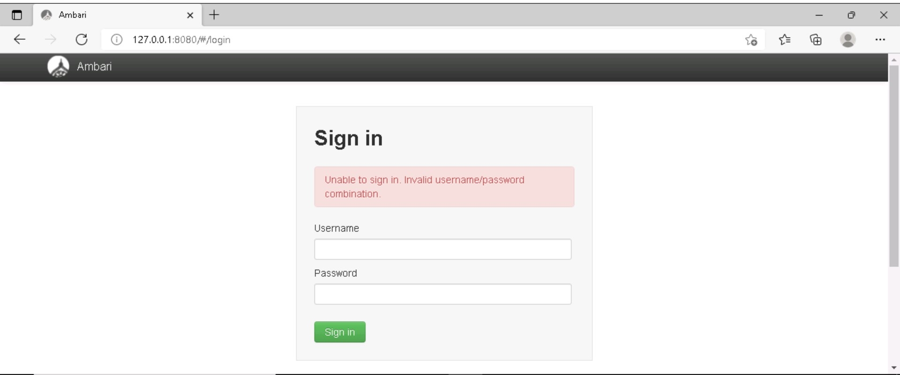
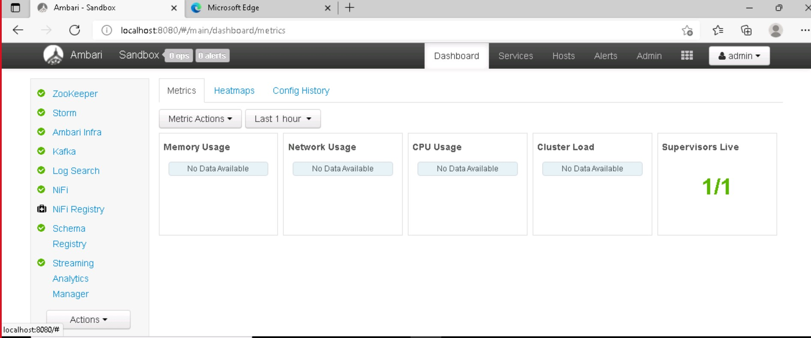

# Exercise:Set up a lab for big data analytics using Docker deployment of HortonWorks Data Platform
This lab will guide you on how to set up a big data analytics class. With this type of class, students learn how to handle large volumes of data and apply machine and statistical learning algorithms to derive data insights. A key objective for students is to learn to use data analytics tools, such as Apache Hadoop's open-source software package which provides tools for storing, managing, and processing big data.

In this lab, students will use a popular commercial version of Hadoop provided by Cloudera, called Hortonworks Data Platform (HDP). Specifically, students will use HDP Sandbox 3.0.1 which is a simplified, easy-to-use version of the platform that is free of cost and intended for learning and experimentation. Although this class may use either Windows or Linux virtual machines (VM) with HDP Sandbox deployed, this article will show how to use Windows.

Another interesting aspect of this lab, is that we will deploy HDP Sandbox on the lab VMs using Docker containers. Each Docker container provides its own isolated environment for software applications to run inside. Conceptually, Docker containers are like nested VMs and can be used to easily deploy and run a wide variety of software applications based on container images provided on Docker Hub. Cloudera's deployment script for HDP Sandbox automatically pulls the HDP Sandbox 3.0.1 Docker image from Docker Hub and runs two Docker containers:

   - sandbox-hdp
   - sandbox-proxy

# Task 1: Connecting to Ambari Dashboard

1.Open GitBash or any terminal and execute the following commands
   
   - a.docker start sandbox-hdf
   - b.docker start sandbox-proxy
   - c.docker ps
   
 
   
 2.Open browser and enter the following IP Address 172.0.0.1/8080 or localhost. After entering the IP address you will be able to the see the screen where in you will be        asked to enter the username and password.
 
   - enter the following details for username and password
   - username:admin
   - password:admin
  
 
 
 3.After entering the correct credentials you will be prompted to see the following page i.e., the Ambari Dashboard.
 
 
  
 4.You can Explore the following services by click on:

   - a.Metrics, Heatmaps and Config History

     and then on:

   - b.Background Operations,Alerts, Admin and User Views, icon (represented by 3×3 matrix ) to become familiar with the Ambari resources available to you.
