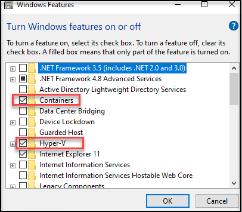
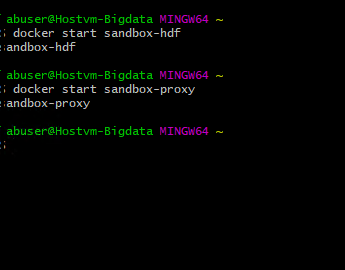
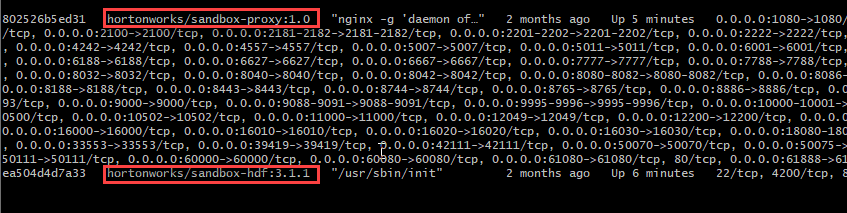
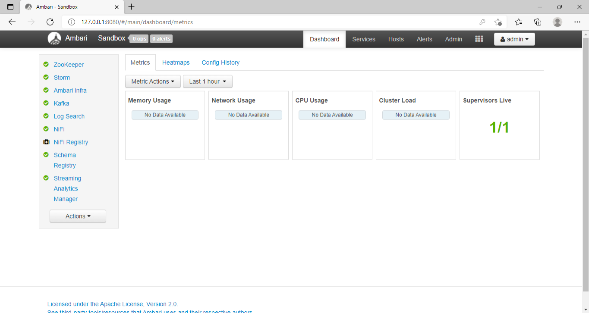

### Exercise 1 : Set up a lab for big data analytics using Docker deployment of HortonWorks Data Platform

This lab explains you to set up a big data analytics class. It assists the user in dealing with massive volumes of data and apply machine and statistical learning methods to obtain data insights. A key objective of this lab is to learn how to use data analytics technologies, such as Apache Hadoop's open-source software package, which provides tools for storing, managing, and processing massive data.

In this lab, we will use Hortonworks Data Platform(HDP), a popular commercial version of Hadoop provided by Cloudera. We are using HDP Sandbox 3.0.1, which is a free, simplified version of the platform that is used to design for learning and experimentation purpose. We may use either Windows or Linux virtual machines (VM) with HDP Sandbox deployed, but here we are using windows virtual machine to perform this lab.

### Task 1: Verifying the Pre-requisites of the lab

1. In the search Window, type windows features and select the windows features

1. In the **windows features** dialog box ensure that windows container and Hyper-V are turned on.
 
    
    
  >Note : If it is not enabled make sure that you are enabling it.
    
### Task 2 : Verfying the HDP Sandbox

1. On the Labvm desktop, select the **Git Bash**.

1. In the git bash, run the following to start the **HDP SandBox**

```
docker start sandbox-hdf

docker start sandbox-proxy

docker ps
```
   
   
    
   
### Task 3 : Connecting to the Ambari Dashboard

1. In the labvm desktop, select the microsoft edge icon.

1. In the browser, enter the following ip address 127.0.0.1:8080. It navigates to the Ambari Signin Page.

1. By using the following credentials you can able to login to the Ambari Dashboard

   |Setting|Value|
   |------|-------|
   |Username| admin|
   |Password| admin|

1. Once you have logged in, you can able to explore the various features of the Ambari Dashboard.

   

 


     
