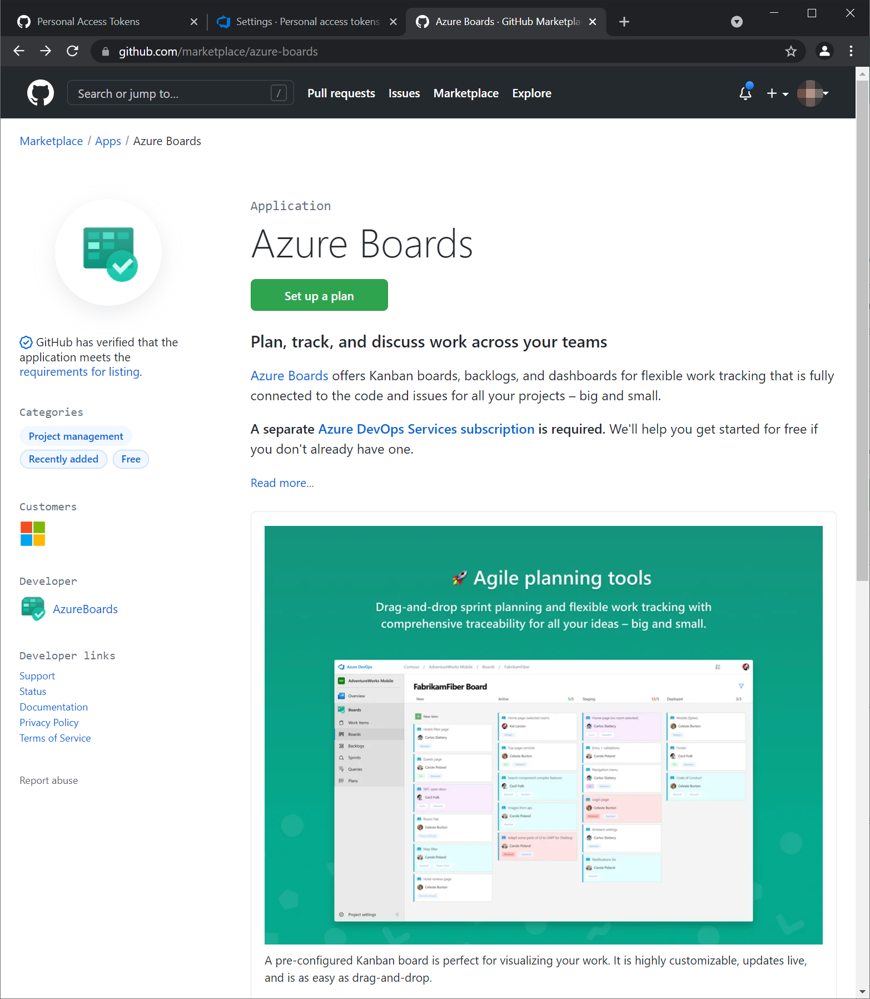
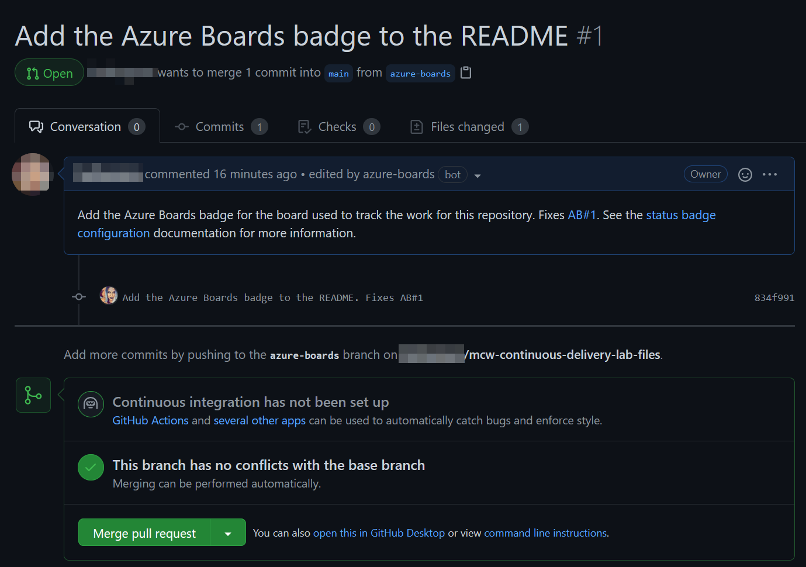
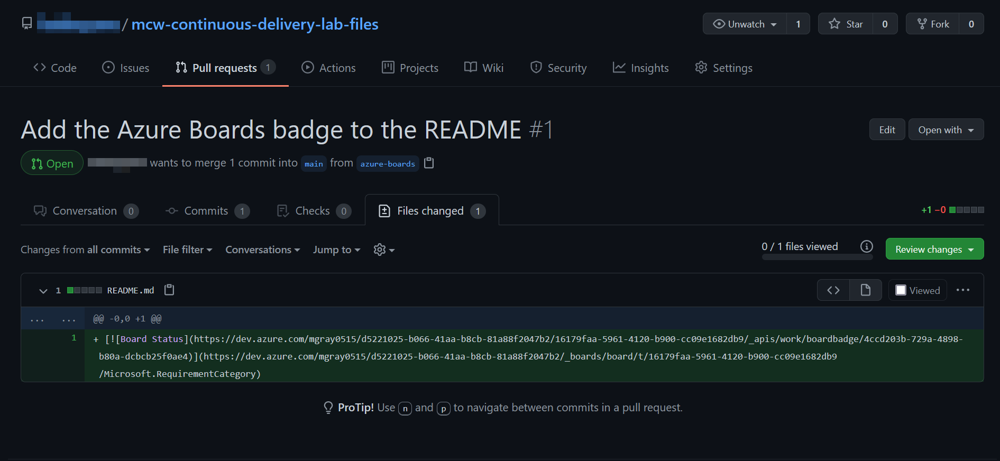
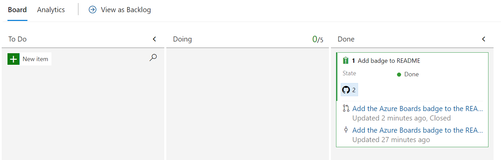

## Before the hands-on lab

Duration: 60 minutes

You should follow all of the steps provided in this section _before_ taking part in the hands-on lab ahead of time.

### Task 1: Create the Project Repo

In this task, you will create an account in [GitHub](https://github.com) and use `git` to add lab files to a new repository.

1. In a new browser tab open ```https://www.github.com``` and Log in with your personal GitHub account.

    > **Note** : You have to use your own GitHub account. If you don't have a GitHub account then navigate to the following link ```https://github.com/join``` and create one.
    
1. In the upper-right corner, expand the user drop down menu and select **Your repositories**.

   

1. Next to the search criteria, locate and select the **New** button.

   

1. On the **Create a new repository** screen, name the repository ```mcw-continuous-delivery-lab-files```, select **Private** and click on **Create repository** button.

   
   
   >Note: If you have done this lab previously you may have the repository already created in your GitHub account, Please make sure the delete the Repo and create a new one. 

1. On the **Quick setup** screen, copy the **HTTPS** GitHub URL for your new repository, and paste this in notepad for future use.

   


1. Open PowerShell with administrator and run the below commands to set your username and email, which git uses for commits. Make sure to replace your email and username.
   
     ```pwsh
     cd C:\Workspaces\lab\mcw-continuous-delivery-lab-files
     git config --global user.email "you@example.com"
     git config --global user.name "Your UserName"
     ```
     
    - Initialize the folder as a git repository, commit, and submit contents to the remote GitHub branch `main` in the lab files repository created in Step 1. Make sure to replace `<your_github_repository-url>` with the value you copied in step 5.

      > **Note**: The URI of the lab files GitHub repository created in Step 1 will differ from that in the example below.

      ```pwsh
      git init
      git add .
      git commit -m "Initial commit"
      git branch -M main
      git remote add origin <your_github_repository-url>
      git push -u origin main
      ```
      
    - After running the above commands, you will be prompted with a pop-up window to sign in to the GitHub. Select **Sign in with your Browser** on the pop-up window.

       
     
   - If you are re-directed to the Git Credential Manager page, sign in to the GitHub using your personal GitHub account credentials.

       
       
   - After you are prompted with the message **Authorization Succeeded**, close the tab and continue with the next task.
      
    

### Task 2: Create GitHub Personal Access Token


1. Navigate back to the **GitHub** tab and create a Personal Access Token as described below:

   - In the upper-right corner of your GitHub page, click your profile photo, then click **Settings (1)** and in the left sidebar click **Developer settings (2)**.

     

   - Then in the left sidebar, click **Personal access tokens (3)** and select **Generate new token (4)** button on the right. Provide the GitHub password if prompted. 
   
     

2. Select the scopes or permissions you would like to grant this token

    - **Note**: Provide the following text in the note field, **<inject key="DeploymentID" enableCopy="false" />-token**. 
    
    - **Select scopes**:

        * repo - Full control of private repositories
        * workflow - Update GitHub Action workflows
        * write:packages - Upload packages to GitHub Package Registry
        * delete:packages - Delete packages from GitHub Package Registry
        * read:org - Read org and team membership, read org projects
  
      

    - Click **Generate token**.

      

3. Click on the Copy icon to copy the token to your clipboard and save it on your notepad. For security reasons, after you navigate off the page, you will not be able to see the token again. **DO NOT COMMIT THIS TO YOUR REPO!**

   

### Task 3: Create Azure DevOps Personal Access Token

1. In your LabVM, open a new tab in the browser then copy and paste the below mentioned link.

    ```pwsh
    https://dev.azure.com/
    ```
1. On the **Azure Devops** page, click on **Sign in to Azure Devops**. 

    
    
1. On **We need few more details page**, leave everything as default and click on **Continue**.

    
    
1. On the home page of Azure Devops, select the existing organization named aiw-devops and select **Fabrikam-<inject key="DeploymentID" enableCopy="false" />** project.
    
   

1. Click on the **User settings** at the top right corner of the page and then select **Personal Access Tokens**.
   
   
   
1. Now on the **Personal Access Tokens** page, click on **+ New Token**   
   
   
   
1. In the Create a new personal access token page enter the following details:
   
   - **Name**: Enter **mcw-continuous-delivery** 

   - **Organization**: Leave as **Default**

   - **Expiration** : Leave as **Default**

   - **Scopes**: Full access

   - Click on **Create**

   
   
1. Copy the value of the generated token and save it in the notepad where you have stored the GitHub Personal Access Token then click on **Close**.

   
   
1. Keep this Personal Access token safe for later use. **DO NOT COMMIT THIS TO YOUR REPO!**

### Task 4: Start the Docker application.

1. Minimize the browser and open the **Docker application** from the LabVM desktop. You may find that docker is stopping abruptly, try starting it multiple times to fix it.

   
  
   >**Note**: If you get a warning pop up saying **Windows 17762 deprecated**. Please click on **OK**. Docker application might take a few seconds to open, please wait till the application opens.
   
1. Click on **Start**.

   

1. Skip the tutorial pop up by clicking on **Skip tutorial** situated in the bottom-left corner of the application.

   
   
1. Copy the command from the docker application page and save it in a notepad.

   
   
   >**Note**: If the Docker application is taking more than 10 mins to start. Please follow the steps from the `https://github.com/CloudLabs-MCW/MCW-Continuous-delivery-in-Azure-DevOps/blob/prod/Hands-on%20lab/docker-install.md` link and start the Docker again.
   
1. In the search bar, search for **PowerShell** application and open it.

   
   
1. Paste the **docker run** command which you had copied earlier and wait till the execution completes.

   
   
1. After the execution completes, open the **Docker application**. You should be able to see a container in a running state. This confirms the running of the Docker application.

   

### Task 5: Connect Azure Board with GitHub

We can automate our project tracking with the Azure Board integration for GitHub. In this task, you will connect your Azure DevOps project's board to your GitHub repository.

1. In your browser open GitHub Marketplace by navigating to the below URL:

    ``` 
    https://github.com/marketplace/azure-boards
    ```

    

2. Scroll to the bottom of the page and select `Install it for Free`.

   

3. On the next page, select **Complete order and begin installation**.

4. Select the lab files repository `mcw-continuous-delivery-lab-files` which you created earlier.

   
    
   >**Note**: If you see the message **You’ve already purchased this on all of your GitHub accounts** this indicates Azure Boards integration is already used in your account, follow the below steps.
   
   - In the upper-right corner of your GitHub page, click your profile photo, then click **Settings** and in the left sidebar click **Application** under **Integrations**.
   
   
   
      
   
   - In the Applications tab, select **Configure** next to **Azure Boards** under Installed GitHub Apps.

     
     
   - Scroll down to **Repository access** in **Azure Boards** pane, then **Check** the **Only select repositories**. From the **Select repositories** drop-down search for **mcw-continuous-delivery-lab-files** and select the repositiory. Click on **Save**.

     
    
5. Select the **aiw-devops** Azure DevOps organization and select the Fabrikam project then click on **Continue**

    

6. When the integration succeeds, you will be taken to the Azure DevOps Board. In the onboarding tutorial click on **Create** to create an initial Issue in the `To Do` Column.

    
    
7. Now click on **Create and link a pull request** to create a pull request associated with your Issue.

    

8. Open the new Issue that the onboarding tutorial creates and observe the GitHub pull request and comments that are linked to the Azure DevOps board Issue.

    

9. In GitHub, browse to the `Pull Requests` tab of the lab files repository created in [Task 1 of the Before the HOL Instructions] and open the pull request that was created in the onboarding tutorial for the Azure Boards Integration App. Note the `AB#1` annotation in the pull request comments - this annotation signals to Azure DevOps that this pull request comment should be linked to Issue #1 in Azure Boards.

    

10. Select the `Files changed` tab within the pull request detail and observe the change to the README.md associated with this pull request. After reviewing the changes, go back to the `Conversation` tab and select the `Merge pull request` button and confirm the following prompt to merge the pull request into the `main` branch.

    

11. In Azure DevOps Boards, find the work item and observe that the issue has been moved to the `Done` column on completion of the pull request.

    

You should follow all steps provided *before* performing the Hands-on lab.
