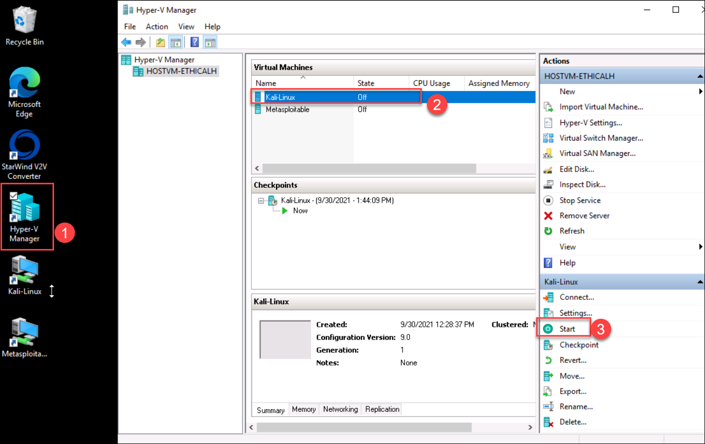
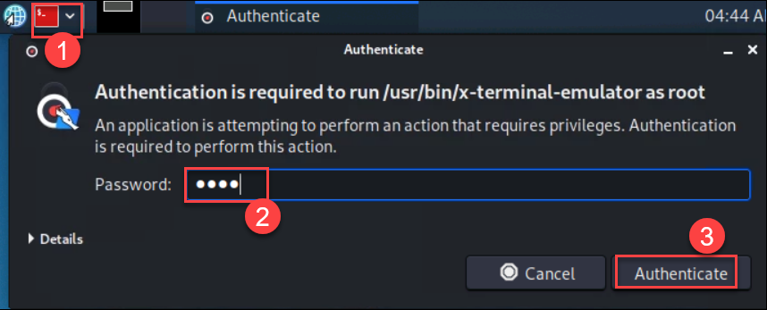
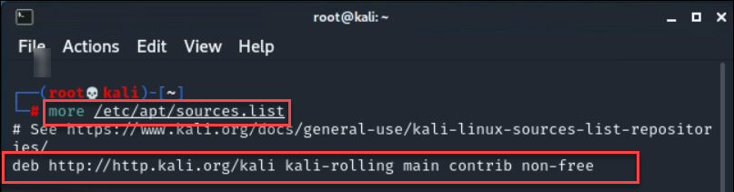
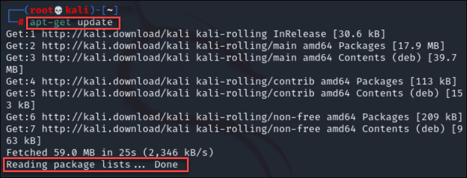

# Ethical hacking using Hyper-V

## Introduction to hacking

In the early 1990's, the word **hacker** was used to describe a great programmer, someone who  was able to build complex logics. Unfortunately, over time the word gained negative hype, and the 
media started referring to a hacker as someone who discovers new ways of hacking into a system, be it a computer system or a programmable logic controller, **someone who is capable of hacking 
into banks, stealing credit card information**, etc. This is the picture that is created by the media and this is untrue because everything has a positive and a negative aspect to it. What the media has 
been highlighting is only the negative aspect; the people that have been protecting organizations by responsibly disclosing vulnerabilities are not highlighted.

The term hacking has been broken down into three types:
1. **White hat hacker**-This kind of hacker is often referred to as a **security professional or security researcher**. Such hackers are employed by an organization and are permitted to attack 
an organization to find vulnerabilities that an attacker might be able to exploit.

2. **Black hat hacker**- Also known as a cracker, this kind of hacker is referred to as a bad guy, who uses his or her knowledge for negative purposes. They are often referred as **hackers**.

3. **Gray hat hacker**- This kind of hacker is an **intermediate between a white hat and a black hat hacker**. For instance, a gray hat hacker would work as a security professional for an 
organization and responsibly disclose everything to them; however, he or she might leave a backdoor to access it later and might also sell the confidential information, obtained after 
the compromise of a company’s target server, to competitors

The sole difference between the terms “hacking” and “ethical hacking” is the permission. Now, let us know what is ethical hacking in the next section.

## Ethical hacking and Penetration testing(Pen-testing)

**Ethical hacking** is a process of detecting vulnerabilities in an application, system, or organization’s infrastructure that an attacker can use to exploit an individual or organizationa and an **ethical hacker** is as a person who is hired and permitted by an organization to attack its systems for the purpose of identifying vulnerabilities, which an attacker might take advantage of.

A **penetration test** is a subclass of ethical hacking; it comprises a set of methods and procedures that aim at testing/protecting an organization’s security. The penetration tests prove helpful in finding vulnerabilities in an organization and check whether an attacker will be able to exploit them to gain unauthorized access to an asset

**Categories of Penetration testing:**
When the scope of the penetration test is defined, the category/type of the penetration test engagement is also defined along with it. The entire penetration test can be Black Box, White Box, or 
Gray Box depending upon what the organization wants to test and how it wants the security paradigm to be tested.
1. **Black box**- A black box penetration test is where little or no information is provided about the specified target. 
2. **Gray box**- In a gray box test, some information is provided and some hidden
3. **White box**- A white box penetration test is where almost all the information about the target is provided

**Types of Penetration testing:**
1. **Network Penetration test**
   In a network penetration test, you would be testing a network environment for potential security vulnerabilities and threats. This test is divided into two categories: external and internal penetration tests.
   An external penetration test would involve testing the public IP addresses, whereas in an internal test, you can become part of an internal network and test that network. You may be provided VPN access to the network or would have to physically go to the work environment for the penetration test depending upon the engagement rules that were defined prior to conducting the test

2. **Web application Penetration test**
   Web application penetration test is very common nowadays, since your application hosts critical data such as credit card numbers, usernames, and passwords; therefore this type of penetration test 
   has become more common than the network penetration test.

3. **Mobile application Penetration test**
    The mobile application penetration test is the newest type of penetration test that has become common since almost every organization uses Android- and iOS-based mobile applications to provide services to its customers. Therefore, organizations want to make sure that their mobile applications are secure enough for users to rely on when providing personal information when 
using such applications

4. **Social engineering Penetration test**
   A social engineering penetration test can be part of a network penetration test. In a social engineering penetration test the organization may ask you to attack its users. This is where you use speared phishing attacks and browser exploits to trick a user into doing things they did not intend to do

5. **Physical Penetration test**
   A physical penetration test is what you would rarely be doing in your career as a penetration tester. In a physical penetration test, you would be asked to walk into the organization’s building physically and test physical security controls such as locks and RFID mechanisms.
   
## Explore the lab environment 

In this lab environment you are provided with a lab virtual machine with Hyper-V manager pre-installed along with the guest operating systems like Kali Linux and Metasploitable using which you will learn the penetration testing skills.
**Kali linux** is a penetration testing platform which is a debian based linux distribution aimed at advanced penetration testing and security auditing. It contains several tools for various information security tasks like social engineering, Forensics or penetration testing.
**Metasploitable** is an intentionally vulnerable linux virtual machine, this virtual machine is usually used to conduct security training, test security tools and practice common penetration testing techniques.

## Exercise 1 : Working with Kali

In this exercise you will update/upgrade kali and download some of the essential tools required.

# Task 1 : Updating and Upgrading Kali Linux

1. In the labvm provided, click on **Hyper-V Manager** and select **Kali-linux** under the Virtual machines and click on **Start** to start the virtual machine.
   
   
2. Once the kali linux is turned on, you will be prompted to login to the Virtual machine. Use the below credentials and login to the VM.
   * **Username:** <inject key="Kali VM Username" />
   * **Password:** <inject key="Kali VM Password" />

3. Open the **Root terminal emulator** from top left corner of the kali linux and if prompted to authenticate provide the password as **kali** and click on **Authenticate**.  This will ensure that you are using the terminal as a root user
   
   
4. In the terminal, run the following command to verify if the repository is correctly defined in the sources.
   
   ```
   more /etc/apt/sources.list
   ```
  
   
  
4. Next, run the below command to update the list of available packages.
   ```
   apt-get update
   ```
  
  
5. Run the below command to install new version of the packages, if prompted with **Do you want to continue (Y/N), type Y**. Note that this may take some time to complete.
   ```
   apt-get upgrade
   ```
6. Now the system is updated with latest packages/updates from the repository.

# Task 2 : Installing VM tools

Vm tools are required to supprot Shared folders and to support drag and drop operations etc.

1. Open the terminal again, and run the below command to install the packages.If prompted with **Do you want to continue (Y/N), type Y**
   
   ```
   apt-get install open-vm-tools-desktop fuse
   ```
   
2. Once the installation is complete, reboot the system by running the below command

    ```
    reboot
    ```


  


