# Getting started with Ethical hacking and Penetration testing

## Introduction to hacking

In the early 1990's, the word **hacker** was used to describe a great programmer, someone who  was able to build complex logics. Unfortunately, over time the word gained negative hype, and the 
media started referring to a hacker as someone who discovers new ways of hacking into a system, be it a computer system or a programmable logic controller, **someone who is capable of hacking 
into banks, stealing credit card information**, etc. This is the picture that is created by the media and this is untrue because everything has a positive and a negative aspect to it. What the media has 
been highlighting is only the negative aspect; the people that have been protecting organizations by responsibly disclosing vulnerabilities are not highlighted.

The term hacking has been broken down into three types:
1. **White hat hacker**-This kind of hacker is often referred to as a **security professional or security researcher**. Such hackers are employed by an organization and are permitted to attack 
an organization to find vulnerabilities that an attacker might be able to exploit.

2. **Black hat hacker**- Also known as a cracker, this kind of hacker is referred to as a bad guy, who uses his or her knowledge for negative purposes. They are often referred as **hackers**.

3. **Gray hat hacker**- This kind of hacker is an **intermediate between a white hat and a black hat hacker**. For instance, a gray hat hacker would work as a security professional for an 
organization and responsibly disclose everything to them; however, he or she might leave a backdoor to access it later and might also sell the confidential information, obtained after 
the compromise of a company’s target server, to competitors.

The sole difference between the terms “hacking” and “ethical hacking” is the permission. Now, let us know what is ethical hacking in the next section.

## Ethical hacking and Penetration testing(Pen-testing)

**Ethical hacking** is a process of detecting vulnerabilities in an application, system, or organization’s infrastructure that an attacker can use to exploit an individual or organizationa and an **ethical hacker** is as a person who is hired and permitted by an organization to attack its systems for the purpose of identifying vulnerabilities, which an attacker might take advantage of.

A **penetration test** is a subclass of ethical hacking; it comprises a set of methods and procedures that aim at testing/protecting an organization’s security. The penetration tests prove helpful in finding vulnerabilities in an organization and check whether an attacker will be able to exploit them to gain unauthorized access to an asset.

**Categories of Penetration testing:**
When the scope of the penetration test is defined, the category/type of the penetration test engagement is also defined along with it. The entire penetration test can be Black Box, White Box, or 
Gray Box depending upon what the organization wants to test and how it wants the security paradigm to be tested.
1. **Black box**- A black box penetration test is where little or no information is provided about the specified target. 
2. **Gray box**- In a gray box test, some information is provided and some hidden.
3. **White box**- A white box penetration test is where almost all the information about the target is provided.

**Types of Penetration testing:**
1. **Network Penetration test:**
   In a network penetration test, you would be testing a network environment for potential security vulnerabilities and threats. This test is divided into two categories: external and internal penetration tests.
   An external penetration test would involve testing the public IP addresses, whereas in an internal test, you can become part of an internal network and test that network. You may be provided VPN access to the network or would have to physically go to the work environment for the penetration test depending upon the engagement rules that were defined prior to conducting the test.

2. **Web application Penetration test:**
   Web application penetration test is very common nowadays, since your application hosts critical data such as credit card numbers, usernames, and passwords; therefore this type of penetration test 
   has become more common than the network penetration test.

3. **Mobile application Penetration test:**
    The mobile application penetration test is the newest type of penetration test that has become common since almost every organization uses Android- and iOS-based mobile applications to provide services to its customers. Therefore, organizations want to make sure that their mobile applications are secure enough for users to rely on when providing personal information when 
using such applications.

4. **Social engineering Penetration test:**
   A social engineering penetration test can be part of a network penetration test. In a social engineering penetration test the organization may ask you to attack its users. This is where you use speared phishing attacks and browser exploits to trick a user into doing things they did not intend to do.

5. **Physical Penetration test:**
   A physical penetration test is what you would rarely be doing in your career as a penetration tester. In a physical penetration test, you would be asked to walk into the organization’s building physically and test physical security controls such as locks and RFID mechanisms.
   
## Explore the lab environment 

In this lab environment you are provided with a lab virtual machine with Hyper-V manager pre-installed along with the guest operating systems like Kali Linux and Metasploitable using which you will learn the penetration testing skills.

**Kali Linux** is an open-source, Debian-based Linux distribution geared towards various information security tasks, such as Penetration Testing, Security Research, Computer Forensics and Reverse Engineering.

**Metasploitable** is an intentionally vulnerable linux virtual machine, this virtual machine is usually used to conduct security training, test security tools and practice common penetration testing techniques.

## Exercise 1 : Working with Kali

In this exercise you will update/upgrade Kali Linux system and explore some of the essential tools used in ethical hacking.

## Task 1 : Updating and Upgrading Kali Linux

1. In the labvm provided, click on **Hyper-V Manager** and select **Kali-Linux** under the Virtual machines and click on **Start** to start the virtual machine.

   

2. Once the Kali-Linux is turned on or in Running state, wait for the machine to boot up and click on **Connect**
   
3. You will be prompted to login to the Kali Linux guest operating system. Use the below credentials and login to the Guest OS.

   > **Note:** The Below commands need to be entered manually in terminal.

   * **Username:** <inject key="Kali VM Username" />
   * **Password:** <inject key="Kali VM Password" />

4. Open the **Root terminal emulator** from top left corner of the Kali-Linux and if prompted to authenticate provide the password as **kali** and click on **Authenticate**.  This will ensure that you are using the terminal as a root user.

   
  
5. In the terminal, run the following command to verify if the repository is correctly defined in the sources.

   > **Note:** The Below command need to be entered manually in Terminal.

   **more /etc/apt/sources.list**

   

6. GPG (GNU Privacy Guard) keys are used to digitally sign packages in a Linux distribution's package repository, updating GPG keys is a security best practice that helps ensure the authenticity and integrity of the software packages you download and install on your system.

  Run the below command to update the GPG keys

  **sudo apt-key adv --refresh-keys --keyserver keyserver.ubuntu.com**
  
7. Next, run the below command to update the list of available packages.

   > **Note:** The Below command need to be entered manually in terminal.
   
   **apt-get update**
   
   
  
8. Run the below command to install new version of the packages, if prompted with **Do you want to continue (Y/N), type Y**. Note that this may take some time to complete.

   > **Note:** The Below command need to be entered manually in terminal.

   **apt-get upgrade**
   
9. Now the system is updated with latest packages or updates from the repository.

## Task 2 : Essential Kali tools

The Kali Linux penetration testing platform contains a vast array of tools and utilities pre-installed. From information gathering to final reporting, Kali Linux enables security and IT professionals to assess the security of their systems.
Some of the pre-installed Kali tools you will explore in this lab are :
- Nmap
- Metasploit framework
- Hydra

1. From the top left corner of the Kali-Linux, select **Applications** and search for pre-installed tools like nmap. Similarly you can check for other pre-installed tools.

   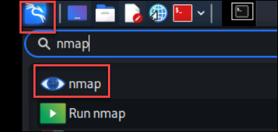

   💡 **Nmap**, also known as Network mapper is Linux command-line tool for network exploration and security auditing. This tool is generally used by hackers and cybersecurity enthusiasts and even by network and system administrators. It is used for the following purposes:

   - Real time information of a network
   - Detailed information of all the IPs activated on your network
   - Number of ports open in a network
   - Provide the list of live hosts
   - Port, OS and Host scanning 

2. The **Metasploit framework** is a very powerful tool which can be used by cybercriminals as well as ethical hackers to probe systematic vulnerabilities on networks and servers. Because it's an open-source framework, it can be easily customized and used with most operating systems.

  - Click on **Applications** from the top-left corner and select **Metasploit framework**. This will open up a terminal if prompted provide the Kali-Linux password **kali**.

    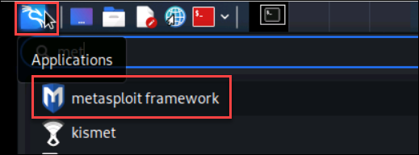
   
3. **Hydra** is a parallelized login cracker which supports numerous protocols to attack. It is very fast and flexible, and new modules are easy to add.
   This tool makes it possible for researchers and security consultants to show how easy it would be to gain unauthorized access to a system remotely.
 
   - Click on **Applications** from the top-left corner and select **Hydra**.

## Task 3 : Configuring Victim

1. In the labvm provided, click on **Hyper-V Manager** and select **Metasploitable** under the Virtual machines and click on **Start** to start the virtual machine.

   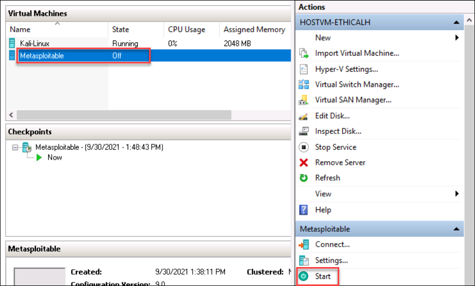

2. Once the  Metasploitable OS is on or in Running state, wait for the machine to boot up and click on **Connect**.
   
3. You will be prompted to login to the guest OS. Use the below credentials and login to the guest OS.

   > **Note:** The Below commands need to be entered manually in terminal.

   * **Username:** <inject key="Metasploitable VM Username" />
   * **Password:** <inject key="Metasploitable VM Password" />

4. After you are logged in, run the below command to get the IP address of the Metasploitable Virtual machine. Note down the IP address as you will be using it in the next step.

   > **Note:** The Below command need to be entered manually in terminal.
   
   ifconfig
   
   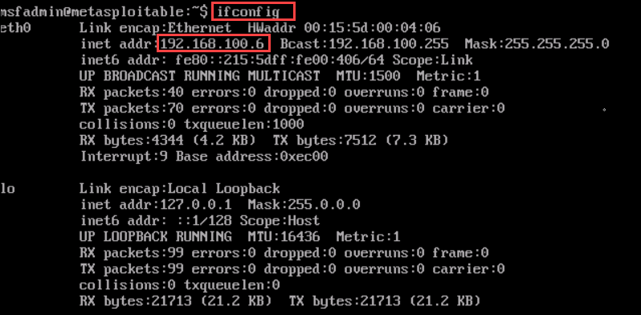

5. Now, navigate back to Kali-Linux VM and run the below command in the terminal window to connect to Metasploitable VM and verify if the output is similar as shown in the below screenshot. Ensure to replace the [ip_address of metasploitable vm] with the ip address value you noted in the previous step.

   > **Note:** The Below command need to be entered manually in terminal.
   
   ping [ip_address of metasploitable vm]
   
   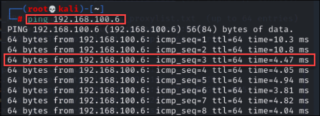
 
5. Also, run the below command to note down the ip address of Kali-Linux as you will be using it in the further tasks.

   > **Note:** The Below command need to be entered manually in terminal.
   
   ifconfig
   
   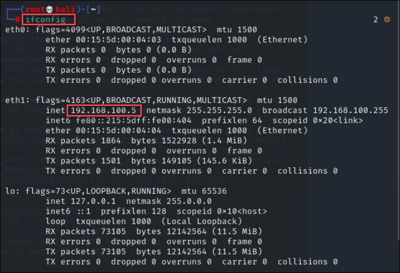
   
## Exercise 2 : Scanning with Nmap to find the vulnerable machines

Nmap stands for “Network Mapper”. Nmap utilizes novel ways of using IP packets for determining the hosts available on the network, services offered by the hosts, operating systems they are running on, types of packets or firewalls being used and many such characteristics.
Nmap mainly aims at protecting the network by performing a sniffing which leads to detailed network analysis. The detailed network analysis enables the admin who built the system to protect on a network to have complete detail about the packet traffic. Being vigilant and prepared allows the admin to quickly respond to attacks.

In Kali Linux, analyzing network or in hacking terms, we call it as **sniffing network** is an important skill and tools for the same is without a doubt the absolute necessity so that we can uncover the potential attacks possible in the weak points in the network and fix them to safeguard our system. And in this exercise you will use nmap commands for network sniffing.

1. Open the Terminal on Kali-Linux and run the below command **nmap**, to list the options of target specification or host discovery and the nmap manual.

   > **Note:** The Below command need to be entered manually in terminal.
   
   nmap
   
  
     💡 **nmap** helps in network discovery that it sends the packets to ip addresses, ip segments and ports inorder to find the running machines and services.

2. To scan the specific ip address's ports and services, run the below command. In this example, we are scanning the ip address of Metasploitable VM that you noted in the previous tasks.

   > **Note:** The Below command need to be entered manually in terminal.
      
    nmap [ip_addresss of metasploitable vm]
    
   
   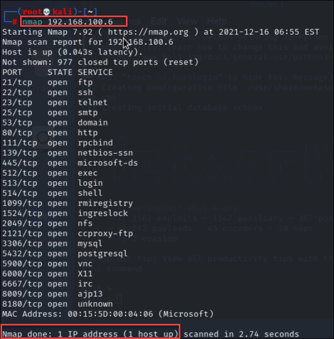
   
Using this, the “threat sniffer” who is noticing some unfamiliar activities from a single IP can scan so that the false positives and false negatives can be distinguished and hit the target if the IP is a notorious one. False positives trigger alert unnecessarily, which might hide any attack. Using the utility to distinguish false positives and false negatives will allow false positives to come out in the open and keep the network analyst on toes to respond to any true positive attack without worrying about the false positives.

3. Run the below command to scan all the ip addresses available, virtual machines connected in a specific ip address range. In our case the 192.168.100 is the address range(For Kali-Linux and Metasploitable), you can see all the virtual machines connected in this address range as shown below indicates all results to be considered.

   > **Note:** The Below command need to be entered manually in terminal.
   
    nmap -sP 192.168.100.*
    
    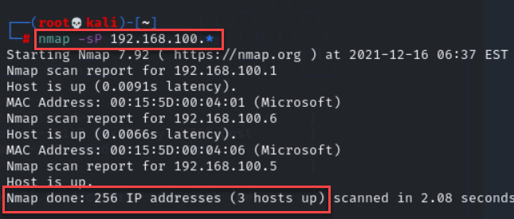
    
   💡 In an extended scenario of scanning an IP address, a user also has the flexibility to use Nmap to scan a range of IP addresses to look for instances or loopholes through which an attack might be possible.
    
5. Run the below command to scan a host.

   > **Note:** The Below command need to be entered manually in terminal.
   
   nmap www.yahoo.com
   
   💡 The next way to use Nmap is by scanning a host for information that might make it a high-value target on a network that the hacker is on the lookout for. For example, attackers prey on the specific host containing financial information.

**Note:** Using the details printed on the console, one can take a copy of the same into a text editor perform required analytics. Along with this, Kali Linux provides utility to get the entire result of the Nmap on a file and utilize it later for its numerous other uses. With just its one base command with multiple other options, Nmap helps users with loads of information to protect machines from unwanted attacks.

## Exercise 3 - Basics of Exploitation using Metasploit

Metasploit is used for hacking into systems for testing purposes.The Metasploit Framework is an open source platform and a Kali Linux tool that supports vulnerability research, exploit development, and the creation of custom security tools. 

1. In the Kali Linux, open the terminal and run the below command to start the PostgreSQL database server. PostgreSQL is the backend database support for Metasploit, which you can use to store your penetration-testing results.

   > **Note:** The Below command need to be entered manually in terminal.
   
   service postgresql start
   
2. Verify if the PostgreSQL database's status **active** by running the below command.

   > **Note:** The Below command need to be entered manually in terminal.
   
   service postgresql status
   
   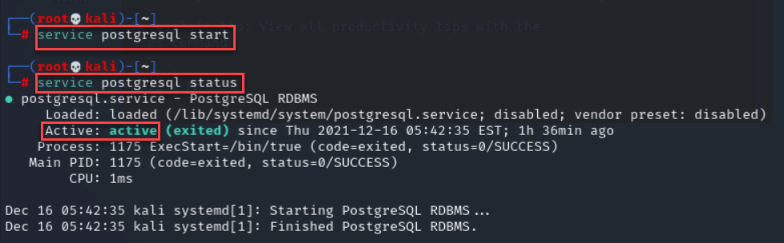
   
3. Run the below command to start the PostgreSQL server everytime Kali Linux is rebooted.

   > **Note:** The Below command need to be entered manually in terminal.
   
   update-rc.d postgresql enable
   
   
4. Run the below command to verify if sockets are listening to the incoming connections and to ensure PostgreSQL server is running.

   > **Note:** The Below command need to be entered manually in terminal.
   
   ss -ant
   
   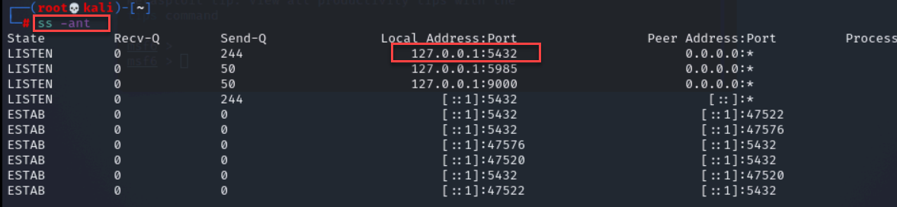

5. Run the below command to open the Metasploit Framework console.

   > **Note:** The Below command need to be entered manually in terminal.
   
   msfconsole
   
   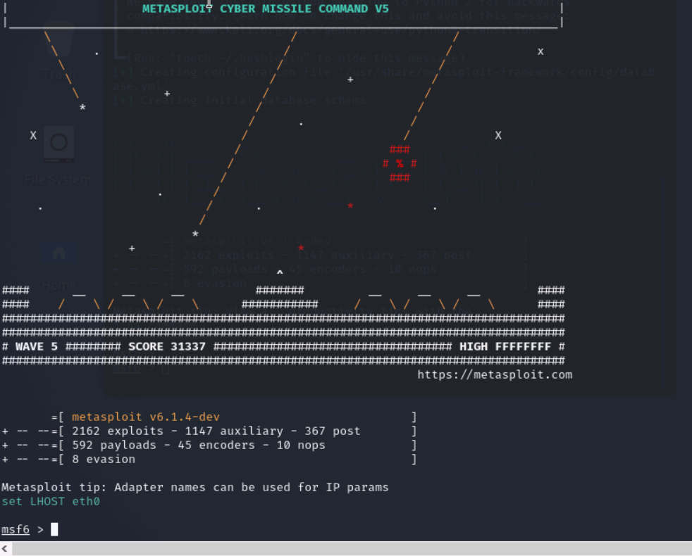
   
6. Run the below command to ensure that the PostgreSQL database is connected to Metasploitable Framework.

   > **Note:** The Below command need to be entered manually in terminal.
   
   db_status
   
   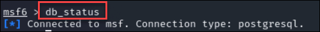
