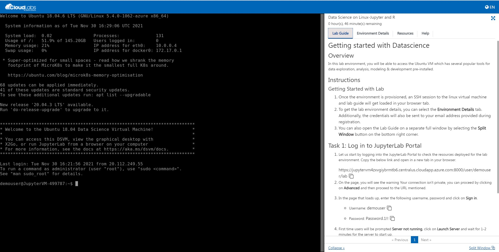
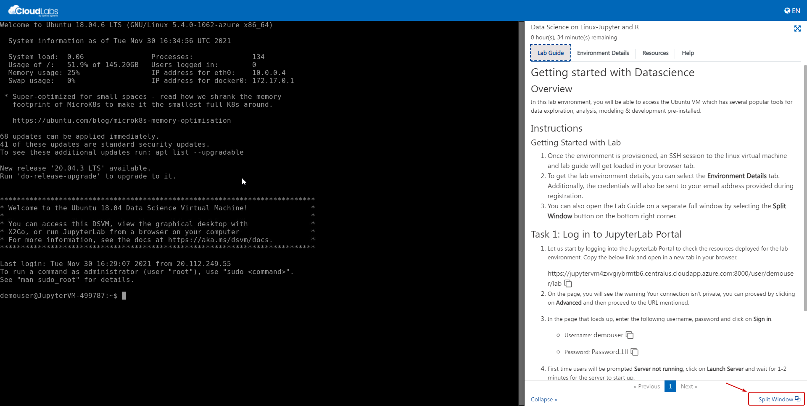
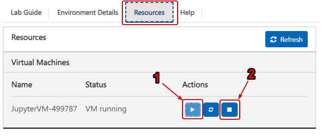

## Instructions

### Exercise 1: Getting started with the Lab environment

1. Once the environment is provisioned, an SSH session to the Linux virtual machine and lab guide will get loaded in your browser tab. 
   
   

2. To get the lab environment details, you can select the **Environment Details** tab. Additionally, the credentials will also be sent to your email address provided during registration.

   
   
3. You can also open the Lab Guide on a separate full window by selecting the **Split Window** button on the bottom right corner.

   

4. You can **start(1)** or **stop(2)** the Virtual Machine from the **Resources** tab.

   
   
