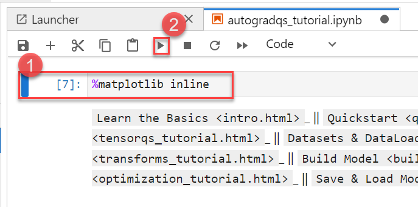

# Getting started with Data Science Lab Environment

## Overview

In this lab environment, you will be able to access the Ubuntu VM which has several popular tools for data exploration, analysis, modeling & development pre-installed.

## Instructions

### Getting started with the Lab environment

1. Once the environment is provisioned, an SSH session to the Linux virtual machine and lab guide will get loaded in your browser tab. 
   
   

2. To get the lab environment details, you can select the **Environment Details** tab. Additionally, the credentials will also be sent to your email address provided during registration.

   
   
3. You can also open the Lab Guide on a separate full window by selecting the **Split Window** button on the bottom right corner.

   

4. You can **start(1)** or **stop(2)** the Virtual Machine from the **Resources** tab.

   
   
   
## Task 1: Log in to JupyterLab Portal

1. Let us start by logging into the JupyterLab Portal to check the resources deployed for the lab environment. Copy the below link and open in a new tab in your local machine browser.

   <inject key="Jupyter Lab Environment" enableCopy="true" />

1. On the page, you will see the warning Your connection isn't private, you can proceed by clicking on **Advanced** and then proceed to the URL mentioned.

   

1. In the page that loads up, enter the following username, password and click on **Sign in**. 

   * Username: <inject key="Jupyter Lab Username"></inject>

   * Password: <inject key="Jupyter Lab Password"></inject>

   

1. First time users will be prompted **Server not running**, click on **Launch Server** and wait for 1-2 minutes for the server to start up.

1. Once the Jupyter Lab loads up, you will see the File System on the left and Launcher on the right. There are a lot of samples loaded up for the various technologies.

   

## Task 2: Execute Notebooks

Here, training of the neural networks has been processed. In this, the famous algorithm has been used where model weights have been adjusted as the gradient weights. To compute these gradients Pytorch has a built-in differentiation engine called 'torch-autograd' is used. 

1. Navigate to **Pytorch** folder

   

1. Select **Beginner** folder and in that move on to **basics** option

   
   
   

1. Select **autogradqs_tutorial** file

   

1. Execute one by one cells by clicking on the cell and selecting the execute button.

   

## Summary

In this exercise, you have signed in to the JupyterLab Portal and reviewed the environment.
