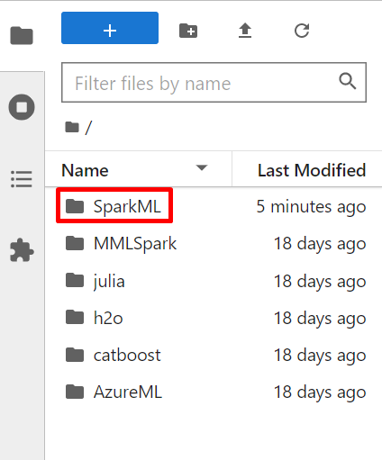

# Getting started with Data Science Lab Environment

## Overview

In this lab environment, you will access the **Ubuntu VM** which has several popular tools for Data Exploration, Analysis, Modeling & Development Pre-Installed.

### JupyterLab
JupyterLab is the latest web-based interactive development environment for notebooks, code, and data. Its flexible interface allows users to configure and arrange workflows in data science, scientific computing, computational journalism, and machine learning. A modular design invites extensions to expand and enrich functionality.

### Jupyter Notebook
The Jupyter Notebook is the original web application for creating and sharing computational documents. It offers a simple, streamlined, document-centric experience.

After completing this, you will learn how to:

- Log in to JupyterLab Portal
- Execute Notebooks

## Instructions

### Getting started with the Lab environment

1. Once the environment is provisioned, an SSH session to the Linux virtual machine and lab guide will get loaded in your browser tab. 
   
   

2. To get the lab environment details, you can select the **Environment Details** tab. Additionally, the credentials will also be sent to your email address provided during registration.

   
   
3. You can also open the Lab Guide on a separate full window by selecting the **Split Window** button on the bottom right corner.

   

4. You can **start(1)** or **stop(2)** the Virtual Machine from the **Resources** tab.

   
   
   
## Task 1: Log in to JupyterLab Portal

1. Let us start by logging into the JupyterLab Portal to check the resources deployed for the lab environment. Copy and paste the link below into a new tab in your browser.

   <inject key="Jupyter Lab Environment" enableCopy="true" />

1. On the page, you will see the warning Your connection isn't private, you can proceed by clicking on **Advanced** and then proceed to the URL mentioned.

   

1. On the page that loads up, enter the following username, password and click on **Sign in**. 

   * Username: <inject key="Jupyter Lab Username"></inject>

   * Password: <inject key="Jupyter Lab Password"></inject>

   

1. First-time users will be prompted **Server not running**, click on **Launch Server** and wait for 1-2 minutes for the server to start up.

1. Once the Jupyter Lab loads up, you will see the File System on the left and Launcher on the right. There are a lot of samples loaded up for the various technologies.

   

## Task 2: Execute Notebooks

Here, you will learn some features and capabilities of Spark's MLlib toolkit for ML problems using the NYC taxi trip and fare data set from 2013. Here you will address two machine learning problems:
- Binary classification: Prediction of tip or no-tip (1/0) for a taxi trip [Using regularized regression]
- Regression problem: Prediction of the tip amount ($) [Using random forest]

Spark.ml is a new package introduced in Spark 1.2, which aims to provide a uniform set of high-level APIs that help users to create and tune practical machine learning pipelines.

1. In the Jupyter lab, in the left pane, select **SparkML** folder and double-click on it to open.

   

1. In the **SparkML** folder, Select **pySpark** folder, then Select **pySpark2.0modeling.ipynb** file and double-click to open it on the right side of the Jupyter lab portal. In this file you will learn about:

   - Set spark context and import necessary libraries
   - Data exploration & visualization
   - Feature engineering, transformation and data prep for modeling
   - Indexing and one-hot encoding of categorical features
   - Binary classification model training
   - Regression model training
   - Load a pipeline model and evaluate it test data
   - Hyper-parameter tuning: Train a random forest model using hyper-parameter tuning and cross-validation
   - Load independent validation data-set and evaluate a model

   

   

1. Execute each cell one at a time by clicking on it and selecting the execute button.

   

## Summary

In this exercise, you have signed in to the JupyterLab Portal and learned how to use Notebook to run the code and get the desired results.
