# Hosting Machine Learning Labs with Jupyter on Azure

## Getting started with Datascience

## Overview

In this lab environment, you will access the Windows Data Science VM which has several popular tools for data exploration, analysis, modeling & development pre-installed.

The Windows Data Science Virtual Machine (DSVM) is a virtual machine image available in Azure that's preinstalled with a collection of tools commonly used for data analytics and machine learning.

The DSVM image makes it easy to get started doing data science in minutes, without having to install and configure each of the tools individually. You can easily stop it when it's not in use. The DSVM resource is both elastic and cost-efficient.

### JupyterLab
JupyterLab is the latest web-based interactive development environment for notebooks, code, and data. Its flexible interface allows users to configure and arrange workflows in data science, scientific computing, computational journalism, and machine learning. A modular design invites extensions to expand and enrich functionality.

### Jupyter Notebook
The Jupyter Notebook is the original web application for creating and sharing computational documents. It offers a simple, streamlined, document-centric experience.

After completing this lab, you will learn how to:

- Log in to JupyterLab Portal
- Execute Notebooks
- Verify the notebook execution output

## Instructions

1. Once the environment is provisioned, a virtual machine (JumpVM) on the left and lab guide on the right will get loaded in your browser. Use this virtual machine throughout the workshop to perform the lab.

   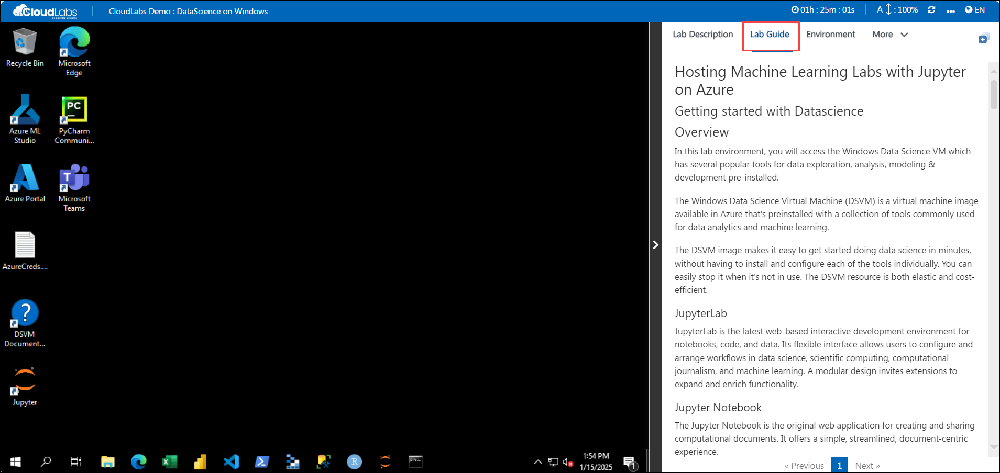

2. To get the lab environment details, you can select the **Environment** tab.
   
   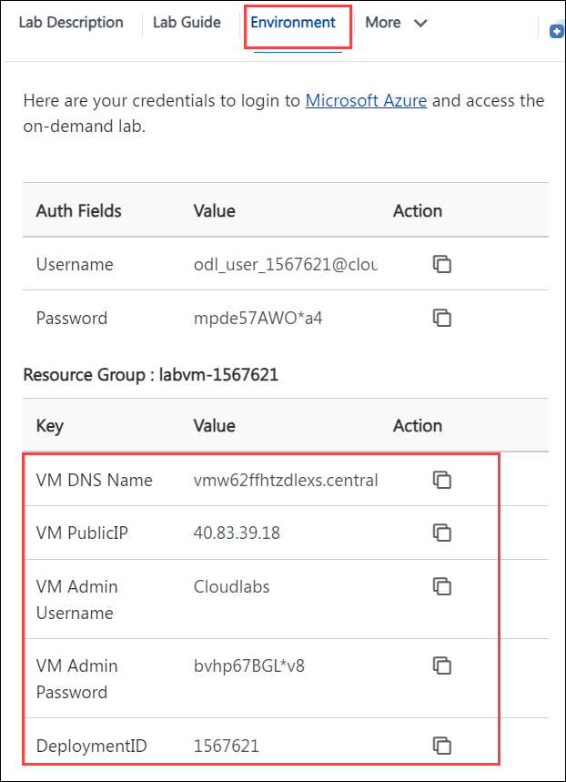

3. You can also open the Lab Guide on a separate full window by selecting the **Split Window** button on the top right corner.
   
   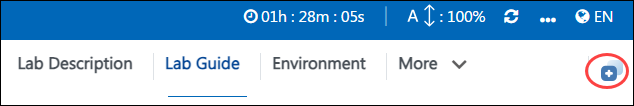
 
4. You can **start(1)** or **stop(2)** the Virtual Machine from the **Resources** tab.

   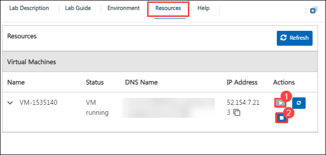
   
## Access the JupyterLab Application

1. In the virtual machine, double click on the **Jupyter**icon on the desktop to start the Jupyter Notebook.

1. This will open up a command prompt and a browser will automatically load and navigate you to the JupyterLab application.

   

   >**Note:** If you see the page Welcome to Microsoft Edge, then click on Start without your data and continue. 
   
1. Once the Jupyter Lab loads up, you will see the File System on the left and **Launcher** on the right. 

   
   
1. Navigate to the **notebooks** directory which has a lot of sample notebooks loaded up for the various technologies and are pre-provisioned within the lab environment.

   
   
1. For this lab demonstration, select the **AzureML** folder.

   

1. Select the notebook named **configuration.ipynb** using which you will set up your Azure Machine Learning services workspace and configure the notebook library.

   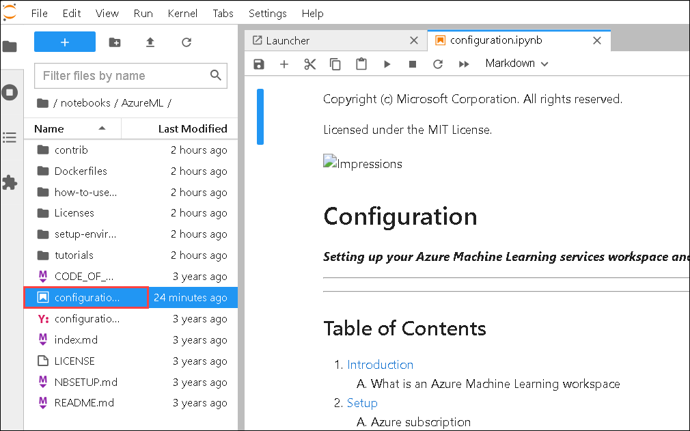

1. Set the Kernel as **Python 3.6 - AzureML - AutoML** (1), scroll down and select the cell under **Azure ML SDK and other Library Installation** (2) and click on **Run > (3)** icon to execute the notebook. You will see the output(4) as shown in the screenshot.

   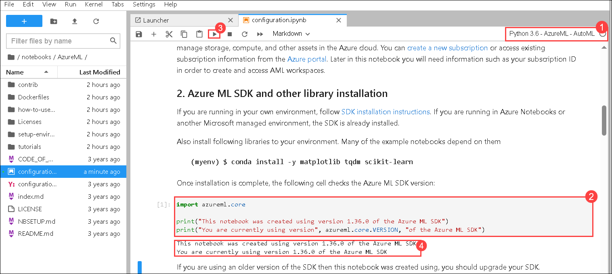
   
1. Before executing the remaining cells, login to the **Azure Portal** (<http://portal.azure.com>) using the following email/username and Password 

   * **Azure Username/Email**:  <inject key="AzureAdUserEmail"></inject> 
   * **Azure Password**:  <inject key="AzureAdUserPassword"></inject>

1. In the Azure portal click on the Subscriptions option. Copy the Subscription ID and paste it in a notepad file as we will need it in the next step.

    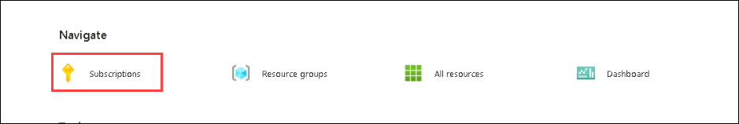

    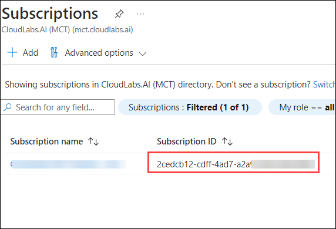

1. Scroll down and under the **Configure your Azure ML Workspace** section provide the following details, leave the region as default, and run the cell.

    - Subscription ID: Paste the Subscription ID you had copied in the previous step.
    - Resource Group: **dslab-<inject key="Deployment ID" enableCopy="false" />**
    - Workspace Name: **ML-<inject key="Deployment ID" enableCopy="false" />**

     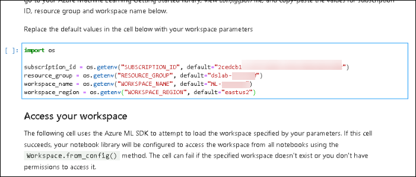
    
1. Now, run the cell under **Access your Workspace** section. Once you run this cell a new browser window will open up to sign into the Azure portal. Select the **<inject key="AzureAdUserEmail"></inject>** account and complete the authentication process.

    >**Note:** You will encounter an error message indicating that the workspace is not accessible. Proceed to the next step.
    
1. Scroll down and **run** the cell under **Create a new workspace** section.

1. Scroll down to the **Create compute resources for your training experiments** section. Update the size to **STANDARD_NC4AS_T4_V3** in both the **CPU Cluster** and **GPU cluster** creation cells, then run the cells in the same order.

    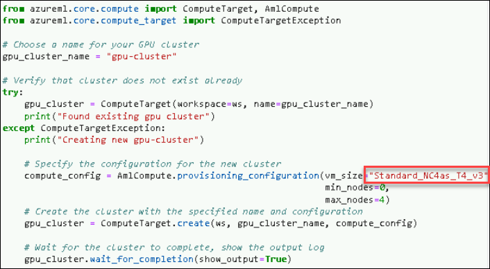

     >**Note:** While creating the CPU cluster or GPU cluster if you get a message stating that **Found existing cluster** in the output section, kindly rename the cluster and run the cell again.

1. After executing the notebook to check if you have successfully executed the notebook, verify if all the resources are created in the resource group **dslab-<inject key="DeploymentID"></inject>** in the Azure portal.

    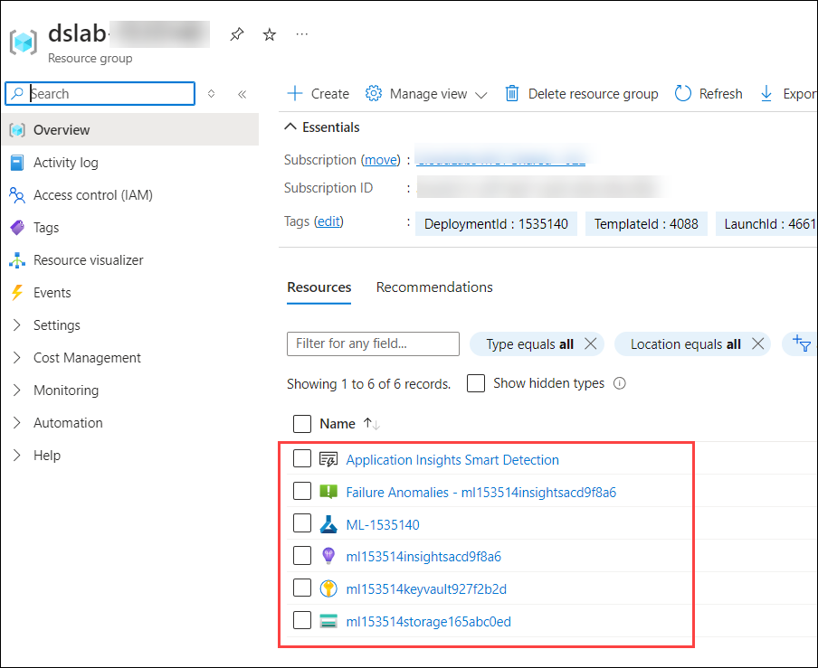
    
    >**Note** You might need to click **Refresh** periodically until all the resources appear in the **Resource Group**. You can proceed with the next step and come back later to verify the resources.

1. To ensure that the compute resources **cpu-cluster and gpu-cluster** as mentioned in the notebook are created click on the  **ML-<inject key="DeploymentID"></inject>** resource.

    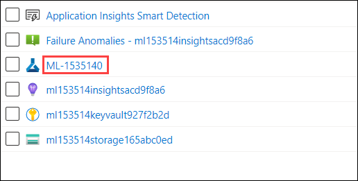

1. In the ML workspace Overview page, click on the Studio Web URL which will direct you to the Machine learning Studio window.

    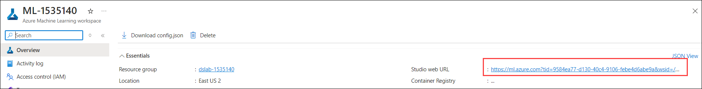

1. In the Machine Learning studio window, from the left navigation pane click on **Compute** option and navigate to the **Compute Clusters** tab to view the compute resources created.

    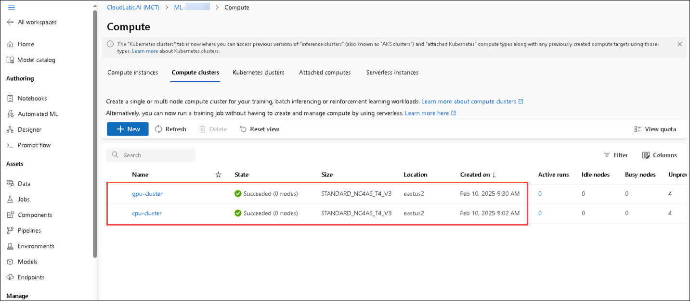

1. Similarly, you can navigate to the **/notebooks** directory which has a lot of sample notebooks loaded up for the various technologies and are pre-provisioned within the lab environment. You can explore through the notebooks and perform any exercise with the datascience virtual machine (DSVM).
   
 ## Summary
 
 In this lab environment, you have accessed the JupyterLab application, executed a notebook to configure the Azure Machine learning workspace, and explored other notebooks.

## You have successfully completed the workshop.
   

