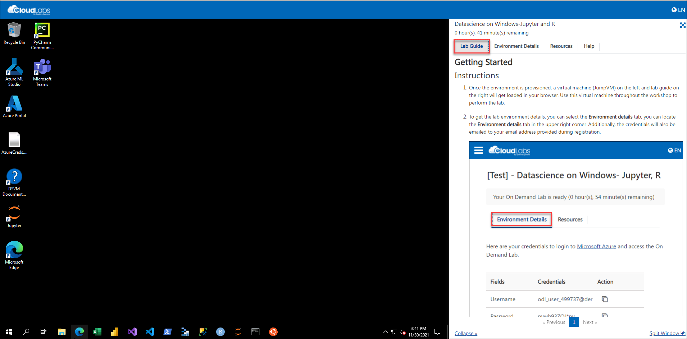
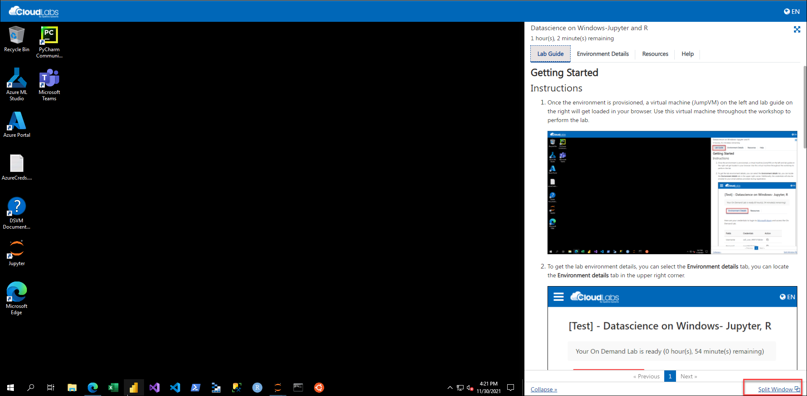
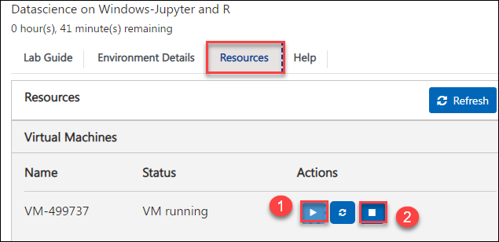
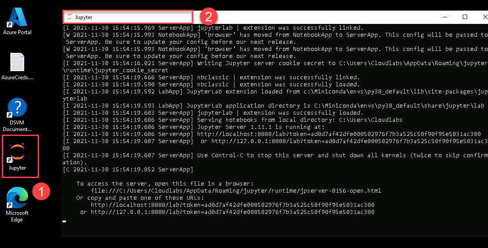
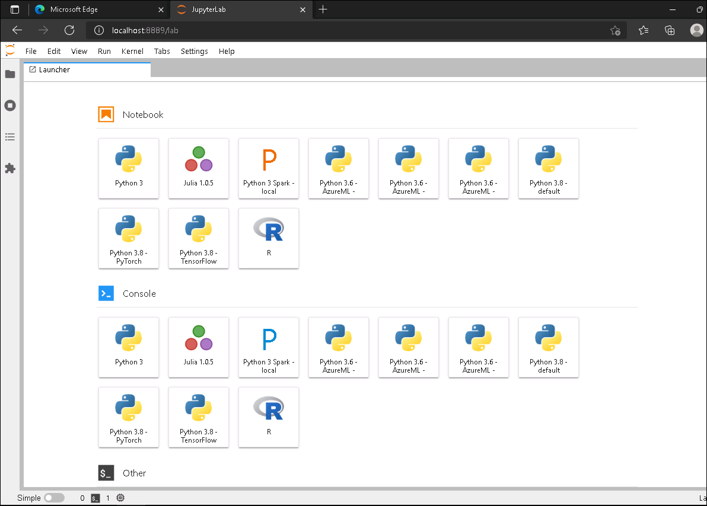
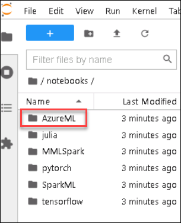
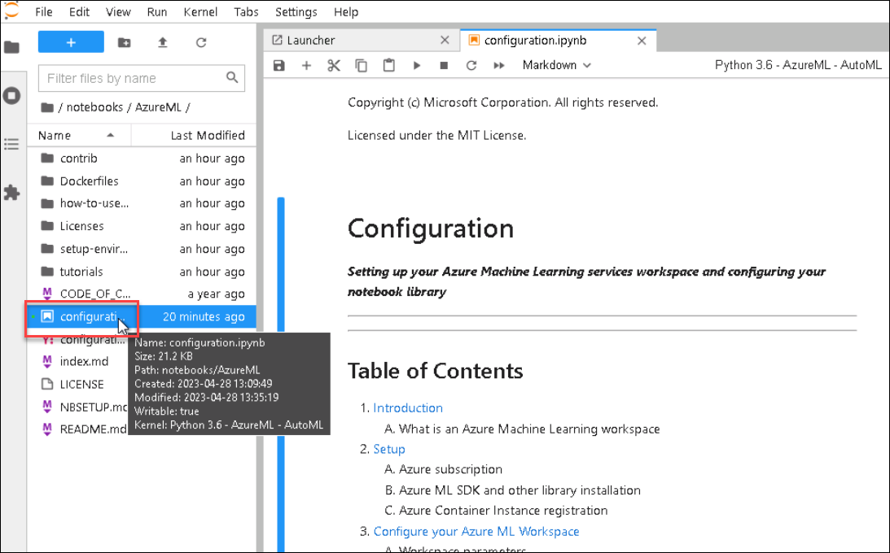
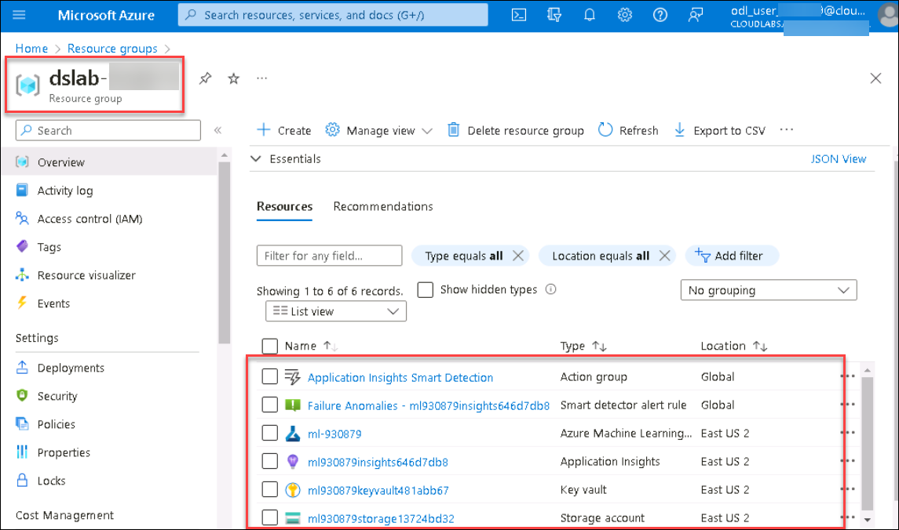
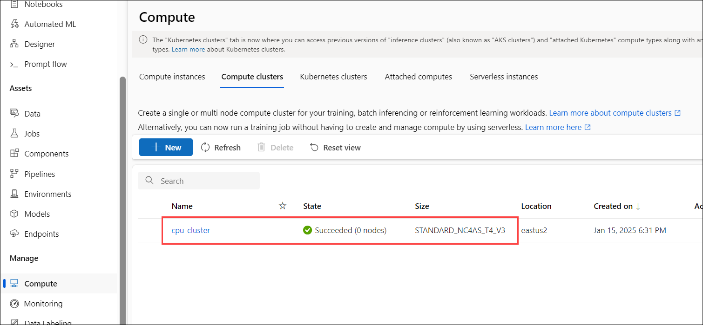

# Getting started with Datascience

## Overview

In this lab environment, you will be able to access the Windows Data Sciemce VM which has several popular tools for data exploration, analysis, modeling & development pre-installed.

The Windows Data Science Virtual Machine (DSVM) is a virtual machine image available in Azure that's preinstalled with a collection of tools commonly used for data analytics and machine learning.

The DSVM image makes it easy to get started doing data science in minutes, without having to install and configure each of the tools individually. You can easily stop it when it's not in use. The DSVM resource is both elastic and cost-efficient.

### JupyterLab
JupyterLab is the latest web-based interactive development environment for notebooks, code, and data. Its flexible interface allows users to configure and arrange workflows in data science, scientific computing, computational journalism, and machine learning. A modular design invites extensions to expand and enrich functionality.

### Jupyter Notebook
The Jupyter Notebook is the original web application for creating and sharing computational documents. It offers a simple, streamlined, document-centric experience.

After completing this lab, you will learn how to:

- Log in to JupyterLab Portal
- Execute Notebooks
- Verify the notebook execution output

## Instructions

1. Once the environment is provisioned, a virtual machine (JumpVM) on the left and lab guide on the right will get loaded in your browser. Use this virtual machine throughout the workshop to perform the lab.

   

2. To get the lab environment details, you can select the **Environment details** tab, you can locate the **Environment details** tab in the upper right corner.
   
   

3. You can also open the Lab Guide on a separate full window by selecting the **Split Window** button on the bottom right corner.
   
   
 
4. You can **start(1)** or **stop(2)** the Virtual Machine from the **Resources** tab.

   
   
## Access the JupyterLab Application

1. In the virtual machine, double click on the **Jupyter** icon on the desktop to start the Jupyter Notebook.

2. This will open up a command prompt and a browser will automatically load and navigate you to the JupyterLab application.

   
   
3. Once the Jupyter Lab loads up, you will see the File System on the left and **Launcher** on the right. 

   
   
4. Navigate to the **/notebooks** directory which has a lot of sample notebooks loaded up for the various technologies and are pre-provisioned within the lab environment.

   
   
5. For this lab demonstration, select the **AzureML** folder.

   

6. Select the notebook named **configuration.ipynb** using which you will set up your Azure Machine Learning services workspace and configuring the notebook library.

   

7. Execute the notebook while ensuring the Kernel is **Python 3.6 - AzureML - AutoML** (1) , select the cell (2) and click on **Run > (3)** icon.
   You will see the output(3) as shown in the screenshot.

   
   
8. Before executing the next cells, login to the **Azure Portal** (<http://portal.azure.com>) using the following email/username and Password and ensure to use the resource group **dslab-<inject key="DeploymentID"></inject>** for performing the lab

   * **Azure Username/Email**:  <inject key="AzureAdUserEmail"></inject> 
   * **Azure Password**:  <inject key="AzureAdUserPassword"></inject>

9. Continue to run the remaining cells and provide the necessary values of Subscription ID, Resource Group, Workspace name whereever required. 
   You can get the values by logging to the **Azure Portal** (<http://portal.azure.com>) and resource group  **dslab-<inject key="DeploymentID"></inject>** overview page.

10. After executing the notebook to check if you have successfully executed the notebook, verify if all the resources are created in the resource group **dslab-<inject key="DeploymentID"></inject>** .
   
    
11. Also, ensure if the compute resources **cpu-cluster and gpu-cluster** as mentioned in the notebook are created by navigating to the Machine Learning studio and **Compute** tab.
    

11. Similarly, you can navigate to the **/notebooks** directory which has the notebooks that are pre-packaged with a lot of samples loaded up for the various technologies. You can explore through the notebooks and perform any exercise with the environment.
   
 ## Summary
 
 In this lab environment, you have accessed the JupyterLab application, executed a notebook to configure the Azure Machine learning workspace and explored other notebooks.

   

