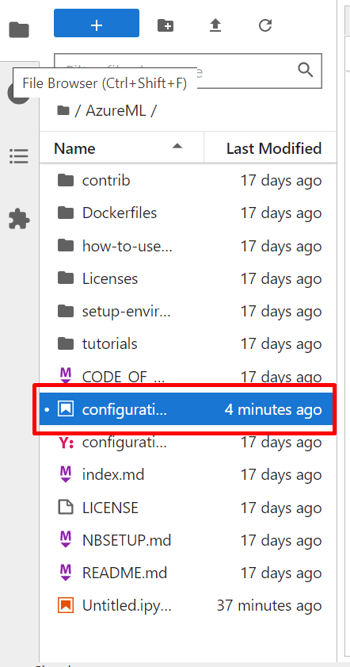

# Getting started with Datascience

## Overview

In this lab environment, you will be able to access the windows VM which has several popular tools for data exploration, analysis, modeling & development pre-installed.

## Instructions

1. Once the environment is provisioned, a virtual machine (JumpVM) on the left and lab guide on the right will get loaded in your browser. Use this virtual machine throughout the workshop to perform the lab.

   

2. To get the lab environment details, you can select the **Environment details** tab, you can locate the **Environment details** tab in the upper right corner.
   
   

3. You can also open the Lab Guide on a separate full window by selecting the **Split Window** button on the bottom right corner.
   
   
 
4. You can **start(1)** or **stop(2)** the Virtual Machine from the **Resources** tab.

   
   
## Access the JupyterLab Application

1. In the virtual machine, double click on the **Jupyter** icon on the desktop to start the Jupyter Notebook.

2. This will open up a command prompt and a browser will automatically load and navigate you to the JupyterLab application.

   
   
3. Once the Jupyter Lab loads up, you will see the File System on the left and **Launcher** on the right. 

   
   
4. Navigate to the **/notebooks** directory which has a lot of sample notebooks loaded up for the various technologies and are pre-provisioned within the lab environment.

   
   
5. For this lab demonstration, select the **AzureML** folder.

   

6. Select the notebook named **configuration.ipynb** using which you will set up your Azure Machine Learning services workspace and configuring the notebook library.

   

7. Execute the notebook while ensuring the Kernel is **Python 3.6 - AzureML - AutoML** (1) , select the cell (2) and click on **Run > (3)** icon.
   You will see the output(3) as shown in the screenshot.

   
   
8. Continue to run the remaining cells and provide the necessary values of Subscription ID, Resource Group, Workspace name whereever required.
   >You can get the values by logging to the Azure Portal using the credentials provided in the Environment details tab of the environment page.

9. To check if you have successfully executed the notebook, navigate to the **Azure Portal** (<http://portal.azure.com>) and resource group **dslab-<inject key="DeploymentID"></inject>** and verify if all the resources are created.
   
    
10. Ensure if the compute resources **cpu-cluster and gpu-cluster** as mentioned in the notebook are created by navigating to the Machine Learning studio and Compute tab.
    

11. Similarly, you can navigate to the /notebooks directory which has the notebooks that are pre-packaged with a lot of samples loaded up for the various technologies. You can explore through the notebooks and perform any exercise with the environment.
   
 ## Summary
 
 In this lab environment, you have accessed the JupyterLab application, executed a notebook to configure the Azure Machine learning workspace and explored other notebooks.

   

