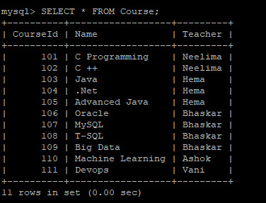

# Exercise 1: MySQL Learning


## Database: A database is a structured collection of data.

Data is a collection of a distinct small unit of information. It can be used in a variety of forms like text, numbers, media, bytes, etc. it can be stored in pieces of paper or electronic memory.

A database is an organized collection of data, so that it can be easily accessed and managed. You can organize data into tables, rows, columns, and index it to make it easier to find relevant information.


## SQL(structured query language) – the language of the relational database
SQL or Structured Query Language is used to operate on the data stored in a database. SQL depends on relational algebra and tuple relational calculus.
SQL contains three parts:
   - **Data definition language** DDL is abbreviation of Data Definition Language. It is used to create, modify and destroy the structure of database objects in database.
   - **Data manipulation language** DML is abbreviation of Data Manipulation Language. It is used to retrieve, modify, add, and delete data in database.
   - **Data control language** DCL is abbreviation of Data Control Language. It is used to create roles, permissions, and referential integrity as well it is used to control access to database by securing it.
   - **Transaction Control Language** TCL is abbreviation of Transactional Control Language. It is used to manage different transactions occurring within a database.


## MySQL

MySQL is a relational database management system (RDBMS) developed by Oracle that is based on structured query language (SQL). It stores that information in separate “tables” and connects it with “keys”, which is why it’s relational. When your Website needs to access the information, it sends a request to the MySQL database server using SQL (this is the client-server model). MySQL uses something called the client-server model. The server part is where your data actually resides. In order to access this data, you need to request it. That’s where the client comes in. Using SQL programming language we mentioned earlier, the client sends a request to the database server for the data that the client needs.


### Task 1: Connect to MySQL server(In Ubuntu VM)

In this task, we are going to connect to the pre-installed MySQL server inside the Jump VM. In MySQL, we'll execute various queries for building, examining, connecting, and removing databases.

1. You will be connected to the Linux Virtual Machine as demouser, which has already been provisioned.

1. Execute the below query to connect to the MySQL Server from terminal.

   ```
   sudo mysql -u root
   ```
   
1. Once you are connected to the MySQL server, a welcome message will be displayed and the `mysql>` prompt appears as shown below.

   

1. Run the below query to view all databases in the current server. 
    
    ```
    show databases;
    ```
    The output for the above query will be simlar to below screenshot.
    
    
    
1. Execute the below query to create a sample database named **demo**. We will be using this database in further steps of this task.
    
    ```
    CREATE DATABASE demo;
    ```
   An output message will be prompted  as shown below after running the above command successfully which shows `Query OK, 1 row affected (0.02 sec)`.
   
   
   
1. Run the below query for using the database **demo** which we created in the previous step. After running the command you will be prompted with a message saying **Database changed** which refers to change in database from Default to **Demo**.
   
   ```
   USE demo;
   ```
   
   
1. Run the below query to delete the database **demo** which we created in step 7. The query will give an output message which says **Query OK, 0 rows affected (0.03 sec)**. **DROP DATABASE** command is used for deleting the databases in MySQL. 
   
   ```
   DROP DATABASE demo;
   ```
   

### Task 2: CRUD(Create, Read, Update and Delete) operations in MySQL

MySQL provides a set of some basic operations that will help you to easily interact with the MySQL database and these operations are known as CRUD operations. 
Let's look at the examples below to learn about CRUD operations in MySQL. In the supporting examples, we'll use the MySQL database to write all of the queries.

CRUD is an acronym that stands for Create, Read, Update, and Delete. 

1. Run the below commands to create a new database named **sample** and a table named **sample_table**. 

   ```
   CREATE DATABASE sample;
   USE sample;
   CREATE TABLE sample_table ( id smallint unsigned not null auto_increment, name varchar(20) not null, constraint pk_example primary key (id) );
   ```
   
   
1. Now you created a table named **sample_table** inside the database **sample**.
   
1. In the next step, run the following query to insert the data to the **sample_table**. SQL uses **INSERT INTO** statement to create new records within the table.
   
   ```
   INSERT INTO sample_table ( id, name ) VALUES ( 1, 'Sample data1' );
   INSERT INTO sample_table ( id, name ) VALUES ( 2, 'Sample data2' );
   INSERT INTO sample_table ( id, name ) VALUES ( 3, 'Sample data3' );
   ```
   
   
1. Execute the following query in order to view the data inside **sample_table**. You will be prompted with a table with two fields named **id** and **name** with data. 
   
   ```
   SELECT * FROM sample_table;
   ```
   
   
1. Run the below query to select only the **name** field from the **sample_table** which we created in the previous steps of this task.
   
   ```
   SELECT name FROM sample_table;
   ```
   
   
1. Execute the below query and observe the updated data under **name** column with **id=2**. To update values in the multiple columns of the table, you need to specify the assignments with **SET** clause.
   
   ```
   UPDATE sample_table SET name = 'Hill' WHERE id = 2;
   ```
   
   
   > Note: Now you have successfully updated the table with new value under **name** cloumn
   
1. Run the below query to view the changes that have been done to the table **sample_table**.
    
    ```
     SELECT * FROM sample_table;
    ```
    
    
1. Execute the following query to delete the row where **id=3** inside the **sample_table**. We will be using **DELETE FROM** command with **WHERE** clause to delete the specific data inside the table.
   
   ```
   DELETE FROM sample_table WHERE id=3;
   ```
   
   
   > Note :The above command will delete the row with **id=3**.
   
1. Run the below query to view the changes that have been done in table after running **DELETE FROM** command.
    
    ```
     SELECT * FROM sample_table;
    ```
    
    
1. Run the following query to delete the table **sample_table** which we created in the step 1. **DROP TABLE** command is used to delete the complete table inside database. You will be prompted with a `Query OK, 0 rows affected (0.30 sec)` message after running the following command.
   
    ```
    DROP TABLE sample_table;
    ```
    
    
### Task 3: Clauses in MySQL

In this task, we will use various clauses that let you to filter how your data is queried to you. MySQL queries are SQL functions that allow us to get specific records from a database table. We will use different clauses to understand and comprehend the principles of MySQL commands in the database. In the following task we will use **SELECT**, **FROM**, **WHERE**, **GROUP BY**, **HAVING**, **ORDER By** clauses to get information or data from the database and observe how clauses will work for fetching the data.

1. Execute the following query to creates a new table **Course** and insert the different values into the table. We will use this table in further steps for learning the clauses in MYSQL.
   
   ```
   CREATE TABLE Course
   (
    CourseId INT PRIMARY KEY,
    Name NVARCHAR(50) NOT NULL,
    Teacher NVARCHAR(256) NOT NULL
   );
   ```
   ```
   INSERT INTO Course ( CourseId, Name, Teacher ) VALUES ( 101, 'C Programming', 'Neelima' );
   INSERT INTO Course ( CourseId, Name, Teacher ) VALUES ( 102, 'C ++', 'Neelima' );
   INSERT INTO Course ( CourseId, Name, Teacher ) VALUES ( 103, 'Java', 'Hema' );
   INSERT INTO Course ( CourseId, Name, Teacher ) VALUES ( 104, '.Net', 'Hema' );
   INSERT INTO Course ( CourseId, Name, Teacher ) VALUES ( 105, 'Advanced Java', 'Hema' );
   INSERT INTO Course ( CourseId, Name, Teacher ) VALUES ( 106, 'Oracle', 'Bhaskar' );
   INSERT INTO Course ( CourseId, Name, Teacher ) VALUES ( 107, 'MySQL', 'Bhaskar' );
   INSERT INTO Course ( CourseId, Name, Teacher ) VALUES ( 108, 'T-SQL', 'Bhaskar' );
   INSERT INTO Course ( CourseId, Name, Teacher ) VALUES ( 109, 'Big Data', 'Bhaskar' );
   INSERT INTO Course ( CourseId, Name, Teacher ) VALUES ( 110, 'Machine Learning', 'Ashok' );
   INSERT INTO Course ( CourseId, Name, Teacher ) VALUES ( 111, 'Devops', 'Vani' );
   ```
1. Run the following query inorder to view the data created inside the **Course** table.
   
   ```
   SELECT * FROM Course;
   ```
   
   
1. Execute the below query to select the Name and Teacher field from **Course** table. In the below query we will use **select**, **from**, **Where** clauses. **Select** clause is used to retrieve the from the table. Using **from** clause, you can mention the source table from where data is going to be fetched. **Where** clause is used to specify a condition while fetching the data from a table. Observe how clauses will work for fetching the data.
 
   ```
   SELECT Name, Teacher FROM Course WHERE Teacher='Hema';
   ```
   
   
1. Run the following query with the **GROUP BY** clause, which is used to aggregate the data from the **Course** table.
   
   ```
   SELECT count(CourseId) N_subjects, Teacher FROM Course GROUP BY Teacher;
   ```
   
   
1. Run the following query with **HAVING** clause, which will be used to restrict the data upon data aggregation(along with GROUP BY).
   > Note: **HAVING** clause works only with the **GROUP BY** clause.
  
    ```
    SELECT count(CourseId) N_subjects, Teacher FROM Course GROUP BY Teacher HAVING count(CourseId) > 1;
    ```
    
    
1. The following query with **ORDER By** clause is used to order the data based on the required field from the source table. Run the query and observe the order of Teacher field in the output.

   ```
   SELECT Name, Teacher, CourseId FROM Course ORDER BY Teacher;
   ```
   
   
1. Below is an example query with all the clauses. Run the following query and you can explore the different clauses in MySQL by changing the fields in the above queries.
   
   ```
   SELECT count(CourseId) N_subjects, Teacher FROM Course WHERE Teacher != 'Hema' GROUP BY Teacher HAVING count(CourseId) > 1 ORDER BY Teacher;
   ```
   

### Task 4: Update, Delete and Replace commands in MySQL

We will use **UPDATE**, **DELETE** and **REPLACE** commands in this task for performing different operations inside the MySQL tables. SQL **UPDATE** command can be used to modify any field value of any MySQL table. The **DELETE** statement is used to delete existing records in a table. The **REPLACE** statement in MySQL is an extension of the SQL standard. **REPLACE** statement works the same as the INSERT statement, except that if an old row matches the new record in the table for a PRIMARY KEY or a UNIQUE index, this command deletes the old row before the new row is added.

1. Execute below query and hit **Enter**. The below **Update** command is used to update the data in the **Course** table. The following query replaces course ID **101** with **1001** inside **Course** table.
   
   ```
   UPDATE Course SET CourseId = 1001 WHERE CourseId = 101;
   ```
   
   
1. Run following query and observe that the Name Bhaskar is replced with **John**. **REPLACE** command replaces all occurrences of a substring within a string, with a new substring. 
   
   ```
   SELECT CourseId, Name, Teacher, REPLACE (Teacher, 'Bhaskar', 'John') Teacher_New FROM Course;
   ```
   
   
1. Execute the following query and you will be prompted with a message saying `Query OK, 2 rows affected (0.03 sec)` after running it successfully. **DELETE FROM** command is used to delete the records based on the given condition from the table. The below command deletes the Teacher with name **Neelima** from **Course** table.

   ```
   DELETE FROM Course WHERE Teacher = 'Neelima';
   ```
   Execute the following query and observe the data inside the **Course** table after deleting fields with name **Neelima**.
   
   

### Task 5: Joins in MySQL

In this task, we will use different queries to learn about **JOINS** in MySQL. A JOIN clause is used to combine rows from two or more tables, based on a related column between them. MySQL JOINS are used to retrieve data from multiple tables. A MySQL JOIN is performed whenever two or more tables are joined in a SQL statement. There are different types of MySQL joins:

   - MySQL INNER JOIN (or sometimes called simple join)
   - MySQL LEFT OUTER JOIN (or sometimes called LEFT JOIN)
   - MySQL RIGHT OUTER JOIN (or sometimes called RIGHT JOIN)
    
1. Let us create one more table named **Qualification** and insert different values to the table by running the following queries. We need two tables for performing the actions in MySQL using Joins. 
   
   ```
   CREATE TABLE Qualification
   (
    Qualification Varchar(20),
    Teacher_Name VARCHAR(50) PRIMARY KEY,
    Year_of_Passed DATE 
   );
   ```
   ```
   INSERT INTO Qualification( Qualification, Teacher_Name, Year_of_Passed ) VALUES ( 'MCA', 'Neelima', '2015-04-30' );
   INSERT INTO Qualification( Qualification, Teacher_Name, Year_of_Passed ) VALUES ( 'BCA', 'Hema', '2012-06-30' );
   INSERT INTO Qualification( Qualification, Teacher_Name, Year_of_Passed ) VALUES ( 'MCA', 'Bhaskar', '2012-04-10' );
   INSERT INTO Qualification( Qualification, Teacher_Name, Year_of_Passed ) VALUES ( 'PHD', 'John', '2019-01-04' );
   INSERT INTO Qualification( Qualification, Teacher_Name, Year_of_Passed ) VALUES ( 'MCA', 'Vani', '2017-04-30' );
   INSERT INTO Qualification( Qualification, Teacher_Name, Year_of_Passed ) VALUES ( 'MSC', 'Ashok', '2014-07-30' );
   ```
1. Run the following query to perform **INNER JOIN** operation on the tables **Course** and **Qualification**. Inner join is used to join both the tables. Data qualified only when the data exist in both the tables.(Based on the given fields). 
   > Note: In general, primary key fields will be used to join the tables.
   ```
   SELECT CourseId, Name, Teacher, Qualification, Year_of_Passed FROM Course A INNER JOIN Qualification B on A.Teacher  = B.Teacher_Name;
   ```
   
   
1. Execute the following query and observe the **LEFT OUTER JOIN** operation. Left outer join is used to qualify all the records from the left table **Course** and only matched records from the right tabl **Qualification**.
   ```
   SELECT CourseId, Name, Teacher, Qualification, Year_of_Passed FROM Course A LEFT OUTER JOIN Qualification B on A.Teacher  = B.Teacher_Name;
   ```
   
   
1. Execute the following query and observe the output data. **RIGHT OUTER JOIN** is used to qualify all the records from the Right table **Qualification** and only matched records from the left table **Course**.
   
   ```
   SELECT CourseId, Name, Teacher, Qualification, Year_of_Passed FROM Course A RIGHT OUTER JOIN Qualification B on A.Teacher  = B.Teacher_Name;
   ```
   
   
## Summary
 
 In this Exercise, you have learned basic operations of MySQL for beginners. You can see the numbers on lab guide bottom area to switch on different exercises of lab guide. Click on **Next** to move to the next exercise.
