# Exercise 2: Getting Started with PostgreSQL Learning


## Overview

Each PostgreSQL server controls access to a number of databases. Databases are storage areas used by the server to partition information.

## PostgreSQL – PostgreSQL is the most advanced open source database server.

PostgreSQL is a powerful, open source object-relational database system. It has more than 15 years of active development and a proven architecture that has earned it a strong reputation for reliability, data integrity, and correctness. PostgreSQL runs on all major operating systems, including Linux, UNIX (AIX, BSD, HP-UX, SGI IRIX, Mac OS X, Solaris, Tru64), and Windows. It Supports many features of SQL including some advanced features. Several extensions can be installed to add additional functionality to PostgreSQL.

Importance of PostgreSQL:

  - Stores data securely.
  - Supports best practices.
  - Allows retrieving the data when the request is processed.
  - Is cross-platform and can run on many operating systems including Linux, FreeBSD, OS X, Solaris, and Microsoft Windows.

There are several tools available as front-end to PostgreSQL. Some of these tools are open sources while others are Paid tools Some of these tools are psql, pgAdmin, phpPgAdmin, pgFouine.


### Task 1: Connect to PostgreSQL server

In this section, you will learn how to manage databases in PostgreSQL including creating databases, modifying existing database features, and deleting databases.

1. Run the following query to connect to the PostgreSQL server from terminal.

   ```
   sudo su postgres
   psql
   ```
1. Once you are connected to the PostgreSQL server, a welcome message will be displayed and the `postgres=#` prompt appears as shown below.

   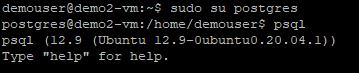

1. Run the following query to display all default databases in the current server. 
    
    ```
    \l
    ```
    The output for the above command will be similar to below screenshot.
    
    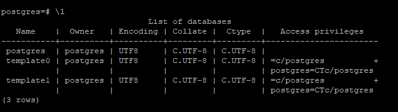
    
1. Execute the below query to create a sample database named **postgredb**. We will be using this database in further steps of this task. 

    ```
    CREATE DATABASE postgredb;
    ```
    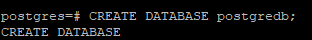
   
1. Run the below query for using the database **demo** which we created in the previous step. After running the command you will be prompted with a message saying **You are now connected to database "postgredb" as user "postgres"**.
   
   ```
   \c postgredb
   ```
   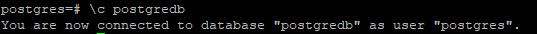
   
1. **DROP DATABASE** command is used for deleting the databases in PostgreSQL. however we are not dropping the database now as we will be using it in further tasks.


### Task 2: CRUD Operations in PostgreSQL

In this task we will learn about CRUD operations in PostgreSQL database which perform basic operations like reading and writing of data and creation and alteration of the schemas that store the data in that particular system.. CRUD stands for Create, Read, Update and Delete operations in a PostgreSQL database. So, for each operation in the PostgreSQL database, we have a dedicated query to perform those operations.

CRUD operations mean:
  - C- Create means "Insert the data".
  - R- Read means "Select the data".
  - U- Update means "Update the data".
  - D- Delete means "Delete the data".

1. Run the below query to create a new table named **sample_table** inside the **postgredb** database. The PostgreSQL **CREATE TABLE** statement is used to create a new table in any of the database.
   
   ```
   CREATE TABLE sample_table(id int, name varchar(15));
   ```
   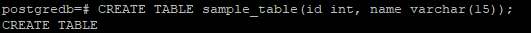
   
1. In the next step, you will insert the data to the **sample_table** by running the following queries. SQL uses **INSERT INTO** statement to create new records within the table.
   
   ```
   INSERT INTO sample_table ( id, name ) VALUES ( 1, 'Sample data1' );
   INSERT INTO sample_table ( id, name ) VALUES ( 2, 'Sample data2' );
   INSERT INTO sample_table ( id, name ) VALUES ( 3, 'Sample data3' );
   ```
   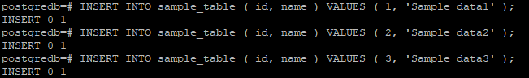
   
1. Run the following query in order to view the data created inside the **sample_table**. You will be prompted with a table with two fields named **id** and **name** with the inserted data from above query.
   
   ```
   SELECT * FROM sample_table;
   ```
   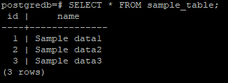
   
1. Execute the following query to select only the **name** field from the above table.
   
   ```
   SELECT name FROM sample_table;
   ```
   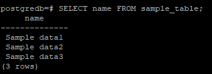
   
1. execute the below query and observe the updated data under **name** column with **id=2**. To update values in the multiple columns of the table, you need to specify the assignments with **SET** clause.

   ```
   UPDATE sample_table SET name = 'Hill' WHERE id = 2;
   ```
   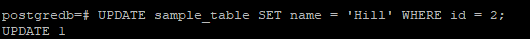
   
   > Note: Now you have successfully updated the table with new value under **name** cloumn
   
1. Run the below query to view the changes that have been done to the table **sample_table**.
    
    ```
    SELECT * FROM sample_table;
    ```
    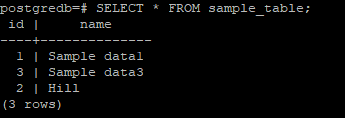
    
1. Execute the following query to delete the row with **id=3** inside the **sample_table**. We will be using **DELETE FROM** command with **WHERE** clause to delete the specific data inside the table.
   
   ```
   DELETE FROM sample_table WHERE id=3;
   ```
   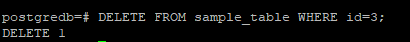
   
   > Note :The above command will delete the row **id=3**.
   
1. Run the below query and hit **Enter** to view the changes that have been done in table after running **DELETE FROM** command.

    ```
    SELECT * FROM sample_table;
    ```
    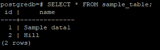
    
1. Execute the following query to delete the table **sample_table** which we created in the step 1. **DROP TABLE** command is used to delete the complete table inside database. you will be prompted with a `DROP TABLE` message after running the following command.
   
    ```
    DROP TABLE sample_table;
    ```
   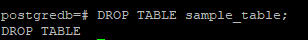
    
### Task 3: Clauses in PostgreSQL

In this task, we will use various clauses that let you to filter how your data is queried to you. A clause in PostgreSQL is a part of a query that lets you filter or customizes how you want your data to be queried to you. PostgreSQL queries are SQL functions that help us to access a particular set of records from a database table. We can request any information or data from the database using the clauses. In the following task we will use **SELECT**, **FROM**, **WHERE**, **WITH**, **GROUP BY**, **HAVING**, **ORDER By** clauses to get the data from the database and observe how clauses will work for fetching the data.


1. Run the following query to creates a new table **course** and insert the different values into the table. We will use this table in further steps for learning the clauses in PostgreSQL.
   
   ```
   CREATE TABLE Course
   (
   CourseId INT PRIMARY KEY,
   Name VARCHAR(50),
   Teacher VARCHAR(256)
   );
   ```
   ```
   INSERT INTO Course ( CourseId, Name, Teacher ) VALUES ( 101, 'C Programming', 'Neelima' );
   INSERT INTO Course ( CourseId, Name, Teacher ) VALUES ( 102, 'C ++', 'Neelima' );
   INSERT INTO Course ( CourseId, Name, Teacher ) VALUES ( 103, 'Java', 'Hema' );
   INSERT INTO Course ( CourseId, Name, Teacher ) VALUES ( 104, '.Net', 'Hema' );
   INSERT INTO Course ( CourseId, Name, Teacher ) VALUES ( 105, 'Advanced Java', 'Hema' );
   INSERT INTO Course ( CourseId, Name, Teacher ) VALUES ( 106, 'Oracle', 'Bhaskar' );
   INSERT INTO Course ( CourseId, Name, Teacher ) VALUES ( 107, 'MySQL', 'Bhaskar' );
   INSERT INTO Course ( CourseId, Name, Teacher ) VALUES ( 108, 'T-SQL', 'Bhaskar' );
   INSERT INTO Course ( CourseId, Name, Teacher ) VALUES ( 109, 'Big Data', 'Bhaskar' );
   INSERT INTO Course ( CourseId, Name, Teacher ) VALUES ( 110, 'Machine Learning', 'Ashok' );
   INSERT INTO Course ( CourseId, Name, Teacher ) VALUES ( 111, 'Devops', 'Vani' );
   ```
1. Run the following query inorder to view the data created inside the **Course** table.
   
   ```
   SELECT * FROM Course;
   ```
   
   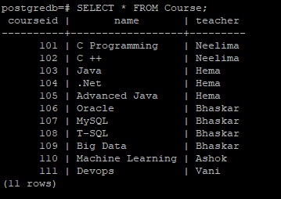
   
1. Execute the following query and hit **Enter** to select the Name and Teacher field from **Course** table. In the below query we will use **select**, **from**, **Where** clauses. **Select** clause is used to retrieve the from the table. Using **from** clause, you can mention the source table from where data is going to be fetched. **Where** clause is used to specify a condition while fetching the data from a table.
 
   ```
   SELECT Name, Teacher FROM Course WHERE Teacher='Hema';
   ```
   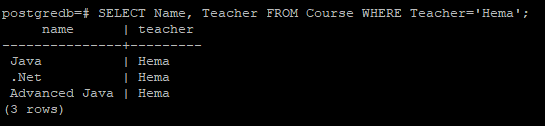
   
1. Run the following query with **GROUP BY** clause which is used to aggregate the data from the **Course** table.
   
   ```
   SELECT count(CourseId) N_subjects, Teacher FROM Course GROUP BY Teacher;
   ```
   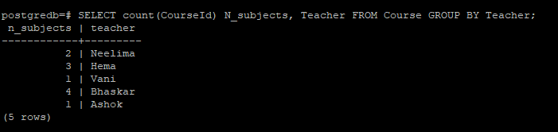
   
1. Run the following query with **HAVING** clause which will be used to restrict the data upon data aggregation(along with GROUP BY).
   > Note: **HAVING** clause works only with the **GROUP BY** clause.
  
    ```
    SELECT count(CourseId) N_subjects, Teacher FROM Course GROUP BY Teacher HAVING count(CourseId) > 1;
    ```
    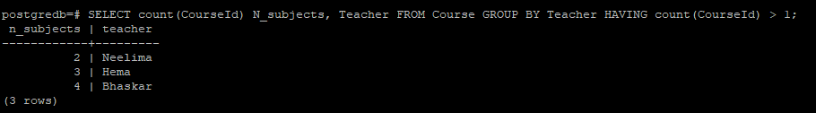
    
1. Execute following query with **ORDER By** clause is used to order the data based on the required field from the source table. Run the query and observe the order of Teacher field in the output.

   ```
   SELECT Name, Teacher, CourseId FROM Course ORDER BY Teacher;
   ```
   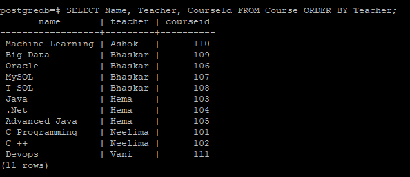
   
1. Run the following query and observe how **WITH** clause we can create a temporary table and perform required aggregations and filters.

   ```
   With temp_course AS ( SELECT COUNT(CourseId) N, Teacher FROM Course GROUP BY Teacher)
   (SELECT * FROM temp_course WHERE N > 1);
   ```
   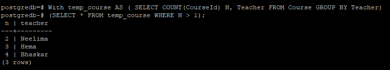
   
1. Below is an example query with all the clauses. Run the following query and you can explore the different clauses in PostgreSQL by changing the fields in the above queries.
   
   ```
   SELECT count(CourseId) N_subjects, Teacher FROM Course WHERE Teacher != 'Hema' GROUP BY Teacher HAVING count(CourseId) > 1 ORDER BY Teacher;
   ```
   
   

### Task 4: Update, Delete and Replace commands in PostgreSQL

In this task, we will use PostgreSQL **UPDATE** statement which can be used to modify any field value of any table and **DELETE** statement which is used to delete existing records in a table. The **REPLACE** statement in PostgreSQL works the same as the INSERT statement, except that if an old row matches the new record in the table for a PRIMARY KEY or a UNIQUE index, this command deleted the old row before the new row is added.

1. Execute the following query. In the below query **Update** command is used to update the data in the **Course** table. The following query replaces course ID **101** with **1001** inside **Course** table.
   
   ```
   UPDATE Course SET CourseId = 1001 WHERE CourseId = 101;
   ```
   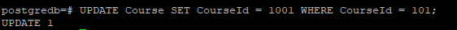
   
1. Run following query and observe that the Name Bhaskar is replced with **John**. **Replace command** is used to replace all occurrences of a substring within a string, with a new substring. 
   
   ```
   SELECT CourseId, Name, Teacher, REPLACE (Teacher, 'Bhaskar', 'John') Teacher_New FROM Course;
   ```
   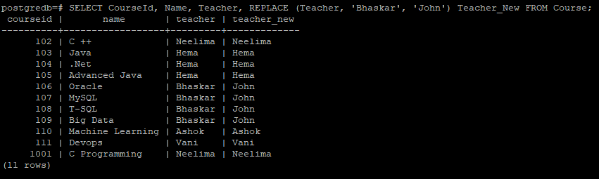
   
1. Execute the following query. **DELETE FROM** command is used to delete the records based on the given condition from the table. The below command deletes the Teacher with name **Neelima** from **Course** table.

   ```
   DELETE FROM Course WHERE Teacher = 'Neelima';
   ```
   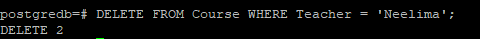
   
1. Run the following query inorder to view the data inside the **Course** table, observe the data that has been removed from the table.
   
   ```
   SELECT * FROM Course;
   ```
   
   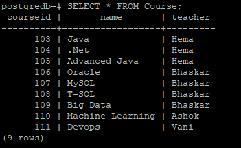
   

### Task 5: Joins in PostgreSQL

We will use PostgreSQL joins to combine columns from one (self-join) or more tables based on the values of the common columns between related tables. The common columns are typically the primary key columns of the first table and foreign key columns of the second table.

We will run the example queries with joins including inner join, left join, right join, and full outer join in the following task. Observe the data and changes made to the table after running each query.
    
1. Let us create one more table named **Qualification** and insert different values to the table by running the following queries. We need two tables for performing the actions in PostgreSQL using Joins. 
   
   ```
   CREATE TABLE Qualification
   (
    Qualification Varchar(20),
    Teacher_Name VARCHAR(50) PRIMARY KEY,
    Year_of_Passed DATE 
   );
   ```
   ```
   INSERT INTO Qualification( Qualification, Teacher_Name, Year_of_Passed ) VALUES ( 'MCA', 'Neelima', '2015-04-30' );
   INSERT INTO Qualification( Qualification, Teacher_Name, Year_of_Passed ) VALUES ( 'BCA', 'Hema', '2012-06-30' );
   INSERT INTO Qualification( Qualification, Teacher_Name, Year_of_Passed ) VALUES ( 'MCA', 'Bhaskar', '2012-04-10' );
   INSERT INTO Qualification( Qualification, Teacher_Name, Year_of_Passed ) VALUES ( 'PHD', 'John', '2019-01-04' );
   INSERT INTO Qualification( Qualification, Teacher_Name, Year_of_Passed ) VALUES ( 'MCA', 'Vani', '2017-04-30' );
   INSERT INTO Qualification( Qualification, Teacher_Name, Year_of_Passed ) VALUES ( 'MSC', 'Ashok', '2014-07-30' );
   ```
1. Run the following query to perform **INNER JOIN** operation on the tables **Course** and **Qualification**. Inner join is used to join both the tables. Data qualified only when the data exist in both the tables.(Based on the given fields). 
   > Note: In general, primary key fields will be used to join the tables.

   ```
   SELECT CourseId, Name, Teacher, Qualification, Year_of_Passed FROM Course A INNER JOIN Qualification B on A.Teacher  = B.Teacher_Name;
   ```
   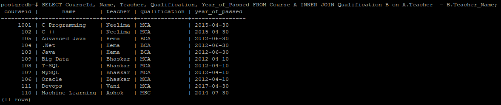
   
1. Run the below query and observe the **Left outer join** operation. Left outer join is used to qualify all the records from the left table **Course** and only matched records from the right tabl **Qualification**.

   ```
   SELECT CourseId, Name, Teacher, Qualification, Year_of_Passed FROM Course A LEFT OUTER JOIN Qualification B on A.Teacher  = B.Teacher_Name;
   ```
   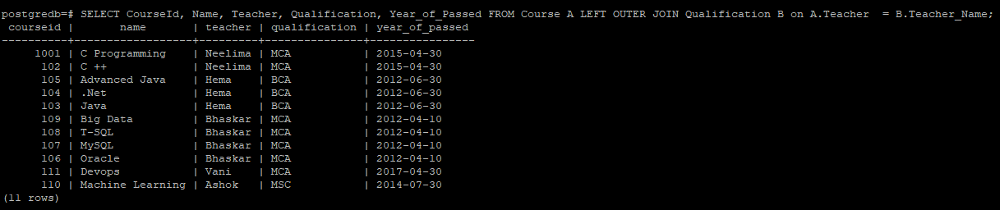
   
1. Execute following query and observe the output data inside table. **Right outer join** is used to qualify all the records from the Right table(Qualification) and only matched records from the left table(Course).
   
   ```
   SELECT CourseId, Name, Teacher, Qualification, Year_of_Passed FROM Course A RIGHT OUTER JOIN Qualification B on A.Teacher  = B.Teacher_Name;
   ```
   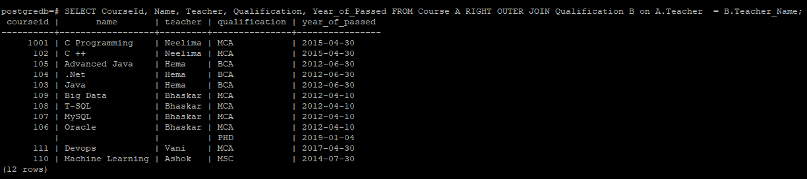
   
1. Run the following query to perform **FULL OUTER JOIN** operation on the tables **Course** and **Qualification**. The full outer join combines the results of both left join and right join. If the rows in the joined table do not match, the full outer join sets NULL values for every column of the table that does not have the matching row.
   
   ```
   SELECT CourseId, Name, Teacher, Qualification, Year_of_Passed FROM Course A FULL OUTER JOIN Qualification B on A.Teacher  = B.Teacher_Name;
   ```
   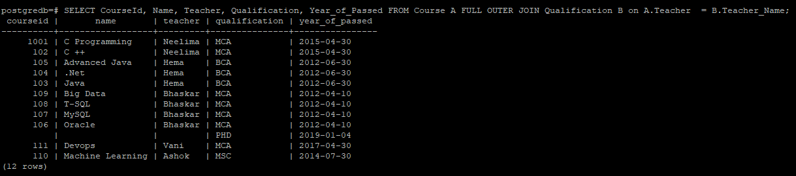
   
   > **Note:** Before moving to the next exercise enter the following command to exit from the PostgreSQL client.
    
   ```
   \q
   exit;
   ```
   
## Summary
 
 In this exercise, you have learned basic operations of PostgreSQL. Click on **Next** at the bottom of lab guide to move to the next exercise.
   


