# Exercise 3: Getting Started with MongoDB Learning


## Overview

NoSQL databases (Not only SQL) are non-tabular databases and store data differently than relational tables. NoSQL databases come in a variety of types based on their data model. The main types are document, key-value, wide-column, and graph. They provide flexible schemas and scale easily with large amounts of data and high user loads.

## MongoDB

MongoDB is an open-source document-oriented database that is designed to store a large scale of data and also allows you to work with that data very efficiently. It is categorized under the NoSQL (Not only SQL) database because the storage and retrieval of data in the MongoDB are not in the form of tables. 

The data stored in the MongoDB is in the format of BSON documents. Here, BSON stands for Binary representation of JSON documents. The MongoDB server converts the JSON data into a binary form that is known as BSON and this BSON is stored and queried more efficiently. MongoDB has a rich set of queries for performing fast and easy operations.

Basic building blocks of MongoDB:

  - **Collection**: Its group of MongoDB documents. This can be thought similar to a table MySQL. This collection doesn’t enforce any structure. 
  - **Document**: Document is referred to as a record in MongoDB collection. Which is similar to **Table** in MySQL.
  - **Field**: It is a name-value pair in a document. A document has zero or more fields. Fields are like columns in relational databases.


### Task 1: Create and Drop Database Operations in MongoDB

In this section, you will learn how to manage databases in MongoDB including creating databases, viewing database features, and deleting databases.

1. Run the following query to connect to the MongoDB server from terminal.

   ```
   mongo
   ```
1. Once you are connected to the MongoDB server, a welcome message will be displayed and the `>` prompt appears as shown below.

   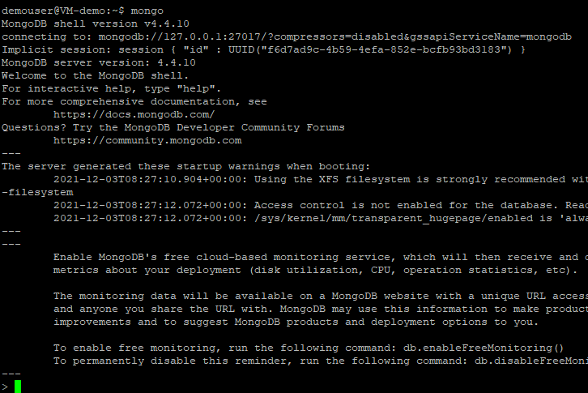

1. Run the following query to display all default databases in the current server. 
    
    ```
    show dbs;
    ```
    The output for the above command will be similar to below screenshot.
    
    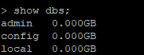
    
1. Execute the below query to create a sample database named **demodb** and connect to it. We will be using this database in further steps of this task. 

    ```
    use demodb;
    ```
    
   
1. Run the below query to create a connection inside **demodb** database. In MongoDB, we can't view the database until we create a connection inside the database.
   
   ```
   db.createCollection("Demo");
   ```
   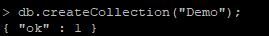
   
1. Run the following query to view the database **demodb** which we created in step 4. 
   
   ```
   show dbs;
   ```
   The output for the above command will be similar to below screenshot. Observe the newly added database in the output.
   
   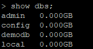
   
1. **db.dropDatabase();** command is used for deleting the databases in MongoDB. however we are not dropping the database now as we will be using it in further tasks.


### Task 2: MongoDB CRUD Operations

In this task we will learn about CRUD operations in MongoDB. CRUD stands for Create, Read, Update and Delete operations in MongoDB. 

CRUD operations mean:
  - C- Create or insert operations add new documents to a collection. If the collection does not currently exist, insert operations will create the collection.
  - R- Read operations retrieve documents from a collection; i.e. query a collection for documents. MongoDB provides the following methods to read documents from a collection.
  - U- Update operations modify existing documents in a collection. MongoDB provides the following methods to update documents of a collection.
  - D- Delete operations remove documents from a collection. MongoDB provides the following methods to delete documents of a collection.

1. Run the below query to create a new collection named **student** inside the **demodb** database. In MongoDB, **db.createCollection()** method is used to create collection.
   
   ```
   db.createCollection("student");
   ```
   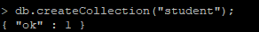
   
1. In the next step, you will insert the documents to the **student** collection by running the following queries. In MongoDB insert documents can be done using 2 methods, **insertOne()** and **insertMany()**. we are using **insertMany()** method here as we are inserting multiple documents.
   
   ```
   db.student.insertMany([
   { name:"Suraj", age:"21", department:"science"},
   { name:"Ram", age:"21", department:"maths"},
   { name:"Dev", age:"25", department:"history"},
   { name:"Tom", age:"26", department:"sociology"},
   { name:"Harry", age:"23", department:"science"}
   ]);
   ```
   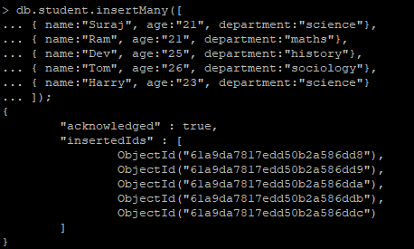
   
1. Run the following query in order to view the documents inside the **student** collection. 
   
   ```
   db.student.find();
   ```
   You will be prompted with documents within the **student** collection as shown below.
   
   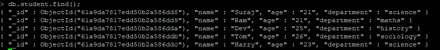
   
1. Execute the following query to output the documents in a formatted output. In MongoDB, we use **pretty()** method along with query for formatting the output data.
   
   ```
   db.student.find().pretty();
   ```
   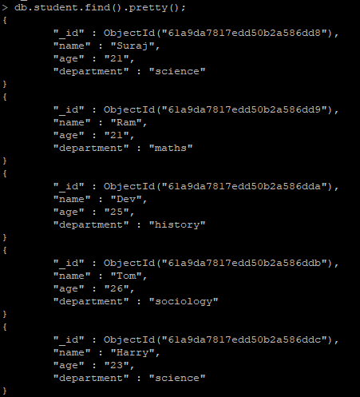
   
1. Run the below query and observe the output document. **findone()** method is used in MongoDB for retrieving the first document inside the collection.

   ```
   db.student.findOne();
   ```
   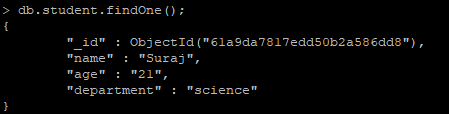
   
   > Note: The above query will select the first document inside **student** collection.
   
1. Execute the following query which select the records with **age=21**.
    
    ```
    db.student.find({"age":"21"}).pretty();
    ```
    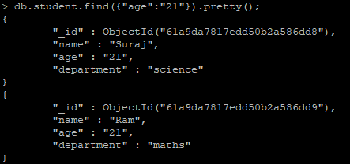
   
1. The MongoDB query language supports 2 update operations **updateOne()** and **updateMany()**. Run the below query and observe the output for **updateOne()** method.

   ```
   db.student.updateOne( {age: "25"}, {"$set": {"age": "24"}} );
   ```
   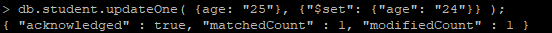
   
1. Execute the following query to view the updated document. The above query will update the value of **age=25** to **age=24** inside the **student** collection.
   
   ```
   db.student.find().pretty();
   ```
   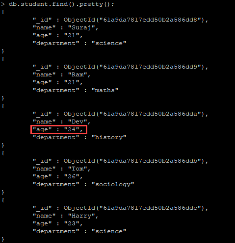
   
1. Execute the following query and observe the output for **updateMany()** method. This query will set all the records will **age=21** to **age=20**.
    
    ```
    db.student.updateMany( {age: "21"}, {"$set": {"age": "20"}} );
    ```
    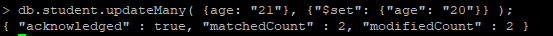
    
1. Execute the below query to view the updated document. Observe the updated values in the collection after running the query.
   
   ```
   db.student.find().pretty();
   ```
   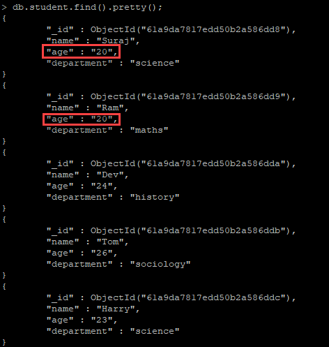

1. Run the following query to delete the **document** inside the student collection. MongoDB query language supports 2 delete operations **deleteOne()** and **deleteMany()**. In the below query we are using **deleteMany()** method to delete the multiple documents. 
   
   ```
   db.student.deleteMany( {age: "20"});
   ```
   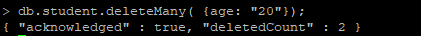
   
   
1. Run the below query to view the updated collection. The above query will delete all the records with **age=20** inside the **student** collection.

    ```
    db.student.find().pretty();
    ```
    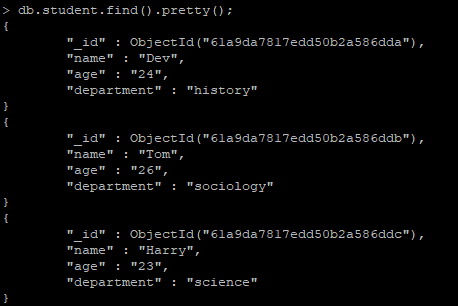
    
1. Execute the following query to delete the collection **student** which we created in the step 1. **db.COLLECTION_NAME.drop()** query is used to delete the whole collection inside the database. Once the collection is dropped successfully, you will be prompted with an output message `True`.
   
   > Note: Inside **db.COLLECTION_NAME.drop()**, **COLLECTION_NAME** refers to the name of the collection which you created.
   
    ```
    db.student.drop();
    ```
   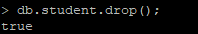
    
### Task 3: Comparison & Logical Operators in MongoDB

There are numerous operators that we can use in our queries to answer more and more complex questions related to our collection. Some of these operators help with learning more about the data stored in the collection whereas others help with understanding the metadata. In this task, we will execute and learn few of the **Comparison & Logical Operators** in MongoDB.


1. Run the below query to create a new collection named **teachers**  and insert the documents to collection inside the **demodb** database. We will be using this collection in the further tasks.
   
   ```
   db.createCollection("teachers");
   ```
   ```
   db.teachers.insertMany([
   { name:"Sam", age:"28", department:"science", year:"1994"},
   { name:"Ram", age:"30", department:"maths", year:"1992"},
   { name:"Jerry", age:"27", department:"history", year:"1995"},
   { name:"Tom", age:"23", department:"sociology", year:"1998"},
   { name:"Harry", age:"32", department:"science", year:"1989"}
   ]);
   ```
   
   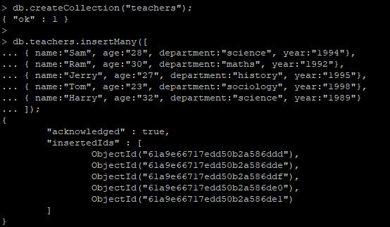
   
1. Run the following query inorder to view the documents added inside the **teachers** table.
   
   ```
   db.teachers.find().pretty();
   ```
   
   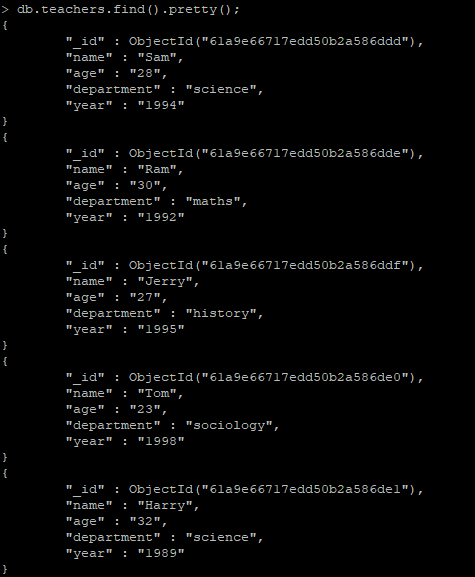
   
1. Execute the below to query and observe the ouput. **$gt** selects those documents where the value of the field is greater than (i.e. > ) the specified value.
   
   ```
   db.teachers.find({"age":{$gt:"30"}}).pretty();
   ```
   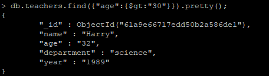
   
   > Note :The above query will return the records whose age is greater than 30 inside the **teachers** collection.
   
1. Run the below query check the ouput records. **$lt** selects those documents where the value of the field is greater than (i.e. < ) the specified value.

    ```
    db.teachers.find({"age":{$lt:"25"}}).pretty();
    ```
    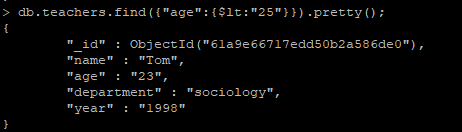
    
    > Note :The above query will return the records whose age is less than 25 inside the student collection.

1. Execute the below to query and observe the ouput. **$gte** selects those documents where the value of the field is greater than or equals  (i.e. >= ) to the specified value.
   
   ```
   db.teachers.find({"age":{$gte:"30"}}).pretty();
   ```
   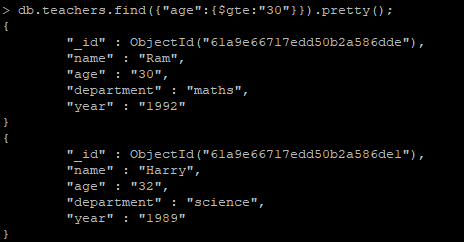
   
   > Note :The above query will return the records whose age is greater than or equals 30 inside the **teachers** collection.

1. Run the below to query and observe the ouput. **$lte** selects those documents where the value of the field is less than or equals (i.e. <= ) to the specified value.
   
   ```
   db.teachers.find({"age":{$lte:"30"}}).pretty();
   ```
   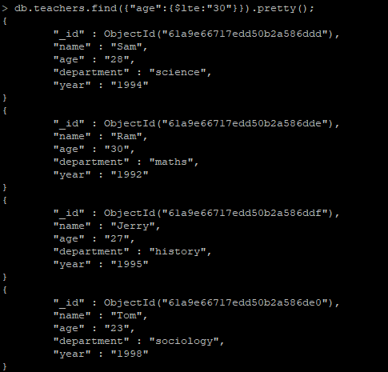
   
   > Note :The above query will return the records whose age is less than or equals 30 inside the **teachers** collection.
   
1. Execute the below to query and observe the ouput. **$ne** selects those documents where the value of the field is not equals (i.e. != ) to the specified value.
   
   ```
   db.teachers.find({"age":{$ne:"23"}}).pretty();
   ```
   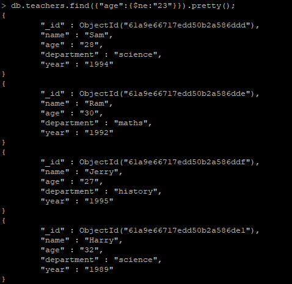
   
   > Note :The above query will return all the records except **age=23** inside the **teachers** collection.
   
1. Run the below query and observe the output records. **$and** operator evaluates one or more expressions and returns ouput only if all of the expressions are true. The following query will will return the document with **name=Sam** and **age=28**.
   
   ```
   db.teachers.find( { $and : [{age:"28"}, {name:"Sam"}]}).pretty();
   ```
   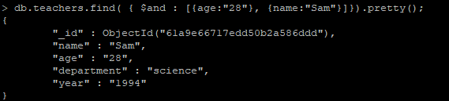

1. Run the below query and observe the output records. **$or** operator selects the documents that satisfy at least one of the expressions. The following query will will return the document with **name=tom** or **age=30**.
  
   ```
   db.teachers.find( { $or : [{"name":"zayn"},{"age":"30"}]}).pretty();
   ```
   As we all know we don't have any document with name **zayn** in the **teachers** collection. So the **$or** operator will return the document with **age=30** from the **teachers** collection as shown in the below screenshot.
  
   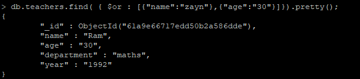

### Task 4: Aggregation Operators in MongoDB

When working with data in MongoDB, you may quickly have to run complex operations, with multiple stages of operations to gather metrics for your project. Generating reports and displaying useful metadata are just two major use cases of aggregation operations. MongoDB aggregation operations are incredibly useful, powerful, and flexible. We are going to learn about **$sort**, **$limit**, **$group** and **$match** operations in this task. 

1. Execute the following query. In the below query we are using **$sort** aggregate operator to take the document that specifies **name** field. Observe the output section which contains all name fields in alphabetical order.
   
   ```
   db.teachers.aggregate( 
   [{ $sort: {"name":1}}
   ]).pretty();
   ```
   
   
1. Run following query and observe how **$limit** operator is used along with **$sort** function to get the specific set of documents from the **teachers** collection. 
   
   ```
   db.teachers.aggregate(
   [{ $sort: {"name":1}}, 
   {$limit: 3}
   ]).pretty();
   ```
   
   
1. Execute the following query. We are using **$group** operator along with **$sum** operator for retrieving the grouped data from the **teachers** collection. Observe the output after running the query.

   ```
   db.teachers.aggregate(
   [{ $group: { "_id": "year", teacherCount: {$sum: 1}}}
   ]).pretty();
   ```
   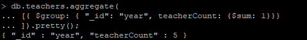
   
1. Run the following query inorder to view the document that matches the field **department** inside the **teachers** collection using **$match** aggregate operator.
   
   ```
   db.teachers.aggregate(
   [{ $match: {"department": "science"}}
   ]).pretty();
   ```
   
   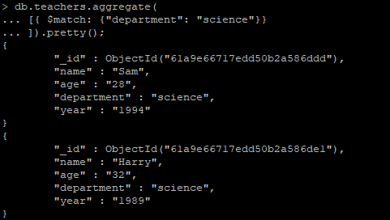
   
  > **Note:** Run the following command to exit from the MongoDB client.
    
   ```
   exit
   ```
   
## Summary
 
 In this exercise, you have learned basic operations of MongoDB. 
   


