# Lab 5: Introduction to Cloud Computing

## Prerequisites:
A VM with **Azure Data Studio** and **SQL Server Management Studio (SSMS)** pre-installed has been provided to you; please use these tools for the lab.

## SQL Databases

A **SQL Database** is a type of database that uses **Structured Query Language (SQL)** to manage and manipulate relational data. SQL databases store data in **tables** (rows and columns), where each table represents a different entity, and relationships between entities are defined using keys (e.g., primary and foreign keys).

Key features of SQL databases include:
- **Structured Data**: Data is stored in tables with predefined structures.
- **Relational Model**: Data is linked across tables using relationships such as primary and foreign keys.
- **SQL**: The language used to interact with the database, including querying, inserting, updating, and deleting data.
- **ACID Properties**: Ensures that database transactions are processed reliably and maintain data integrity (Atomicity, Consistency, Isolation, Durability).
  
Examples of SQL databases include **Microsoft SQL Server**, **MySQL**, **PostgreSQL**, and **Oracle Database**. These databases are widely used in various applications, including business systems, e-commerce, and financial applications.

In cloud computing, services like **Azure SQL Database** allow users to manage relational data in the cloud without the need for physical infrastructure management.

In this lab, we will create a SQL database in Azure and then query the data in that database.

### Task 1: Create a SQL Database on Azure

1. Log into your **Azure Portal** if you haven't already using the credentials
   
   - **Email/Username:** <inject key="AzureAdUserEmail"></inject>

   - **Password:** <inject key="AzureAdUserPassword"></inject>
   
2. In the left sidebar, click **Create a resource**, then search for **SQL Database**.

   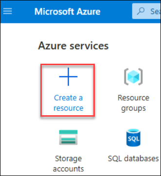

3. Click on **SQL Database** and then click **Create**.

   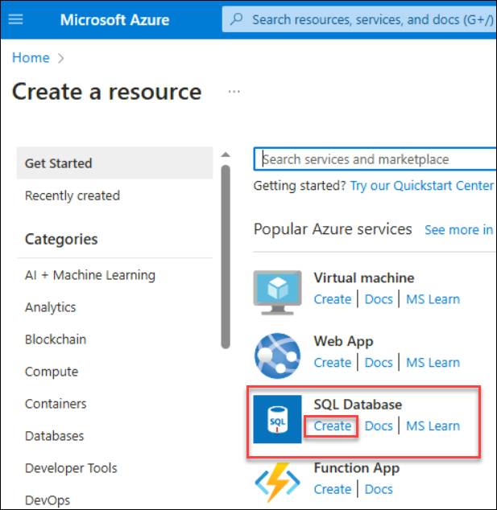

4. **On the Basics tab of the Create SQL Database form**, under **Project details**, select the existing **Azure Subscription** and **Resource group**  **cloudcomputing-<inject key="DeploymentID" enableCopy="false"/>** 

   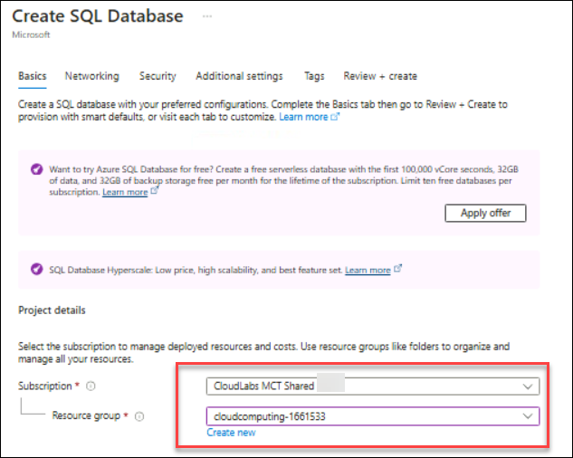

5. For **Database name**, enter **mydb-<inject key="DeploymentID" enableCopy="false"/>**. For **Server**, select **Create new**

   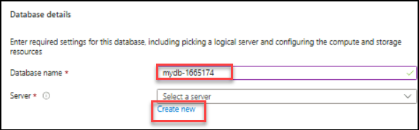

6. Fill out the **New server** form with the following values:
   - **Server name**: Enter **mysqlserver-<inject key="DeploymentID" enableCopy="false"/>** 
   - **Location**: Select a location from the dropdown list.
   - **Authentication method**: Select **Use both SQL and Microsoft Entra authentication**.
   - **Set Microsoft Entra admin**: Click on **Set admin** and search for **Username:** <inject key="AzureAdUserEmail"></inject> and select it
   - **Server admin login**: Enter `sqluser`.
   - **Password**: Enter a password that meets the requirements, and enter it again in the **Confirm password** field.
   
   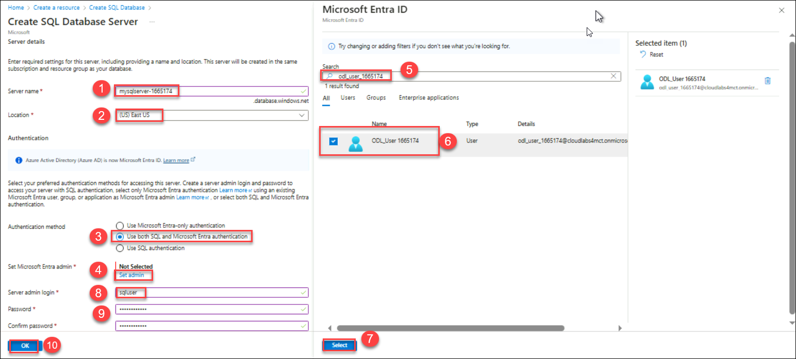

7. Select **OK**.
   
8. Leave **Want to use SQL elastic pool** set to **No**.

9. For **Workload environment**, specify **Development** for this task.

   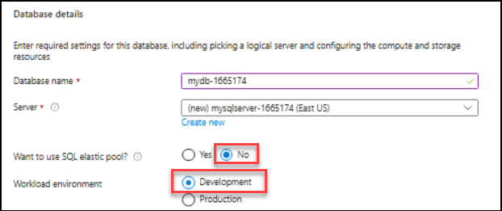

   - The **Azure portal** provides a **Workload environment** option that helps preset some configuration settings. These settings can be however overridden.
   - The **Development** workload environment sets the following options:
     - **Backup storage redundancy** is **Geo redundant backup storage**.
     - **Compute + storage** is **General Purpose, Serverless** with a single vCore. By default, there is a one-hour auto-pause delay.

     

10. Under **Compute + storage**, select **Configure database**.

    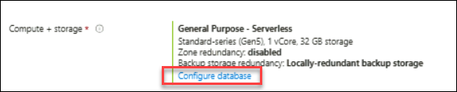

11. This lab uses a serverless database, so leave Service tier set to **General Purpose** (Most budget-friendly, serverless compute) and set Compute tier to **Serverless**.

     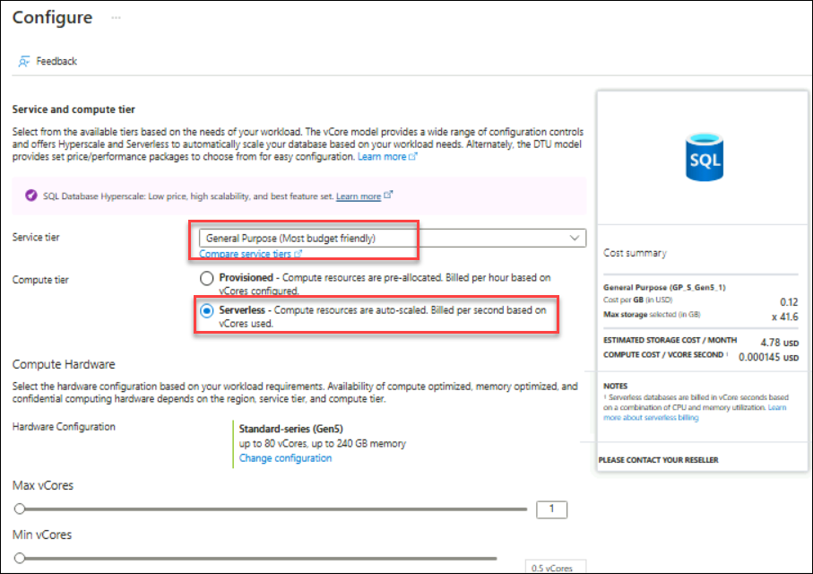

12. Under **Backup storage redundancy**, choose a redundancy option for the storage account where your backups will be saved. Ensure to select **Locally redundant backup storage**.

    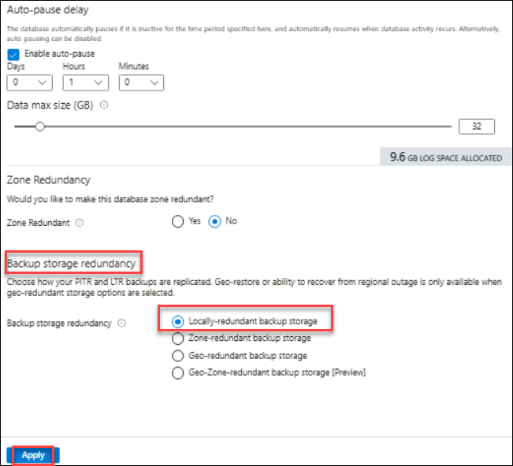

13.  Select **Apply**.
  
14. Select **Next: Networking** at the bottom of the page.

    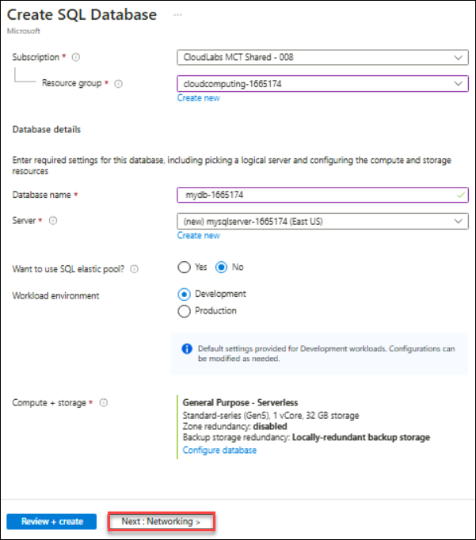

15. On the **Networking** tab, for **Connectivity method**, select **Public endpoint**.

16. For **Firewall rules**, set **Add current client IP address** to **Yes**.Leave **Allow Azure services and resources to access this server** set to **No**.

    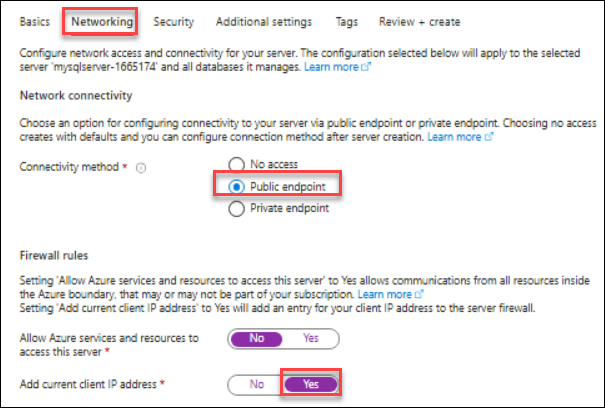

17. Under **Connection policy**, choose the **Default connection policy**, and leave the **Minimum TLS version** at the default of **TLS 1.2**.

    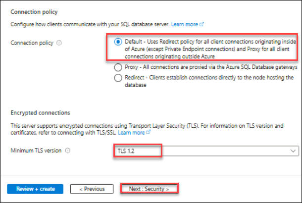

18 . Select **Next: Security** at the bottom of the page.

19. On the **Security** page, review the settings and retain the default configurations

20. Select **Next: Additional settings** at the bottom of the page.

21. On the **Additional settings** tab, in the **Data source** section, for **Use existing data**, select **Sample**.
    - This creates an **AdventureWorksLT sample database** so there are some tables and data to query and experiment with, as opposed to an empty blank database.
    - You can also configure **database collation** and a **maintenance window**.

    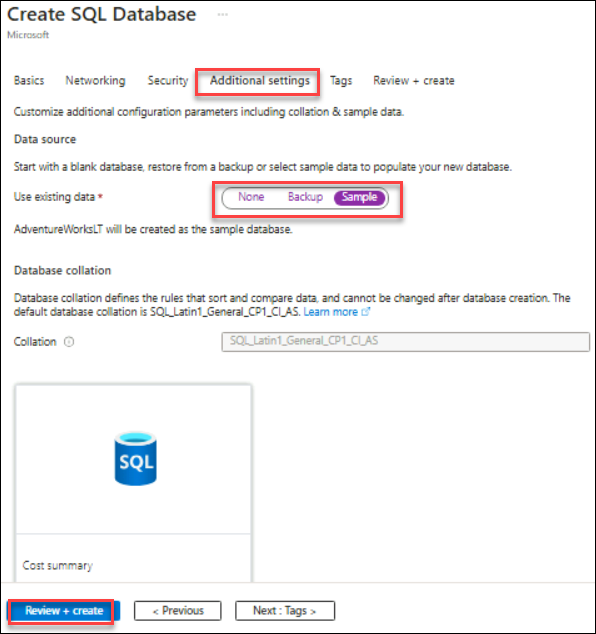

22. Select **Review + create** at the bottom of the page:
   
23. On the **Review + create** page, after reviewing, select **Create**.

   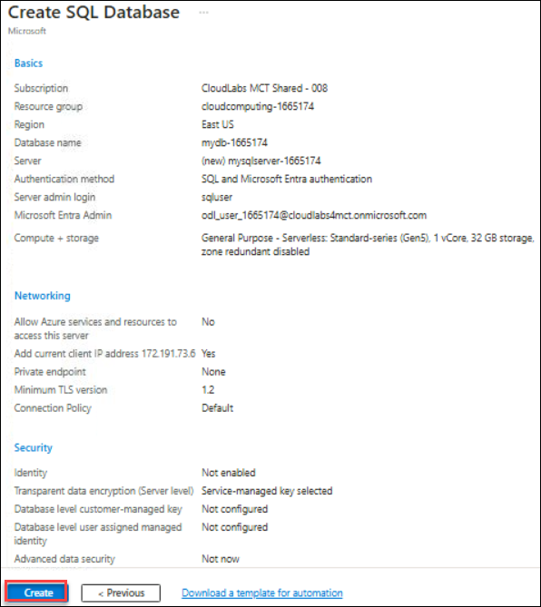

### Task 2: Login to the Database

1. Open SSMS or Azure Data Studio and connect to the SQL Database server created in Task 1.

2. Enter the **SQL login** credentials that you set during the database creation in Task 1 (SQL admin username and password).

3. Click **Connect**.

4. Take a screenshot showing the credentials being entered in SSMS/Azure Data Studio and confirm the successful sign-in.

5. In SSMS or Azure Data Studio, select **Azure Active Directory – Password** as the authentication method.

6. Enter your **Microsoft Entra** credentials (username and password).

7. Click **Connect**.

8. Take a screenshot showing the credentials being entered and confirm the successful sign-in with Microsoft Entra authentication.

### Delete Resources

1. All the resources will be deleted automatically once the lab duration is exhausted.
   
**Note**: Make sure to follow the lab instructions carefully and ensure that the necessary configurations and settings are applied during each step.

