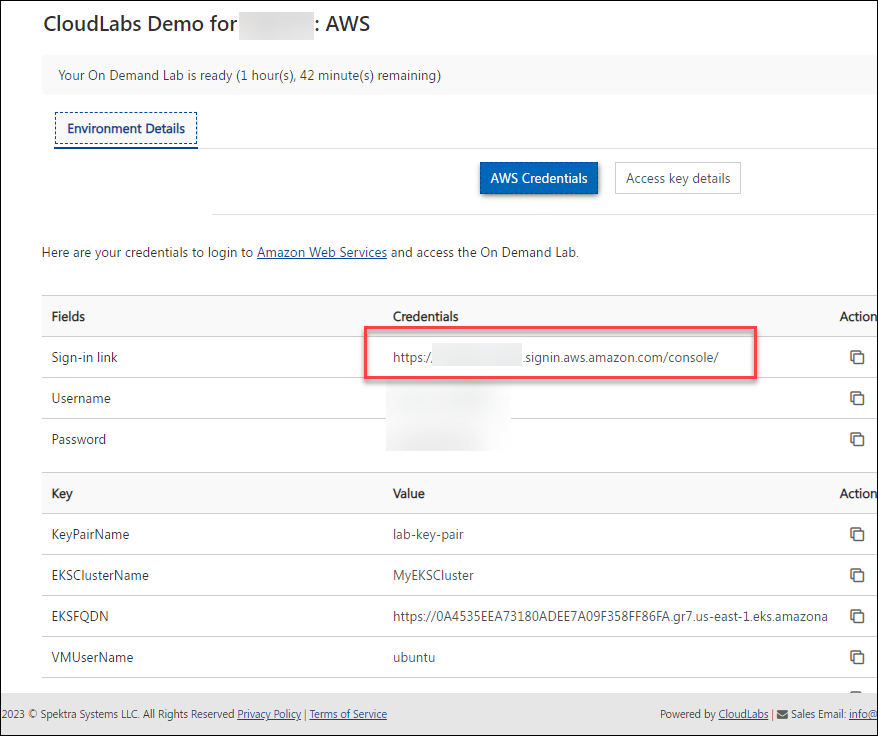
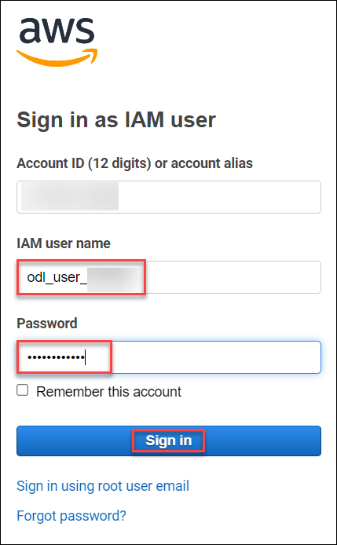
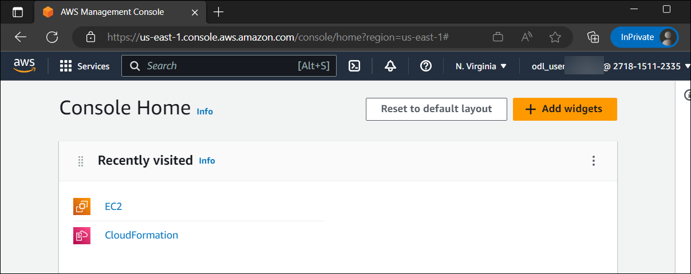

# CloudLabs Demo : Cast AI

## Overview
This lab environment has a Ubuntu EC2 instance along with Elastic Kubernetes Service (EKS) pre-deployed in AWS.

## Getting started

1. In a browser, open a new tab and sign in to the **AWS Console** using the sign-in link provided in the **Environment details** tab 
   
   

2. On the **Sign in as IAM User** blade, you will see a Sign-in screen,  enter the following email/username and then click on **Sign in**.  

   * **AWS Username/Email**:  <inject key="AzureAdUserEmail"></inject> 
   * **AWS Password**:  <inject key="AzureAdUserPassword"></inject>

   **Note**: Refer to the **Environment Details** tab for any other lab credentials/details.
        
   

3. Now you will be able to view the home page of the AWS console
   
    

4. Ensure to switch to the **N.Virginia** region at the top right corner.
  
5. You can search for the services you need like EKS and EC2 instances and perform the tasks.
