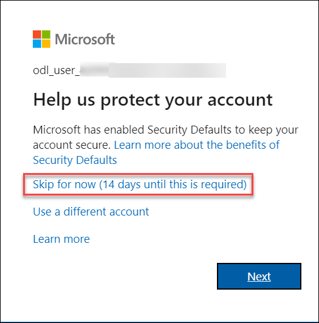
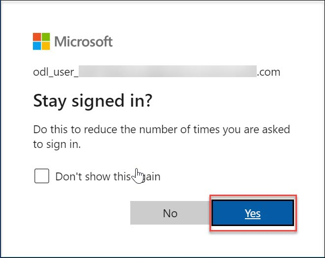

# CloudLabs Demo : Cast AI

## Overview
This lab environment has a Ubuntu Virtual machine with a GUI (Graphical User Interface) along with Azure Kubernetes Service (AKS) pre-deployed

## Getting started

1. Once the environment is provisioned, a virtual machine (VM) on the left and lab guide on the right will get loaded in your browser. Use this virtual machine throughout to perform the lab.

   
   
2. Within the Ubuntu VM, search for "Firefox" browser and use it throughout the lab

3. To get the lab environment details, you can select the **Environment details** tab, you can locate the **Environment details** tab in the upper right corner.
   
   

4. You can also open the Lab Guide on a separate full window by selecting the **Split Window** button on the bottom right corner.
   
   
 
5. You can **start(1)** or **stop(2)** the Virtual Machine from the **Resources** tab.

   
   
## Login to the Azure Portal

1. In the browser that you already opened, open a new tab, and sign in to the **Azure Portal** (<http://portal.azure.com>).

1. On the **Sign in to Microsoft Azure** blade, you will see a login screen, in which enter the following email/username and then click on **Next**.  

   * **Azure Username/Email**:  <inject key="AzureAdUserEmail"></inject> 
   * **Azure Password**:  <inject key="AzureAdUserPassword"></inject>

        **Note**: Refer to the **Environment Details** tab for any other lab credentials/details.
        
    
  
    
  
1. If you see the pop-up like below, click **Skip for now(14 days until this is required)**.

    

1. If you see the pop-up **Stay Signed in?** click ** Yes or No** based on your choice.

    

1. If you see the pop-up **You have free Azure Advisor recommendations!** close the window to continue the lab. 

1. If a **Welcome to Microsoft Azure** popup window appears, click **Maybe Later** to skip the tour.

    

1. Now you will be able to view the Azure Portal Dashboard.

1. To toggle **show/hide** the Portal menu options with icon, **Click** on the **Show Menu** button.

      

1. **Click** on the **Resource groups** button in the **Menu navigation bar** to view the Resource groups blade.
 
      
      
1. Select the **castai-demo-DeploymentID** resource group in the resource groups blade.

      
    
1.  Select the AKS Cluster pre-deployed for you and perform the lab.
