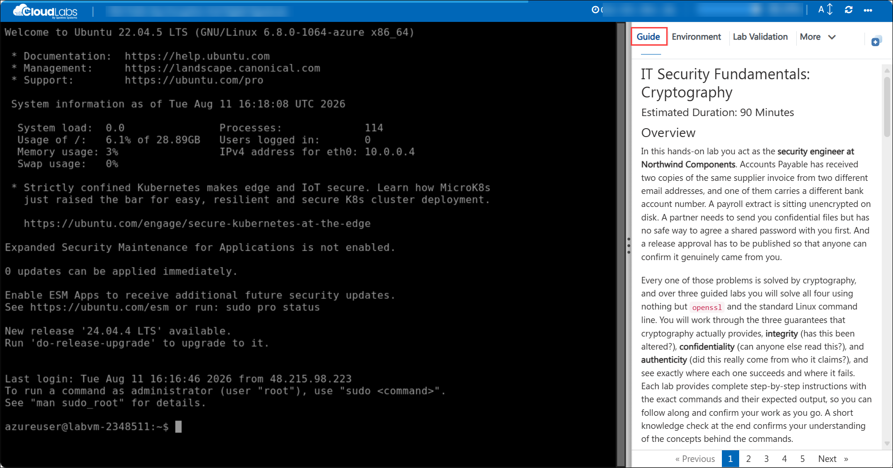
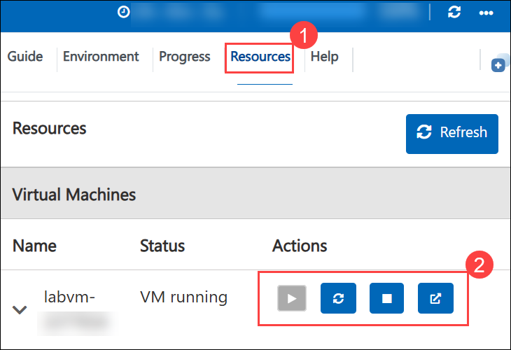
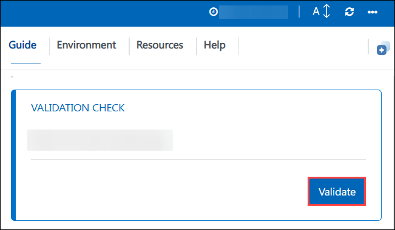

# IT Security Fundamentals: Cryptography

### Estimated Duration: 90 Minutes

## Overview

In this hands-on lab you act as the **security engineer at Northwind Components**. Accounts Payable has received two copies of the same supplier invoice from two different email addresses, and one of them carries a different bank account number. A payroll extract is sitting unencrypted on disk. A partner needs to send you confidential files but has no safe way to agree a shared password with you first. And a release approval has to be published so that anyone can confirm it genuinely came from you.

Every one of those problems is solved by cryptography, and over three guided labs you will solve all four using nothing but `openssl` and the standard Linux command line. You will work through the three guarantees that cryptography actually provides, **integrity** (has this been altered?), **confidentiality** (can anyone else read this?), and **authenticity** (did this really come from who it claims?), and see exactly where each one succeeds and where it fails. Each lab provides complete step-by-step instructions with the exact commands and their expected output, so you can follow along and confirm your work as you go. A short knowledge check at the end confirms your understanding of the concepts behind the commands.

## Getting started with your lab

Welcome to your IT Security Fundamentals: Cryptography hands-on lab. This environment gives you a live Ubuntu 22.04 LTS server that you connect to over SSH. Acting as a security engineer, you will detect a forged invoice using a published checksum, encrypt sensitive data with AES, generate an RSA key pair, discover first-hand why public-key cryptography cannot encrypt bulk data, build the hybrid scheme that solves it, and finish by signing a release approval and issuing an X.509 certificate.

## Accessing Your Environment

Your virtual machine and this **Guide** are available within your web browser.

   

## Environment Details

1. You are now connected to the Lab VM over SSH. You can find more details about the Lab VM in the **Environment** tab.

    - **SSH command:** see the **LabVM SSH Command** output on the **Environment** tab

    - **Username:** see the **LabVM Admin Username** output on the **Environment** tab

    - **Password:** see the **LabVM Admin Password** output on the **Environment** tab

1. The Lab VM is an **Ubuntu 22.04 LTS** server named **labvm-<inject key="DeploymentID" enableCopy="false"/>**.

    >**Note:** Unlike most Linux administration labs, **no step in this lab requires `sudo`**. Every file you work with lives in your own home directory at `~/crypto-lab` and is owned by your account. Cryptography is something you do with your own keys and your own data, not something you do as root.

1. A scenario brief describing all four problems on your desk is waiting for you at **`/home/azureuser/LabFiles/scenario-brief.txt`**. Read it before you begin:

    ```bash
    cat ~/LabFiles/scenario-brief.txt
    ```

1. Your Deployment ID for this run is **<inject key="DeploymentID" enableCopy="false"/>** - quote it if you contact support.

## A note on your working files

> **Note:** Your working directory `~/crypto-lab` has been seeded with the four files the scenario describes: the two competing invoices, the vendor's published checksum, the payroll extract, and the release approval text. **No cryptographic material has been created for you.** Every key, ciphertext, signature, and certificate in this lab is one you generate yourself, because generating them is the point.
>
> Labs 2 and 3 both use the RSA key pair you create in Lab 2, so work through the labs in order rather than jumping ahead.

## Exploring Your Resources

To get a better understanding of your resources and credentials, navigate to the **Environment** tab.

   

## Utilizing the Split Window Feature

For convenience, you can open the guide in a separate window by selecting the **Split Window** button from the top right corner.

   

## Managing Your Virtual Machine

Feel free to **Start, Restart,** or **Stop** your virtual machine as needed from the **Resources** tab. Your experience is in your hands!

   

## Guide Zoom In/Zoom Out

To adjust the zoom level for the environment page, click the **A↕: 100%** icon located next to the timer in the environment.

   

## Validation

Use the **Validate** button on each task to check your work. After completing the task, hit the **Validate** button under the Validation tab integrated within your guide. If you receive a success message, you can proceed to the next task; if not, carefully read the error message and retry the step, following the instructions in the guide.The **Progress** tab shows your validation score, it reaches 100% when all task validations pass.

   

## Lab Structure

| Lab | Topic | Duration |
|-----|-------|----------|
| Lab 1 | Hashing, Integrity, and Symmetric Encryption: SHA-256, checksum manifests, salting, AES-256 | 30 Minutes |
| Lab 2 | Public-Key Cryptography: RSA key pairs, the bulk-data limit, hybrid encryption | 30 Minutes |
| Lab 3 | Digital Signatures and Certificates: signing, tamper detection, X.509, trust anchors | 20 Minutes |
| Lab 4 | Knowledge Check: 5 questions | 10 Minutes |

## Support Contact

The CloudLabs support team is available 24/7 via email and live chat.

- Email Support: labs-support@spektrasystems.com
- Live Chat Support: https://support.cloudlabs.ai/isv

Now, click on **Next >>** from the lower right corner to move on to the next page to begin with Lab 1.

   

## Happy Learning !!
