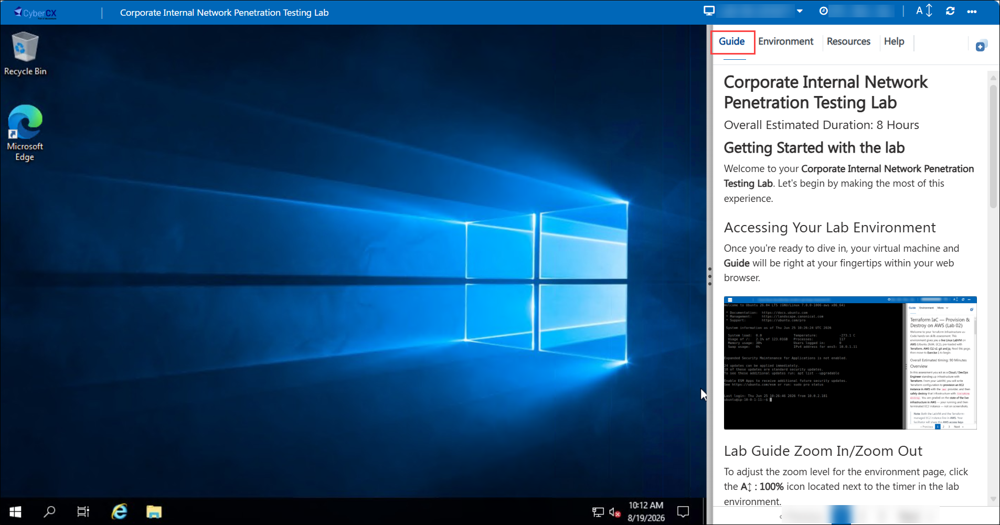
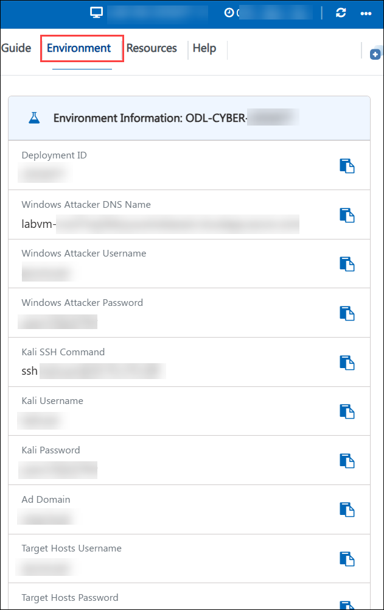
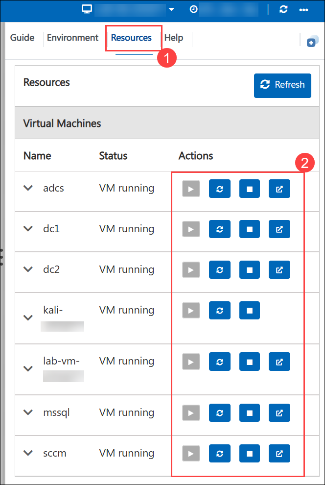
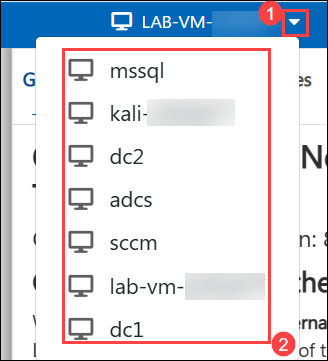

# **Corporate Internal Network Penetration Testing Lab**

### Overall Estimated Duration: 8 Hours

## **Getting Started with the lab**

Welcome to your **Corporate Internal Network Penetration Testing Lab**. Let's begin by making the most of this experience.

## Accessing Your Lab Environment

Once you're ready to dive in, your virtual machine and **Guide** will be right at your fingertips within your web browser.

## Virtual Machine & Lab Guide

Your virtual machine is your workhorse throughout the workshop. The lab guide is your roadmap to success.

## Lab Guide Zoom In/Zoom Out

To adjust the zoom level for the environment page, click the **A↕ : 100%** icon located next to the timer in the lab environment.

## Exploring Your Lab Resources

To get a better understanding of your lab resources and credentials, navigate to the **Environment** tab.

   

## Lab Environment Credentials

### Attacker Machines

The lab environment consists of **7 virtual machines (VMs)**. The usernames and passwords are provided in the **Environment** tab.

- **Windows Attacker:**

   - **Username:** <inject key="Windows Attacker Username" enableCopy="true"/>

   - **Password:** <inject key="Windows Attacker Password" enableCopy="true"/>

- **Kali Linux:**

   - **Username**: <inject key="Kali Username" enableCopy="true"/>

   - **Password:** <inject key="Kali Password" enableCopy="true"/>

### Target Hosts

All target hosts use the same credentials:

   - **Username:** <inject key="Target Hosts Username" enableCopy="true"/>

   - **Password:** <inject key="Target Hosts Password" enableCopy="true"/>

## Utilizing the Split Window Feature

For convenience, you can open the lab guide in a separate window by selecting the **Split Window** button from the Top right corner.

## Managing Your Virtual Machine

Feel free to **Start, Restart,** or **Stop (2)** your virtual machines as needed from the **Resources (1)** tab. Your experience is in your hands!

   

You can also switch between your **virtual machines (2)** as needed using the **dropdown (1)**.

   

## Support Contact

The CloudLabs support team is available 24/7, 365 days a year, via email and live chat to ensure seamless assistance at any time. We offer dedicated support channels tailored specifically for both learners and instructors, ensuring that all your needs are promptly and efficiently addressed.

Learner Support Contacts:

- Email Support: labs-support@spektrasystems.com
- Live Chat Support: https://support.cloudlabs.ai/isv

Click **Next** from the bottom right corner to embark on your Lab journey!

Now you're all set to explore the powerful world of technology. Feel free to reach out if you have any questions along the way. Enjoy your Lab!