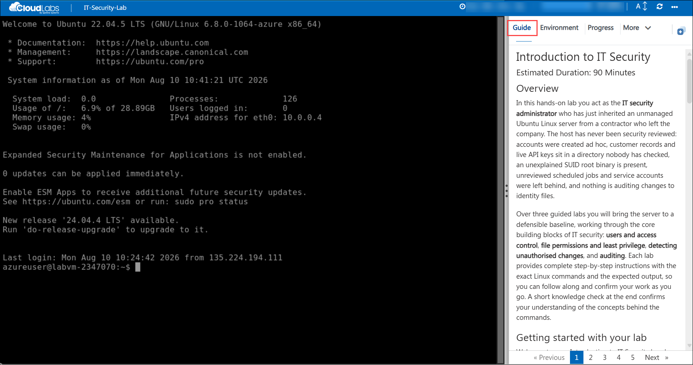
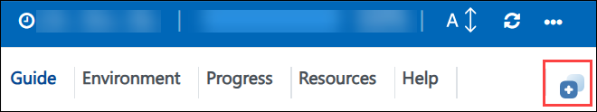
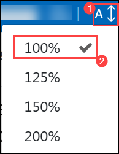

# Introduction to IT Security

### Estimated Duration: 90 Minutes

## Overview

In this hands-on lab you act as the **IT security administrator** who has just inherited an unmanaged Ubuntu Linux server from a contractor who left the company. The host has never been security reviewed: accounts were created ad hoc, customer records and live API keys sit in a directory nobody has checked, an unexplained SUID root binary is present, unreviewed scheduled jobs and service accounts were left behind, and nothing is auditing changes to identity files.

Over three guided labs you will bring the server to a defensible baseline, working through the core building blocks of IT security: **users and access control**, **file permissions and least privilege**, **detecting unauthorised changes**, and **auditing**. Each lab provides complete step-by-step instructions with the exact Linux commands and the expected output, so you can follow along and confirm your work as you go. A short knowledge check at the end confirms your understanding of the concepts behind the commands.

## Getting started with your lab

Welcome to your Introduction to IT Security hands-on lab. This environment gives you a live Ubuntu 22.04 LTS server that you connect to over SSH. Acting as an IT security administrator, you will remediate insecure accounts and file permissions, hunt down unauthorised accounts and scheduled jobs left behind on the host, and turn on system auditing. The lab is designed to teach foundational security concepts through tasks that are performed every day in real enterprise environments.

## Accessing Your Environment

Your virtual machine and this **Guide** are available within your web browser.

   

## Environment Details

1. You are now connected to the Lab VM over SSH. You can find more details about the Lab VM in the **Environment** tab.

    - **SSH command:** see the **LabVM SSH Command** output on the **Environment** tab

    - **Username:** see the **LabVM Admin Username** output on the **Environment** tab

    - **Password:** see the **LabVM Admin Password** output on the **Environment** tab

1. The Lab VM is an **Ubuntu 22.04 LTS** server named **labvm-<inject key="DeploymentID" enableCopy="false"/>**.

    >**Note:** Your account `azureuser` is a member of the `sudo` group. Almost every command in this lab is prefixed with `sudo` because security administration requires root privileges. When `sudo` prompts you for a password, enter your **LabVM Admin Password**.

1. A scenario brief describing everything that is wrong with the server is waiting for you at **`/home/azureuser/LabFiles/scenario-brief.txt`**. Read it before you begin:

    ```bash
    cat ~/LabFiles/scenario-brief.txt
    ```

1. Your Deployment ID for this run is **<inject key="DeploymentID" enableCopy="false"/>** - quote it if you contact support.

## Working with sudo

> **Note:** One step in Lab 1 edits the `sudoers` configuration, which controls who may run privileged commands. A syntax error there can make `sudo` refuse to run for every user on the system. The lab includes a `sudo visudo -c` check immediately after the edit — **do not skip it**, and do not edit `/etc/sudoers` directly with a plain text editor.
>
> No other step in this lab changes your network access, the SSH service, or the firewall, so your connection to the Lab VM is never at risk.

## Exploring Your Resources

To get a better understanding of your resources and credentials, navigate to the **Environment** tab.

   

## Utilizing the Split Window Feature

For convenience, you can open the guide in a separate window by selecting the **Split Window** button from the top right corner.

   

## Managing Your Virtual Machine

Feel free to **Start, Restart,** or **Stop** your virtual machine as needed from the **Resources** tab. Your experience is in your hands!

   

## Guide Zoom In/Zoom Out

To adjust the zoom level for the environment page, click the **A↕: 100%** icon located next to the timer in the environment.

   

## Validation

Use the **Validate** button on each task to check your work. After completing the task, hit the **Validate** button under the Validation tab integrated within your guide. If you receive a success message, you can proceed to the next task; if not, carefully read the error message and retry the step, following the instructions in the guide. The **Progress** tab shows your validation score, it reaches 100% when all task validations pass.

   


## Lab Structure

| Lab | Topic | Duration |
|-----|-------|----------|
| Lab 1 | Users, Groups, and Least Privilege: accounts, password policy, offboarding, sudo | 30 Minutes |
| Lab 2 | File Permissions and Sensitive Data: modes, umask, SUID | 30 Minutes |
| Lab 3 | Auditing and Detecting Unauthorised Changes: hidden root accounts, rogue cron jobs, auditd | 20 Minutes |
| Lab 4 | Knowledge Check: 5 questions | 10 Minutes |

## Support Contact

The CloudLabs support team is available 24/7 via email and live chat.

- Email Support: labs-support@spektrasystems.com
- Live Chat Support: https://support.cloudlabs.ai/isv

Now, click on **Next >>** from the lower right corner to move on to the next page to begin with Lab 1.

   

## Happy Learning !!
