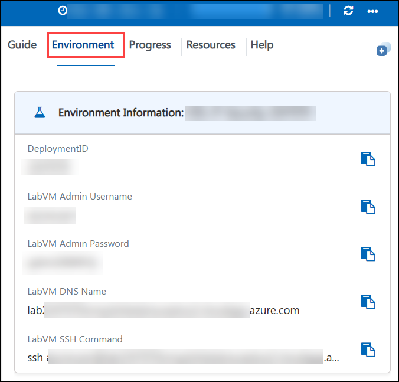

# Lab 1: Users, Groups, and Least Privilege

**Lab Description:** Every security review starts with the same question: **who can log in to this machine, and what are they allowed to do?** On the server you have inherited, accounts were created ad hoc, at least one belongs to a contractor who no longer works here, and there is no password ageing policy. In this lab, you will build a proper group structure, create managed user accounts, enforce password ageing, disable the departed contractor's account, and grant a narrow set of administrative commands with `sudo` instead of handing out full root access.

**Estimated Duration:** **30 Minutes**

**Learning Objectives:** By the end of this lab, you will be able to:

- Explain how Linux separates account information in `/etc/passwd` from credentials in `/etc/shadow`

- Create groups and managed user accounts, and manage group membership safely

- Enforce a password ageing policy with `chage`

- Disable an account belonging to a departed employee without destroying its data

- Apply the principle of least privilege using a `sudoers` drop-in file

## Task: Establish managed accounts and least-privilege access

In this task, you will create a `secops` group with two managed analyst accounts, apply a password ageing policy, disable the departed contractor's account, and grant the group a scoped set of administrative commands.

1. You are already connected to the **Lab VM** over SSH. If you encounter any issues connecting, you can also connect locally using the connection details available under the **Environment tab**.

    

1. Run the following command to list every account that can log in. This is the first thing you check on an unfamiliar host.

    ```bash
    getent passwd | awk -F: '$3 >= 1000 && $3 < 65534 {print $1, $3, $7}'
    ```

    **Expected Output:**

    ```output
    azureuser 1000 /bin/bash
    olduser 1001 /bin/bash
    ```

    >**Note:** The filter selects UID 1000 and above, which is the range Linux reserves for human users; anything below is a system account owned by a service. The `x` you would see in the password field of `/etc/passwd` means the real password hash lives in `/etc/shadow`, readable only by root. Notice `olduser` — that is the departed contractor, and they still have a working login.

### **Create the security group and analyst accounts**

1. Run the following command to create a group named **`secops`** for staff who need security administration rights.

    ```bash
    sudo groupadd secops
    ```

    >**Note:** Groups let you assign permissions once to a role rather than repeatedly to individuals. When someone joins or leaves you change their group membership, not dozens of files and rules.

1. Run the following commands to create two managed analyst accounts, each with a home directory and a Bash login shell.

    ```bash
    sudo useradd -m -s /bin/bash -c "Security Analyst 1" analyst1    
    ```

    ```bash
    sudo useradd -m -s /bin/bash -c "Security Analyst 2" analyst2
    ```

    >**Note:** The `-m` flag creates the home directory. Without it the account exists but has nowhere to store files.

1. Run the following commands to set an initial password for each account.

    ```bash
    echo 'analyst1:Analyst@Lab#2024' | sudo chpasswd
    ```

    ```bash
    echo 'analyst2:Analyst@Lab#2024' | sudo chpasswd
    ```

    >**Note:** `chpasswd` reads `username:password` pairs, which is how accounts are provisioned by automation. In production these would be unique, randomly generated passwords delivered out of band.

1. Run the following commands to add both analysts to the **`secops`** group.

    ```bash
    sudo usermod -aG secops analyst1
    ```

    ```bash
    sudo usermod -aG secops analyst2
    ```

    >**Note:** The `-a` flag means **append**. Using `-G` without `-a` *replaces* all of the user's supplementary groups, silently removing them from every other group they belong to. This is one of the most common and most damaging mistakes in Linux user administration.

1. Run the following command to confirm the group exists and both analysts are members.

    ```bash
    getent group secops
    ```

    **Expected Output:**

    ```output
    secops:x:1002:analyst1,analyst2
    ```

    >**Note:** Your group ID number may differ. Only the group name and the membership list matter.

### **Enforce a password ageing policy**

1. Run the following commands to apply a password ageing policy to both analysts: passwords expire after **90 days**, cannot be changed more than once per day, and the user is warned **7 days** in advance.

    ```bash
    sudo chage -M 90 -m 1 -W 7 analyst1
    ```

    ```
    sudo chage -M 90 -m 1 -W 7 analyst2
    ```

    >**Note:** Each flag maps to a control. `-M 90` caps how long a compromised credential stays valid, `-m 1` stops a user cycling through passwords in one sitting to defeat password history, and `-W 7` gives fair warning so expiry does not cause an outage. The Linux default is 99999 days, which means the password effectively never expires.

1. Run the following command to confirm the policy was applied.

    ```bash
    sudo chage -l analyst1 | grep -E 'Minimum|Maximum|warning'
    ```

    **Expected Output:**

    ```output
    Minimum number of days between password change          : 1
    Maximum number of days between password change          : 90
    Number of days of warning before password expires       : 7
    ```

    >**Note:** Run `sudo chage -l analyst1` without the filter to see the full record, which also shows the last password change date, the resulting expiry date, and the account expiry.

1. Run the following command to make 90 days the default for any account created from now on.

    ```bash
    sudo sed -i 's/^PASS_MAX_DAYS.*/PASS_MAX_DAYS\t90/' /etc/login.defs
    ```

    >**Note:** `/etc/login.defs` only affects accounts created **after** the change, which is why you had to set `analyst1` and `analyst2` individually.

### **Disable the departed contractor's account**

1. Run the following command to check the current status of the `olduser` account.

    ```bash
    sudo passwd -S olduser
    ```

    **Expected Output:**

    ```output
    olduser P 08/07/2026 0 99999 7 -1
    ```

    >**Note:** The second field is the status flag: **`P`** means a usable password is set, **`L`** means locked, and **`NP`** means no password at all.

1. Run the following command to lock the account's password so it can no longer be used to authenticate.

    ```bash
    sudo usermod -L olduser
    ```

    >**Note:** Locking inserts a `!` in front of the password hash in `/etc/shadow`, making it impossible to match. The hash is preserved, so the action is fully reversible.

1. Run the following command to also expire the account, which blocks every login method.

    ```bash
    sudo chage -E 0 olduser
    ```

    >**Note:** Locking the password alone is **not** sufficient. If the contractor left an SSH public key in `~/.ssh/authorized_keys`, key-based login would still work because it never consults the password hash. Expiring the account closes that path. Always do both.

1. Run the following command to confirm the account is now locked.

    ```bash
    sudo passwd -S olduser
    ```

    **Expected Output:**

    ```output
    olduser L 08/07/2026 0 99999 7 -1
    ```

    >**Note:** The flag has changed from `P` to `L`. Notice you disabled the account rather than deleting it. Deleting a user removes their identity while their files remain owned by an orphaned UID, which destroys your audit trail. Disable first, retain for the required period, then delete.

### **Grant least privilege with sudo**

1. Run the following command to create a `sudoers` drop-in file granting the **`secops`** group only the commands they need.

    ```bash
    sudo tee /etc/sudoers.d/secops > /dev/null <<'EOF'
    # Least-privilege administration for the secops group.
    # Members may inspect services and read logs, and nothing more.
    %secops ALL=(root) /usr/bin/systemctl status *, /usr/bin/journalctl *
    EOF
    ```

    >**Note:** You can use **CTRL + SHIFT + V** to paste the command to avoid copy paste issues. 

    >**Note:** The `%` prefix means the rule applies to a **group**. Listing explicit command paths instead of `ALL` is the difference between least privilege and full administrative access.

1. Run the following command to set the required permissions. `sudo` refuses to read a `sudoers` file writable by anyone other than root.

    ```bash
    sudo chmod 0440 /etc/sudoers.d/secops
    ```

1. **Do not skip this step.** Run the following command to validate the syntax of the entire `sudoers` configuration.

    ```bash
    sudo visudo -c
    ```

    **Expected Output:**

    ```output
    /etc/sudoers: parsed OK
    /etc/sudoers.d/secops: parsed OK
    ```

    >**Note:** A syntax error in a `sudoers` file can make `sudo` refuse to run for every user on the system, including you. **Always** run `visudo -c` after editing, and never edit `/etc/sudoers` directly with a plain text editor.

1. Run the following command to confirm what `analyst1` is now permitted to run.

    ```bash
    sudo -l -U analyst1
    ```

    **Expected Output:**

    ```output
    User analyst1 may run the following commands on labvm-...:
        (root) /usr/bin/systemctl status *, /usr/bin/journalctl *
    ```

    >**Note:** Compare this with `sudo -l -U azureuser`, which shows `(ALL : ALL) ALL` — unrestricted root. `analyst1` can inspect the system but cannot install packages, change firewall rules, or read `/etc/shadow`. That gap is the principle of least privilege made concrete.

> **Congratulations** on completing the task! Now, it's time to validate it. Here are the steps:
> - Hit the Validate button for the corresponding task. If you receive a success message, you can proceed to the next task.
> - If not, carefully read the error message and retry the step, following the instructions in the guide.
> - If you need any assistance, please contact us at labs-support@spektrasystems.com. We are available 24/7 to help you out.

<validation step="0be7c6b3-2266-47d5-bf27-af7ecbd1c570" />

**Lab 1 Recap:** In this lab, you:

- Enumerated the human accounts on an unfamiliar host and saw how Linux separates identity from credentials.

- Created the `secops` group and two managed accounts, adding them to the group safely with `usermod -aG`.

- Enforced a 90-day password ageing policy with `chage` and made it the default for future accounts.

- Disabled the departed contractor's account by locking the password **and** expiring the account, preserving the data and audit trail.

- Applied least privilege by granting `secops` a specific command list in a validated `/etc/sudoers.d/secops` drop-in.

## You have successfully completed Lab 1.

Now, click on **Next >>** from the lower right corner to move on to the next page

   
