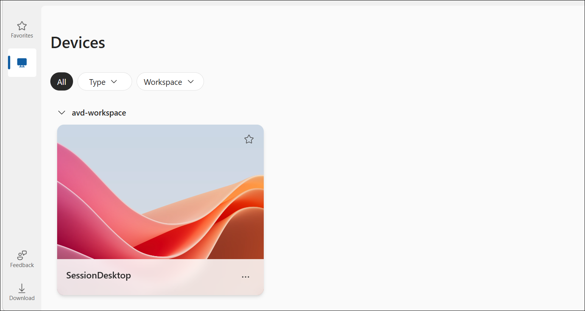
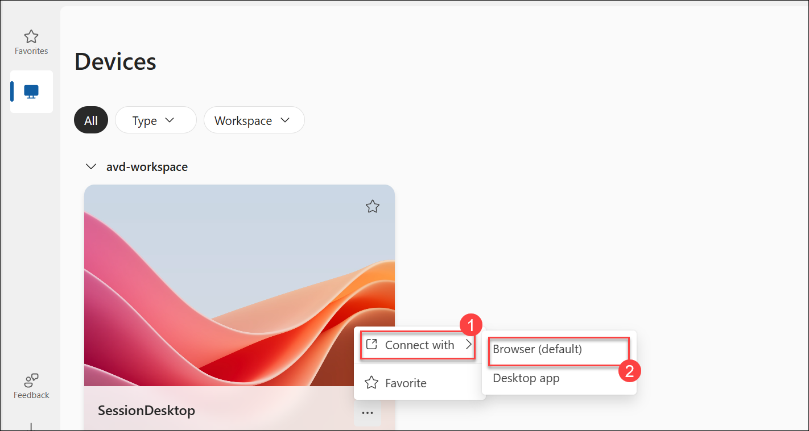
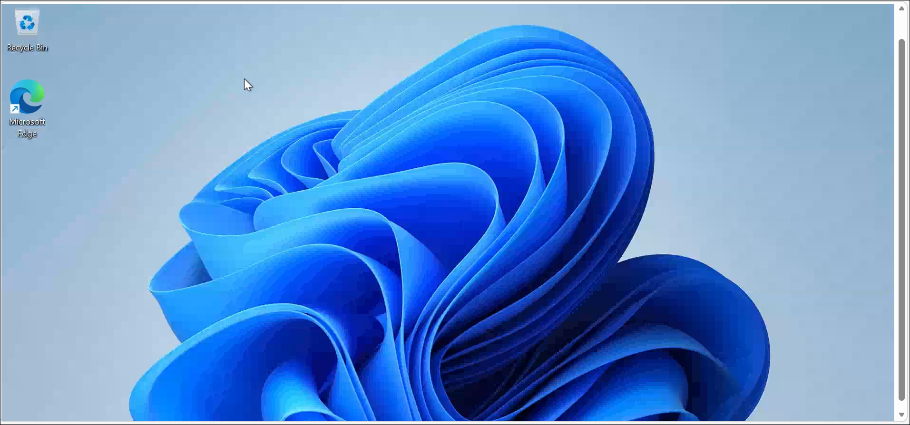

# CloudLabs Demo: Resideo

## Overview

In this lab, you will be provided with a Windows Virtual Machine with SQL Server Management Studio (SSMS) pre-installed. You can connect to the virtual machine and use the available tools to perform the required lab activities

## Getting Started

To access the provided environment, follow the steps below:

1. Open a web browser and navigate to the following URL:

   https://rdweb.wvd.microsoft.com/arm/webclient

2. Sign in using the credentials provided in the **Environment Details** page.

3. After successful authentication, the available desktop will be displayed.

   

4. Click the three-dot menu (...) on the assigned desktop, select **Connect with**, and then choose **Browser (default)** to launch the remote session.

   

6. Wait for the remote desktop session to load completely.

   

7. Once connected, access the platform and perform the required lab activities.

 

