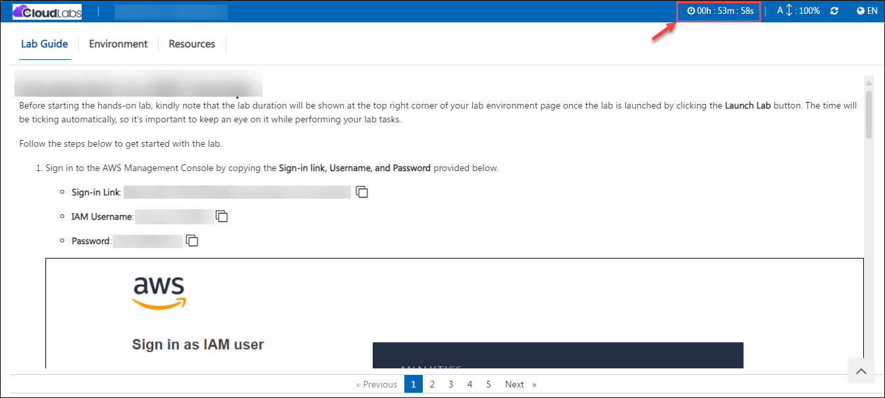
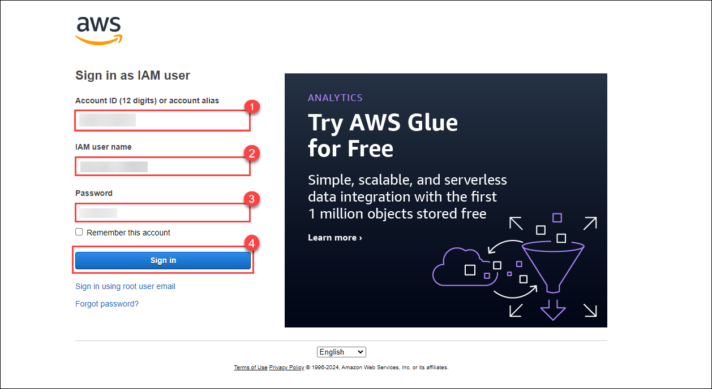
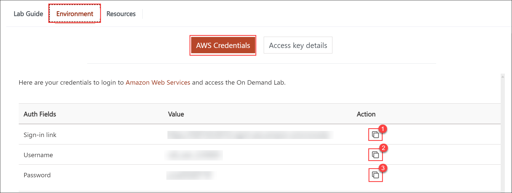
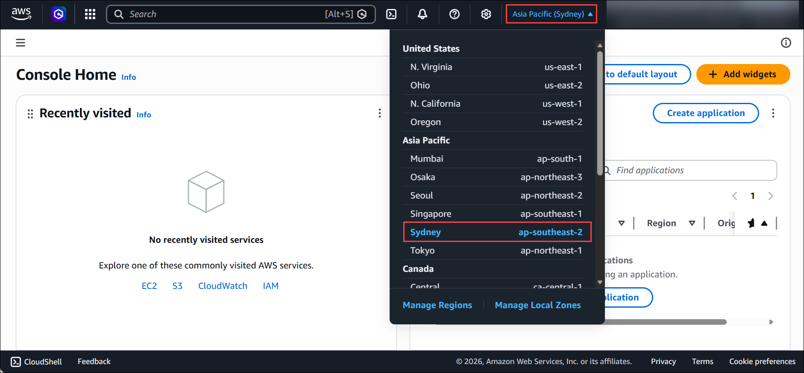

# AWS Environment

Before starting the hands-on lab, kindly note that the lab duration will be shown at the top right corner of your lab environment page once the lab is launched by clicking the **Launch Lab** button. The time will be ticking automatically, so it's important to keep an eye on it while performing your lab tasks.

Follow the steps below to get started with the lab.

## Sign-in Instructions

1. Sign in to the AWS Management Console by copying the **Sign-in link, Username, and Password** provided below.

    * **Sign-in Link**: **<inject key="SignInUrl" enableCopy="true" />**

    * **IAM Username**: **<inject key="UserName" enableCopy="true" />**

    * **Password**: **<inject key="Password" enableCopy="true" />**

    

    Alternatively, you can also find these values on the **CloudLabs** Environment tab.

    

2. After signing in to the AWS Management Console, choose the region **ap-southeast-2 (Sydney)** from the drop-down menu in the top right hand corner.

    

## Allowed Services & Constraints

1. Pre-deployed Resources (Already Available)
    - Virtual Private Cloud (VPC)
    - Subnets
    - Internet Gateway (IGW)
    - Route Tables
    - Security Groups
    - SSM IAM Role (for EC2 access via Systems Manager)
    - RDS Service-Linked Role

2. Allowed Actions:

- **EC2:** Launch EC2 instances using:

    - Pre-existing VPC
    - Pre-existing Subnets
    - Pre-existing Security Groups
    - SSM IAM Role
    - Instance Type: **t3.micro**
    - AMI: **Amazon Linux**
    - AMI ID: **ami-073e5bc3ae6e46156**
    - Region: **ap-southeast-2 (Sydney)**

- **RDS:** Create RDS instance with:

  - Instance Type: **db.t3.micro**
  - Engine: PostgreSQL (enforced)
  - Deployment: Single-AZ or Multi-AZ
  - Authentication: User-managed password
  - Keep default settings
  - Uncheck additional configuration options at the final step

3. Restricted Actions
    - Cannot create, modify, or delete:
        - VPC
        - Subnets
        - Security Groups
        - Internet Gateway
        - Route Tables
    - Cannot create any additional infrastructure outside defined scope
    - No KMS permissions available
    - Cannot customize restricted RDS configurations

##  Start the Lab
You can now start deploying the resources required for the lab using the above constraints.