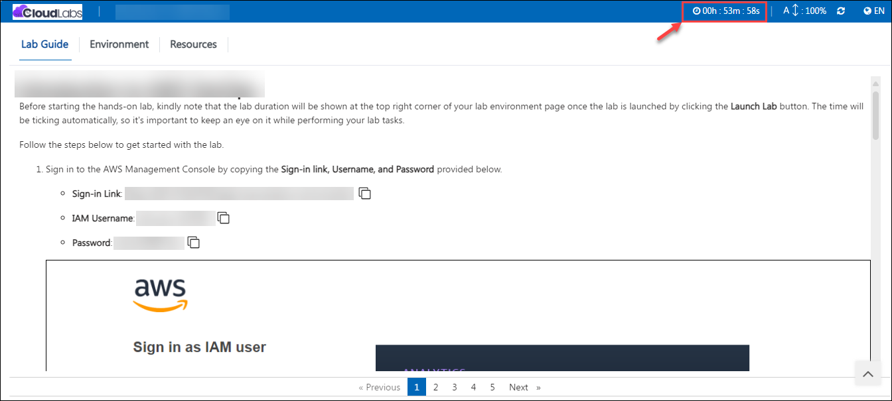
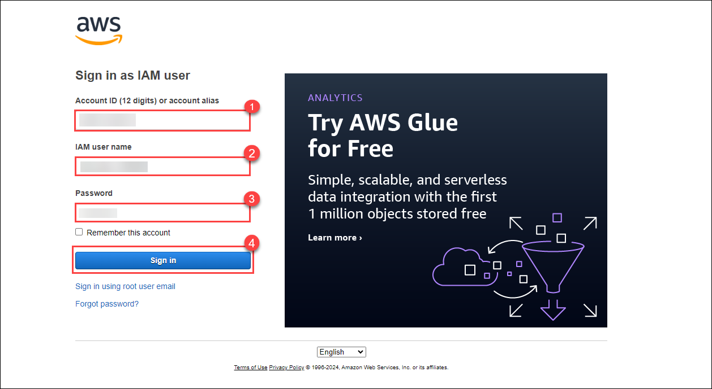
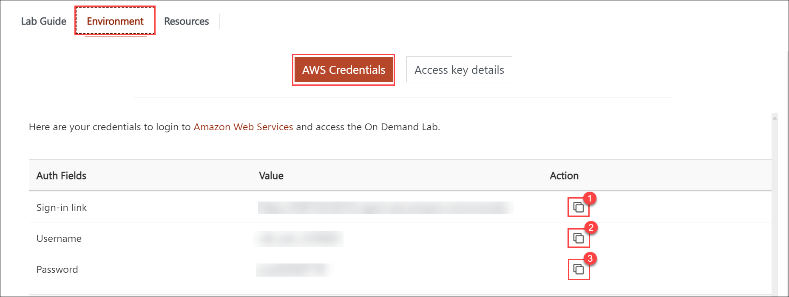
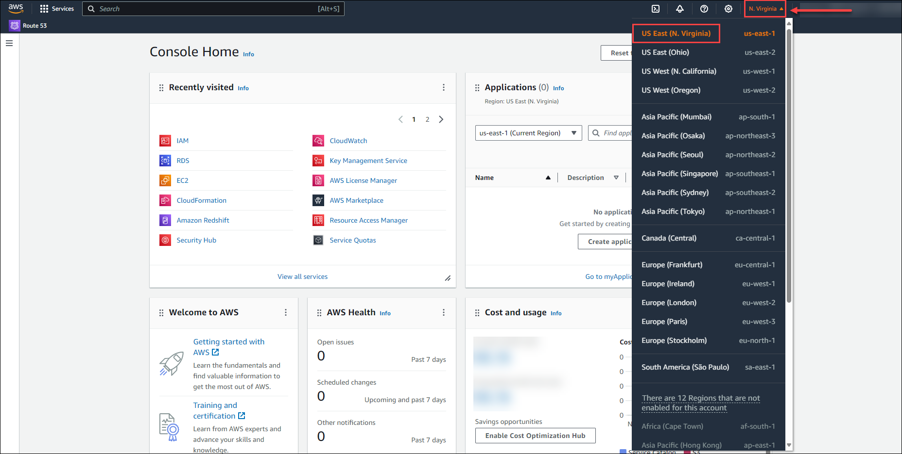

# AWS Environment

Before starting the hands-on lab, kindly note that the lab duration will be shown at the top right corner of your lab environment page once the lab is launched by clicking the **Launch Lab** button. The time will be ticking automatically, so it's important to keep an eye on it while performing your lab tasks.

Follow the steps below to get started with the lab.

1. Sign in to the AWS Management Console by copying the **Sign-in link, Username, and Password** provided below.

    * **Sign-in Link**: **<inject key="SignInUrl" enableCopy="true" />**

    * **IAM Username**: **<inject key="UserName" enableCopy="true" />**

    * **Password**: **<inject key="Password" enableCopy="true" />**

    

    Alternatively, you can also find these values on the **CloudLabs** Environment tab.

    

2. After signing in to the AWS Management Console, choose the region **US-EAST-1 (N. Virginia)** from the drop-down menu in the top right hand corner.

    
