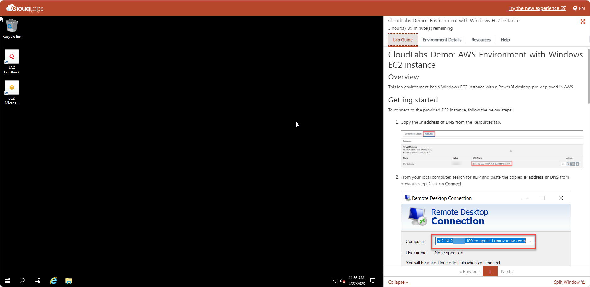
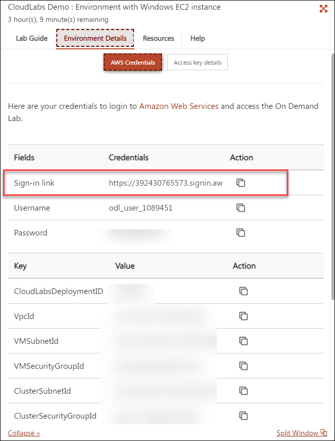
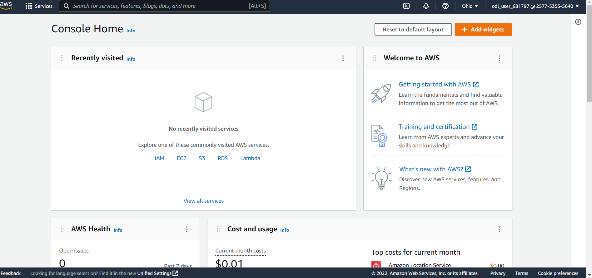

# CloudLabs Demo: Getting Started with AWS EC2

## Overview
This lab environment has a Windows EC2 instance pre-deployed in AWS.

## Getting started

## Instructions

1. Once the environment is provisioned, a **EC2 instance** (JumpVM) on the left and a lab guide on the right will get loaded in your browser. Use this virtual machine throughout to perform the lab tasks.

    

2. To get the lab environment details, you can select the **Environment details** tab, you can locate the **Environment details** tab in the upper right corner.
   
3. You can also open the Lab Guide on a separate full window by selecting the **Split Window** button on the bottom right corner.
   
4.  You can **Start(1)** **Stop(3)** and **Restart(2)** the EC2 instance whenever required

    
    
5.  Perform the tasks within the EC2 instance as required.

## Login to AWS console

In this task, you will log in to the AWS Console

1. In a browser, open a new tab and sign in to the **AWS Console** using the sign-in link provided in the **Environment details** tab 
   
   

2. On the **Sign in as IAM User** blade, you will see a Sign-in screen,  enter the following email/username and then click on **Sign in**.  

   * **AWS Username/Email**:  <inject key="AzureAdUserEmail"></inject> 
   * **AWS Password**:  <inject key="AzureAdUserPassword"></inject>

   **Note**: Refer to the **Environment Details** tab for any other lab credentials/details.
        
   

3. Now you will be able to view the home page of the AWS console
   
    

4. Ensure to switch to the **Ohio** region at the top right corner
   
    

5. Now, you can deploy the resources that are required for the lab tasks.
