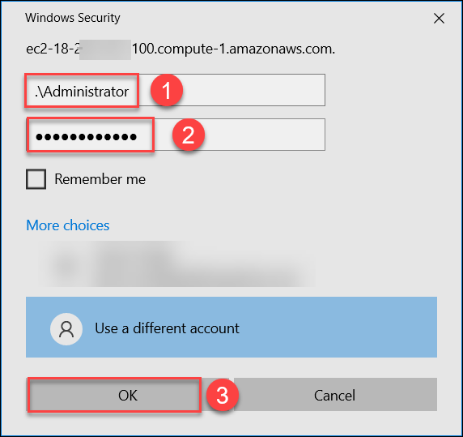

# CloudLabs Demo: AWS Environment with Windows EC2 instance

## Overview
This lab environment has a Windows EC2 instance with a PowerBI desktop pre-deployed in AWS.

## Getting started

To connect to the provided EC2 instance, follow the below steps:

1. Copy the **IP address or DNS** from the Resources tab.

2. From your local computer, search for **RDP** and paste the copied **IP address or DNS** from previous step. Click on **Connect**

    

4. Provide the EC2 instance credentials as mentioned in the **Environment details** page and click on **OK**

    

    

5. If you get a pop-up, click on **Yes**

    

6. Now, you will be connected to the EC2 instance

   

7. Perform the tasks within the EC2 instance as required.

8. You can **Start(1)** **Stop(3)** and **Restart(2)** the EC2 instance whenever required

   
