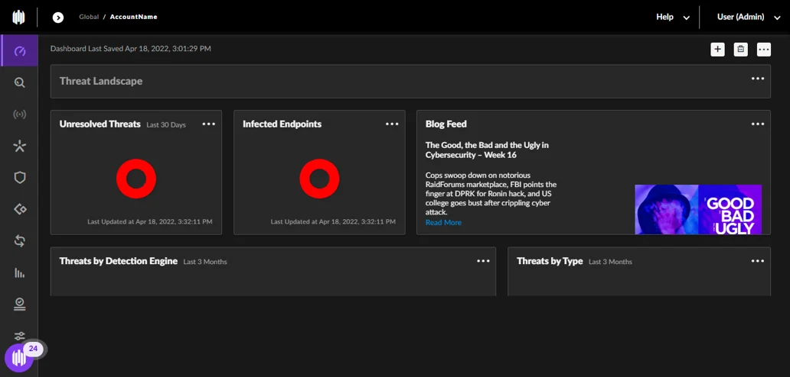
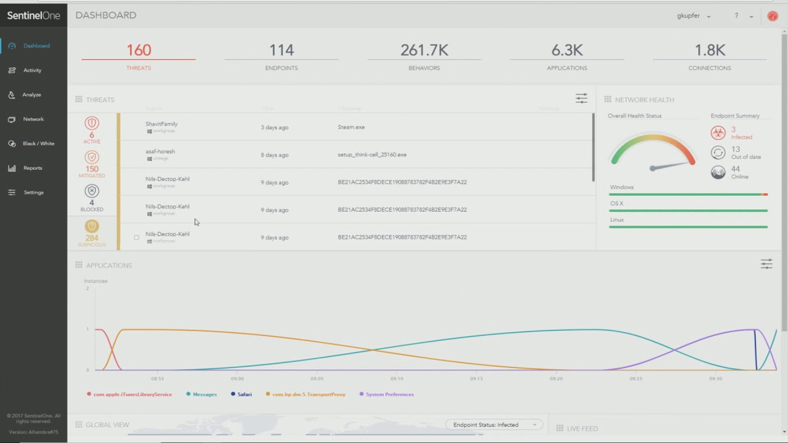

# Getting Started with Endpoint Threat Detection Using SentinelOne

## Lab Overview
In a time when cyber threats are increasingly sophisticated, protecting endpoints is a critical part of any organization’s security strategy. SentinelOne is a widely adopted solution that offers intelligent, real-time protection for endpoints through automated threat detection and response.

This introductory guide is created for those who are new to SentinelOne or endpoint protection in general. It walks you through the foundational concepts of endpoint security, and provides a clear, hands-on approach to deploying and managing SentinelOne agents across your systems.

Whether you're exploring cybersecurity for the first time or expanding your IT skillset, this learning experience focuses on practical usage—such as navigating the SentinelOne console, configuring security policies, monitoring agents, and investigating threats.

You don’t need any prior exposure to SentinelOne to get started. The content is simple, scenario-based, and aimed at helping you build confidence in securing your organization's devices effectively. By the end, you'll be familiar with the core workflows and capabilities that make SentinelOne a strong tool in the endpoint protection space.

## Pre-requisites
SentinelOne agent deployed on a Windows Virtual Machine

## Step 1: Explore the SentinelOne Console

1. On the SentinelOne Console login screen, enter the following username and password, then click Sign In:

    * **Username/Email**:  <inject key="AzureAdUserEmail"></inject> 
   * **Password**:  <inject key="AzureAdUserPassword"></inject>

2. After logging into the SentinelOne Management Console, proceed with the following steps to simulate endpoint visibility, policy configuration, and threat detection workflows.

3. Navigate through the main sections of the console to understand its layout:

- Dashboard – View high-level security summaries, active threats, and system status.

- Endpoints – Displays all devices where the SentinelOne agent is installed and reporting.

- Threats – Lists detected threats, including details like severity, attack chain, and status.

- Policies – Controls the behavioral and protection settings for groups of endpoints.

- Activity – Historical logs of actions taken, detections, and responses.

  

## Step 2: Verify Endpoint Agent Status
Once inside the SentinelOne console:

1. Navigate to the Endpoints tab.

2. Locate your Windows VM in the list.

3. Verify the following:

- Agent is in a "Connected" or "Healthy" state.

- Operating System and IP address are populated.

- Assigned Policy Group and Site are correctly shown.

## Step 3: Review and Edit Security Policies
1. Go to the Policies tab.

2. Select the default policy or one assigned to your endpoint.

3. Simulate reviewing or editing:

4. Behavioral AI Engine (enabled/disabled)

5. Mitigation Actions (quarantine, kill process)

6. Device Control / USB Control (optional features)

7. Save any changes and note that policies are auto-applied to endpoints in the assigned group.

>Policies govern how the agent behaves on the endpoint—what threats are detected and how they’re handled.

## Step 4: Simulate Threat Detection
simulate a detection event:

1. Navigate to the Threats tab.

2. Locate a pre-seeded dummy threat or simulate adding one (e.g., EICAR_Test_File, Simulated_Malware.exe).

3. View details like:

- Threat Name and Classification (Malware, PUP, Exploit)

- Source file path and hash

- Detection timestamp and agent name

  

## Conclusion
In this lab, you explored the SentinelOne console and simulated key aspects of endpoint protection in a controlled environment. Starting from agent visibility on a Windows VM, you walked through reviewing endpoint status, configuring policies, and simulating a threat detection scenario.

While this guide used dummy data and placeholder steps, it reflects the actual workflow used by security teams to monitor, detect, and respond to endpoint threats with SentinelOne.

By completing this lab, you should now have a basic understanding of:
- Navigating the SentinelOne console
- Verifying agent connectivity and health
- Understanding how policies affect threat response behavior
- Identifying and analyzing detected threats
