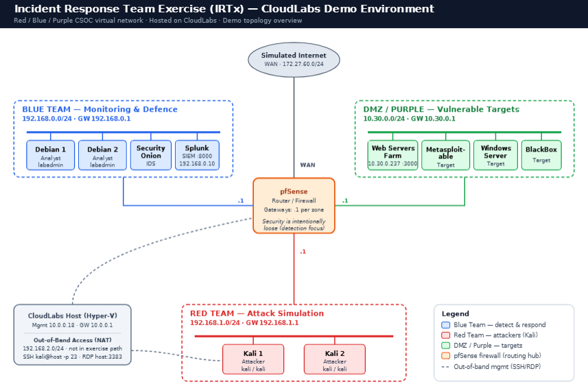
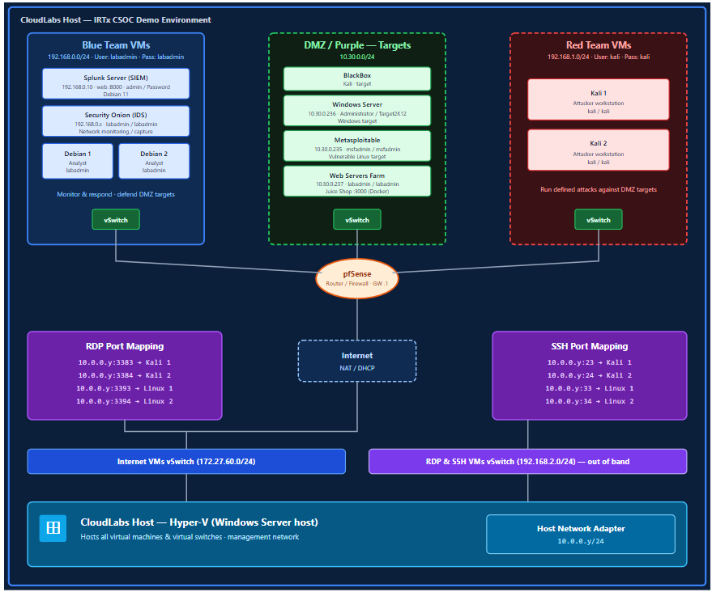

# IRTx CSOC — CloudLabs Demo Lab Guide

**Get to know your lab** · Incident Response Team Exercise (Red / Blue / Purple) · *Demo environment*

---

## 1. What this lab is

A self-contained Computer Security Operations Centre (CSOC) built for a **hybrid Red/Blue/Purple team exercise**. It lets you run a full incident-response cycle — attack, detect, respond — inside one isolated virtual network hosted on **CloudLabs**. Security controls are intentionally relaxed so that a range of attacks succeed; the focus is on **detection, handling, and reporting**, not on defence.

## 2. Architecture Diagram



*All zones route through the pfSense firewall. Remote access to the team VMs is delivered by host NAT port-forwarding over a separate out-of-band `192.168.2.0/24` switch, so RDP/SSH sessions never interfere with exercise traffic. Port map is in Section 5.*

## 3. Network zones at a glance




| Zone | Subnet | Gateway | Role | Key VMs |
|---|---|---|---|---|
| **Blue Team** | `192.168.0.0/24` | `.1` | Monitor & respond | Debian 1, Debian 2, Security Onion, Splunk (`192.168.0.10`) |
| **Red Team** | `192.168.1.0/24` | `.1` | Attack simulation | Kali 1, Kali 2 |
| **DMZ / Purple** | `10.30.0.0/24` | `.1` | Vulnerable targets | Web Servers Farm (`10.30.0.237`), Metasploitable, Windows Server, BlackBox |
| **Internet (WAN)** | `172.27.60.0/24` | — | Simulated external | pfSense WAN interface |
| **OOB Management** | `192.168.2.0/24` | — | Remote access only | NAT SSH/RDP to team VMs |

## 4. Credentials

| System | Username | Password |
|---|---|---|
| Blue Team (Debian / Web Farm / Splunk) | `labadmin` | `labadmin` |
| Red Team (Kali 1 & 2) | `kali` | `kali` |

## 5. Connect to your VMs (out-of-band)

Use the **CloudLabs host IP** (`10.0.0.y`) with the per-VM port below. Sessions are NAT-forwarded over the dedicated `192.168.2.0/24` switch.

| Target VM | RDP port | SSH port |
|---|---|---|
| Kali 1 | `3383` | `23` |
| Kali 2 | `3384` | `24` |
| Linux 1 (Debian) | `3393` | `33` |
| Linux 2 (Debian) | `3394` | `34` |

```bash
# SSH to Kali 1
ssh kali@<host-ip> -p 23

# RDP to Kali 1  (Remote Desktop Connection)
<host-ip>:3383
```

> One RDP session per team VM at a time. Ignore any `192.168.2.x` address on the VMs — that is the management path only.

## 6. Start the key services

| Service | VM | Command / Access |
|---|---|---|
| **pfSense** | Router/Firewall | Start first — it routes all zones. Confirm gateways `.1` are reachable. |
| **Juice Shop** (target web app) | Web Servers Farm | `docker run --rm -d -p 3000:3000 bkimminich/juice-shop` → browse `http://10.30.0.237:3000` |
| **Splunk** (SIEM) | Splunk Server | `sudo /opt/splunk/bin/splunk start` → browse `http://192.168.0.10:8000` |

**Quick health check:** from Kali 1, `ping 192.168.0.x` (Blue) and `ping 10.30.0.237` (DMZ) should both succeed — confirming there are no blocking firewall rules between zones.
