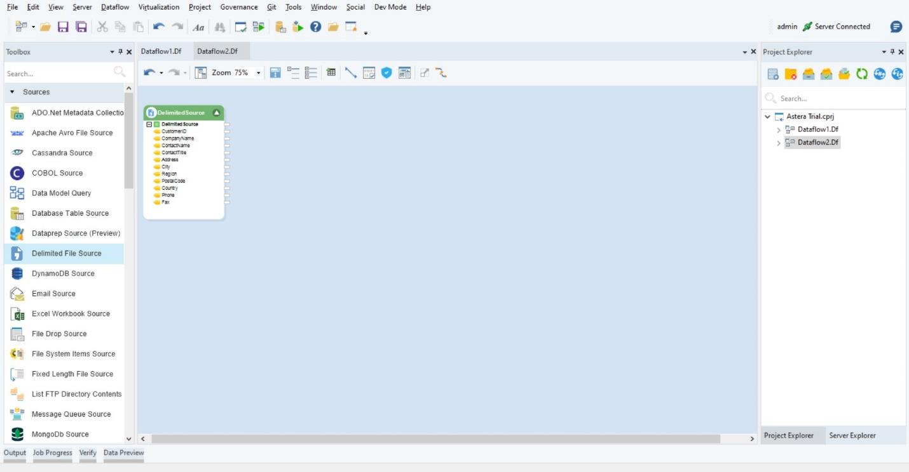
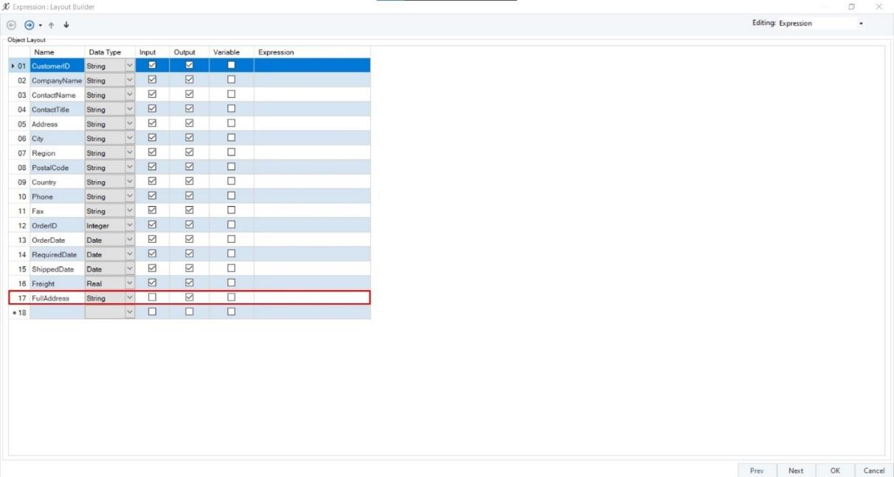
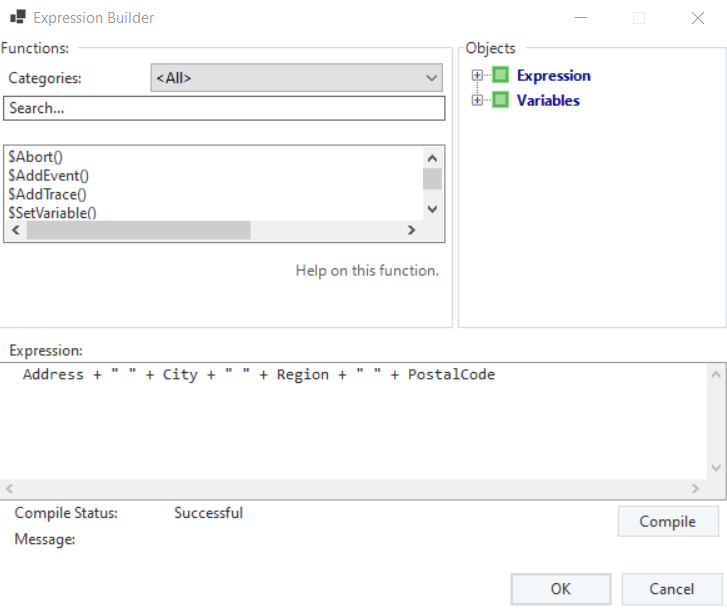
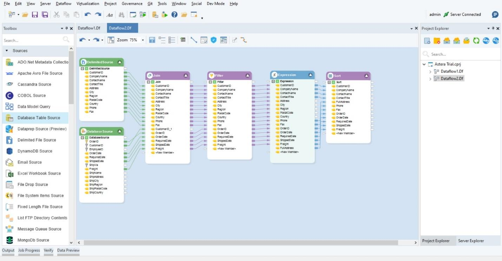
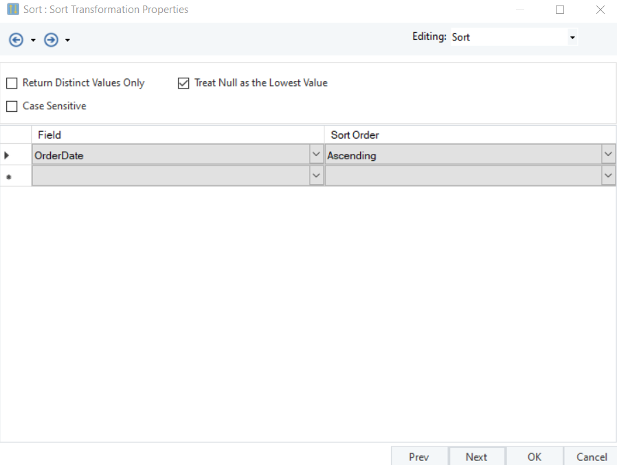
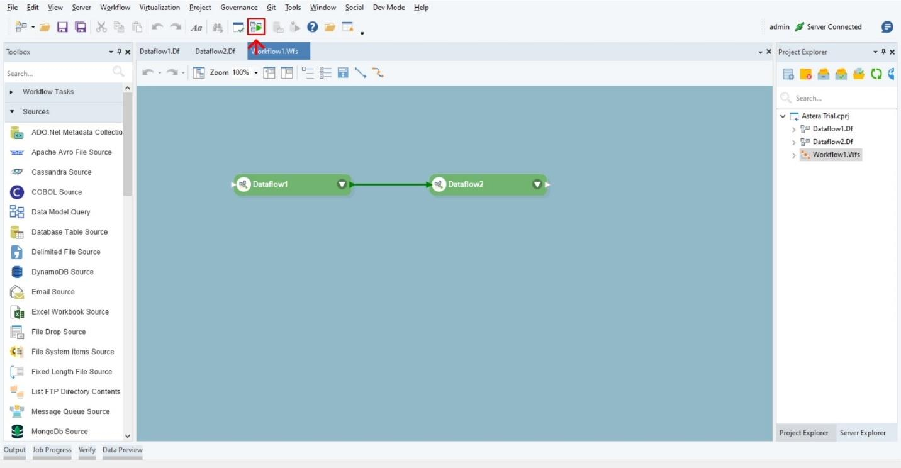
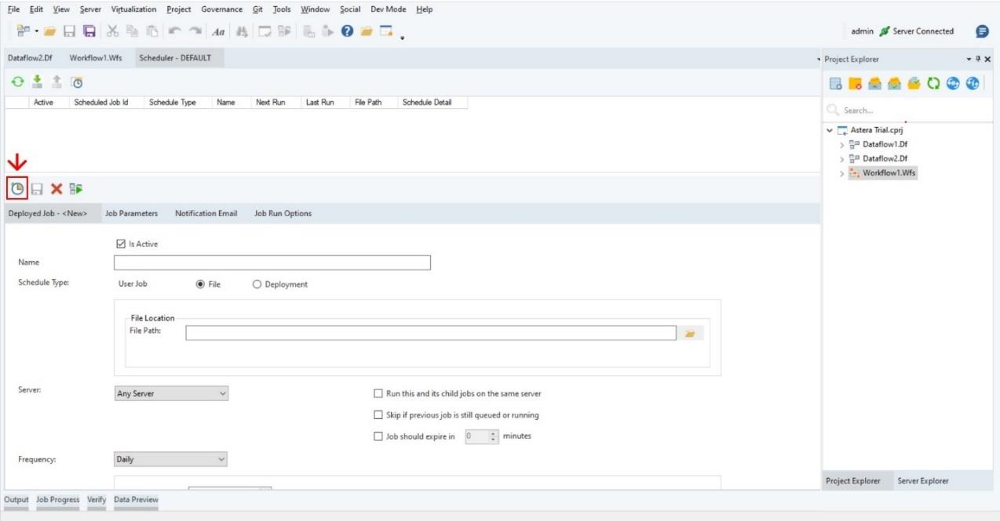
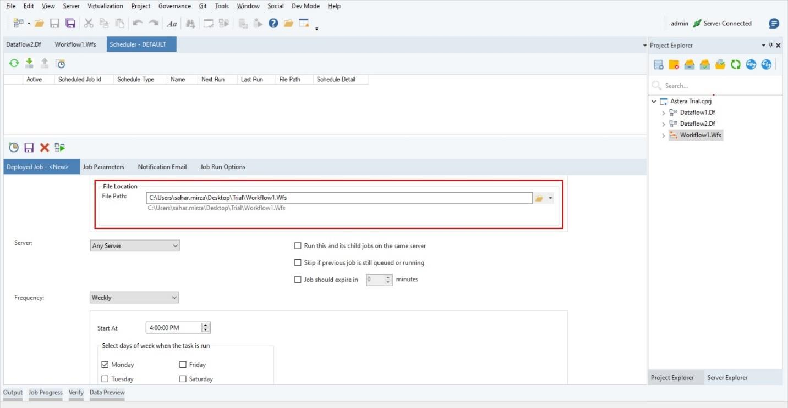

# Welcome to Astera's Free Trial Virtual Machine
Thank you for signing up for Astera's free trial! This virtual machine (VM) is pre-configured with our data integration tool, Astera Data Pipeline Builder. The following manual will guide you through a series of tasks designed to familiarize you with the tool and help you create your first dataflows.

To provide you with practical experience, we'll explore a scenario where DataTech Solutions aims to enhance customer insights, optimize marketing efforts, and improve operational efficiency through the integration and transformation of data. Additionally, they seek to automate these processes to ensure accurate, up-to-date data for strategic business analysis and informed decision-making. Let’s achieve this using Astera Data Pipeline Builder.

We have structured this guide to help you accomplish these objectives step by step. Please follow each step carefully and feel free to explore the tool as you go.

## Task 1: Go Through the Interactive Demo
**Objective:** Familiarizing yourself with the basic features and interface of Astera Data Pipeline Builder.

1. The interactive demo will guide you through the primary features of the tool, including how to create and manage dataflows, use transformations, and connect to data sources.
2. **Start the Interactive Demo:** Open your web browser and navigate to the following link: [Interactive Demo](https://app.arcade.software/share/Ch4uLK5DbPBBNdcrP9YH)

*Note: Please ensure you complete all sections of the demo to gain a comprehensive understanding of the basics.*

## Task 2: Apply What You've Learned
**Objective:** Reinforce your learning by replicating the steps demonstrated in the interactive demo.

1. **Launch Astera Data Pipeline Builder client:** Double-click the Astera client icon on your desktop or by click the icon on the taskbar.

    

2. **Create a New Project:** Go to *Project > New > Integration Project*, and name your project "Astera Trial"

   

3. **Add a Dataflow:**

   - In Project Explorer, right-click on the project "Astera Trial."

   - Select *Add > Add New Item*

    

   - Select Dataflow in the *Add new item* wizard.

    
   
4. **Replicate Steps:** Using what you learned in the interactive demo, replicate the steps. This includes:

   • **Creating a New Dataflow**: As described in step 3.

   • **Add an Excel Source:** Drag and Drop an *Excel Source* object from the toolbox. Open properties to configure the object as shown in the demo.

   • **Adding and Configuring Transformations:** Drag and drop *Cleanse* transformation and configure it as shown in the demo.

   • **Writing to a Destination:** Add a *Database Destination* object and configure the connection to the sample database then map the fields from cleanse transformation to it.

## Task 3: End to End Use Case
**Objective:** We have already familiarized ourselves with the basic features and interface of Astera Data Pipeline Builder and applied these skills to create a simple dataflow. Now let’s develop a more advanced dataflow and workflow to combine related information into a single dataset and transforming it to generate accurate insights for business analysis and decision making at DataTech.

### Step 1: Advanced Dataflow

1. **Create a New Dataflow:**

   - Right-click on the project name "Astera Trial."

   - Select *Add > Add New Item > Dataflow*.

2. **Connect to Data Sources:**

   - Drag and Drop a *Delimited Source object* on the canvas.

   - Double click on its header to specify the file path for the customer data file.

    *Note: you can find the customer file at “[insert file path here]”*

    

   - Drag and Drop a *Database Table Source* object on to the canvas.

     

   - To configure the *Database Table Source* object, right-click on its header and select Properties from the context menu.

     

   - Provide the required credentials.

     *Note: You can use the following credentials to establish connection with Northwind database: [insert database credentials here]*

   - Next, you will see a *Pick Source Table* and *Reading Options* window. On this window, you will select the Orders table from the database that you previously connected to. 

     

3. **Join Data Sources:**

   - Drag and drop the *Join* transformation from the toolbox, to create a unified dataset with customer details and their corresponding orders.

     

   - Connect the *Delimited Source* and *Database Source* to the *Join* transformation.

     

   - Open properties

     

   - Set the Join Type to Inner.

   - Ensure Sort Left Input and Sort Right Input are checked.

   - Match the fields to join on:
   
       - Left Field: CustomerID
   
       - Right Field: CustomerID (or CustomerID_1 if the source data has a different name for this field)

     
   
*To learn more about Join Transformation, please visit:* https://documentation.astera.com/dataflows/transformations/join-transformation

4. **Add Transformations:**

   - **Filter Transformation:**
        - Drag and drop the *Filter* transformation.
        - Map all the fields from the Join Transformation to the Filter Transformation.

     
   
   - To configure the *Filter* transformation, right-click on its header and select Properties from the context menu.

   - Under the *Expression* section in the *Filter* transformation properties window define the criteria to filter those record which have a Freight value greater than 5 and an OrderDate in the year 1997.

     

*To learn more about Filter Transformation, please visit:* https://documentation.astera.com/dataflows/transformations/filter-transformation

  - **Expression Transformation:**

      - Drag and drop an *Expression* transformation.
     
      - Map all the fields from *Filter* transformation to Expression transformation.

     
   
  - To configure the *Filter* transformation, right-click on its header and select Properties from the context menu.

  - Since we want to write the address details from multiple fields into a single field, let’s create a new field named *Full_Address*, and specify the *Data Type* as String and check the *Output* option.

    

  - You can either write an expression directly in the Expression box in the Layout Builder window, or you can build an expression in the Expression Builder. To access the Expression Builder, click on  option. An Expression Builder window will open.

  - In this example, we can either use a concatenate function from the built-in functions or write an expression of our own to return the complete address information in a single field.

    

  - You can now see your expression appear in the Expression field.

    

*To learn more about Expression Transformation, please visit:* https://documentation.astera.com/dataflows/transformations/expression-transformation

- **Sort Transformation:**
  
  - Drag and drop a Sort transformation.
   
  - Map the fields from Expression transformation. (Map the full address field instead of mapping the four fields separately)

    
   
  - To configure the *Sort* transformation, right-click on its header and select Properties from the context menu

  - In the *Sort Transformation* Properties window, set the Sort field to OrderDate in ascending order.

    

*To learn more about Sort Transformation, please visit:* https://documentation.astera.com/dataflows/transformations/sort-transformation

5. **Write to a Destination:**
   - Add an *Excel Destination* object.

   - Connect it to the *Sort* transformation.
 
     
   
   - Configure the output settings to write the data to an Excel file.

### Step 2: Workflow Creation
Now to organize multiple dataflows sequentially to streamline data processing let’s create a workflow.

1. **Create a New Workflow:**
    - Right-click on the project name "Astera Trial."
    - Select *Add > Add New Item > Workflow*.

2. **Add Dataflows to Workflow:**
   - Drag and drop the two dataflows created in Tasks 3 and 4 onto the workflow canvas from the project explorer.

     

3. **Configure Sequence:**
   - Connect the dataflows to run sequentially.

    

4. **Run the Workflow:**
  - Click the execute button to execute the workflow.

   

*To learn more about Workflows, please visit:* https://documentation.astera.com/workflows/creating-workflows-in-astera

### Step 3: Scheduling the Workflow
Now that we have configured our dataflows and workflow for DataTech, let's schedule this on a weekly basis to automate the process and minimize manual intervention, ensuring smooth data processing.

1. **Access the Job Scheduler:**
   - Navigate to *Server > Jobs > Job Schedules*.

     

2. **Create a New Schedule:**
  - Click on *Add Scheduler Task* icon to create a new schedule.

    

3. **Configure Schedule Details:**
   - Name your schedule to easily identify it later.
   - Choose File as the schedule type as we want to create a schedule for a workflow.
   - In the File Location section, provide the File Path to the file that you want to schedule. (In our case the file path of where our workflow is saved)

   

4. **Set Execution Frequency:**
  - Set the Frequency to Weekly.
  - Specify the Start Time for the scheduled execution.
  - Select the specific Day of the Week you want the workflow to execute.

      

5. **Save the Schedule:**
   - Save your schedule configuration.

      

*To learn more about Scheduling, please visit:* https://documentation.astera.com/project-management-and-scheduling/job-scheduling/scheduling-jobson-the-server
