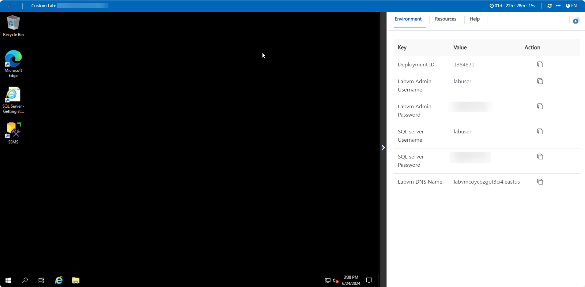
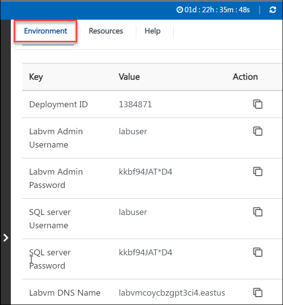
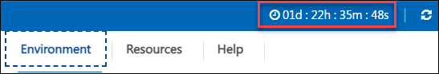
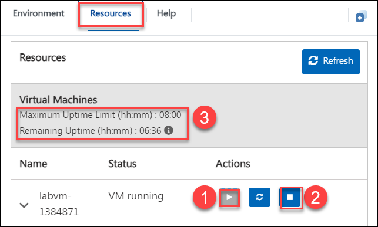
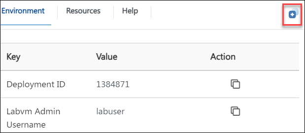

# CloudLabs Demo for CCU: Student Desktop

## Overview
This lab environment has a Windows Virtual machine with all the necessary tools pre-installed.

**Tools Pre-installed**:
- Microsoft 365 Applications: Word, Excel, PowerPoint and Outlook
- Browsers: Chrome, Edge
- File utilities: 7-Zip, Notepad++, FileZilla
- Zoom
- Skype
- Slack
- Teams 
- Adobe Acrobat Reader
- PDFCreator
- OneDrive
- Visual Paradigm (client) 17.1 and
- Visual Studio Code

## Getting started

## Instructions

1. Once the environment is provisioned, a **virtual machine** (JumpVM) on the left and a lab guide on the right will get loaded in your browser. Use this virtual machine throughout to perform the lab tasks.

   

2. To get the lab environment details, you can select the **Environment** tab, you can locate the **Environment** tab in the upper right corner.
   
   

3. You can view the **duration** for the lab evironment from the top right corner

   

4. You can **start(1)** or **stop(2)** the Virtual Machine from the **Resources** tab. You can also monitor the **uptime(3)** for your VM from here.

   

5. You can also open the Lab Guide on a separate full window by selecting the **+** button on the top right corner.

    

6. You can further use the Virtual machine and tools as required.

   
