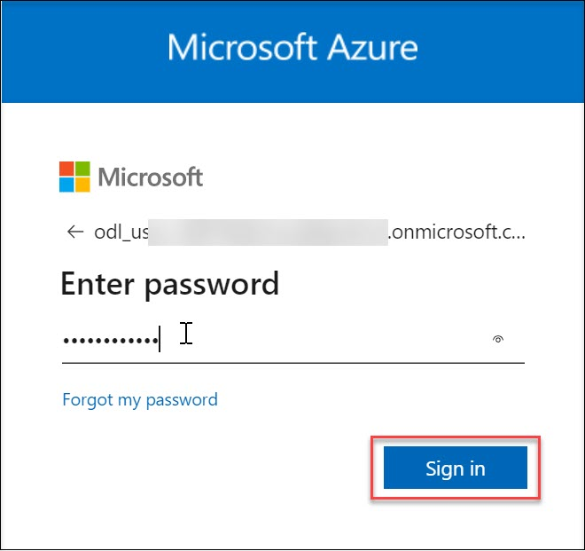
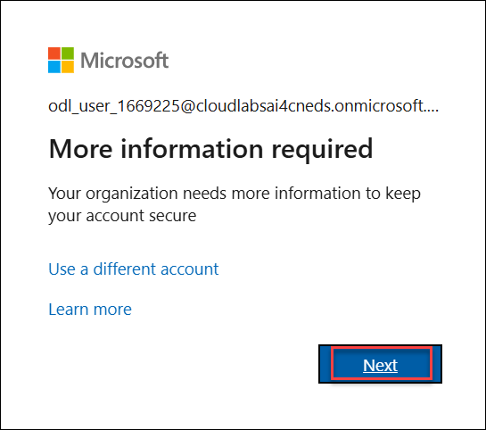
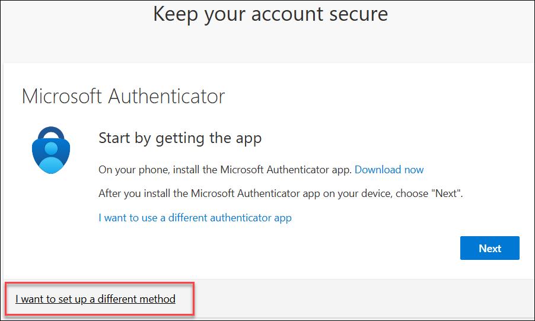
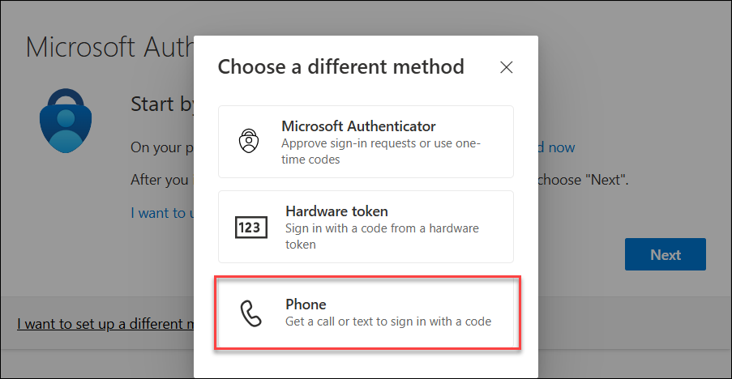
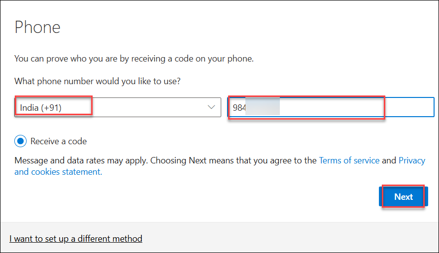
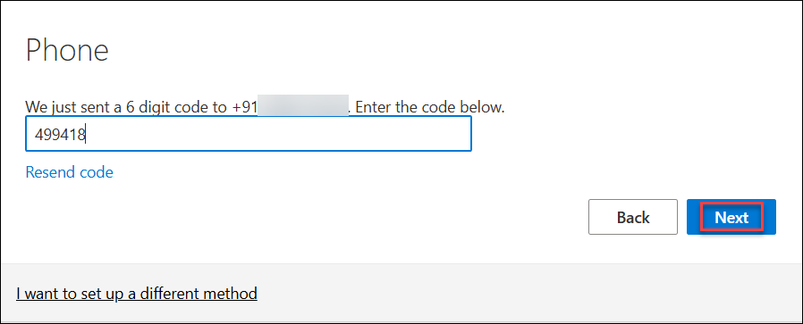
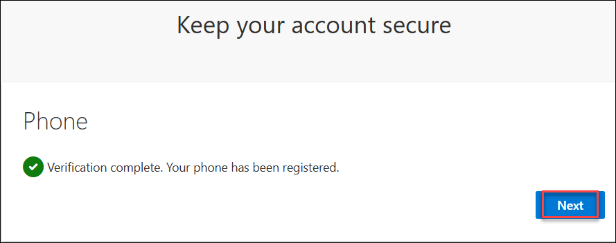
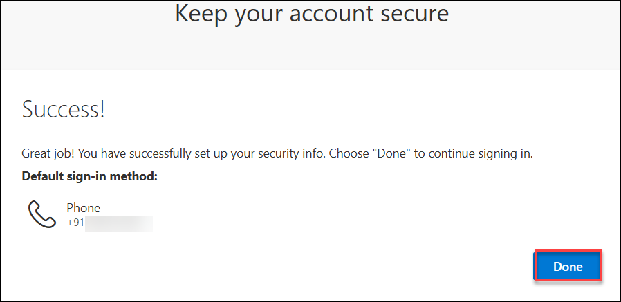

# Azure Sandbox environment 

## Getting started with the Azure Portal

1. In the browser that you already opened, open a new tab, and sign in to the **Azure Portal** (<http://portal.azure.com>).

1. On the **Sign in to Microsoft Azure** blade, you will see a login screen, in which enter the following email/username and then click on **Next**.  

   * **Azure Username/Email**:  <inject key="AzureAdUserEmail"></inject> 
   * **Azure Password**:  <inject key="AzureAdUserPassword"></inject>

        **Note**: Refer to the **Environment** tab for any other lab credentials/details.
        
    
  
    
  
1. If you see the pop-up **Stay Signed in?** click **Yes**.

    

1. If you see the pop-up like below, click **Skip for now(14 days until this is required)**.

    

1. If you are prompted with **"More information required"**, click **`Next`**.

    

    Follow these steps to secure your Microsoft Azure account using multi-factor authentication via phone. These steps are applicable **only if you are prompted** to set up additional security information during login.

1. You may be asked to set up the **Microsoft Authenticator**.

1. Click on **`I want to set up a different method`** at the bottom.

   

1. A popup will appear.

1. Select **`Phone`** from the list.

   

1. Choose your country code (e.g., India +91).

1. Enter your mobile number.

1. Select **`Receive a code`** and click **`Next`**.

   

1. A 6-digit verification code will be sent to your phone.

1. Enter the code and click **`Next`**.

    

1. Once the verification is complete and your phone has been registered, click **Next** to proceed.

    

1. You will see a **Success** message confirming that your MFA method is now configured.  

1. Click **`Done`** to complete the setup.

    

1. If a **Welcome to Microsoft Azure** popup window appears, click **Cancel** to skip the tour.

1. Once you're logged into Azure, you can start creating the required resources.
