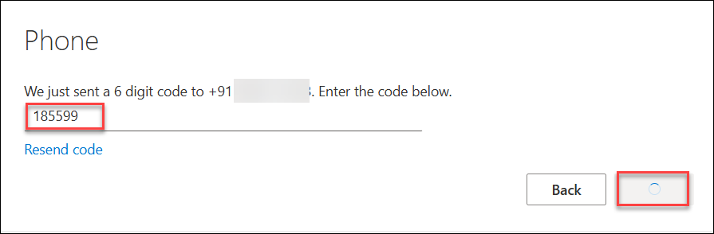
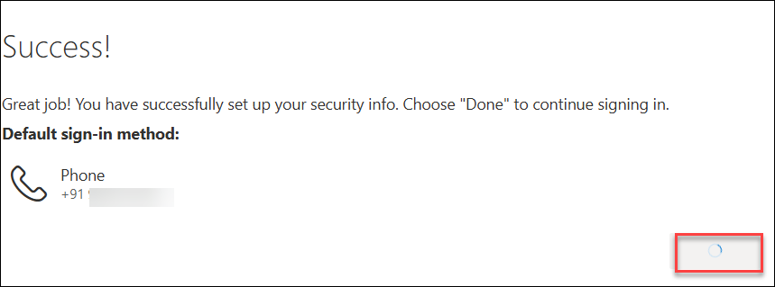

# Azure Sandbox environment 

## Getting started with the Azure Portal

1. In the browser that you already opened, open a new tab, and sign in to the **Azure Portal** (<http://portal.azure.com>).

1. On the **Sign in to Microsoft Azure** blade, you will see a login screen, in which enter the following email/username and then click on **Next**.  

   * **Azure Username/Email**:  <inject key="AzureAdUserEmail"></inject> 
   * **Azure Password**:  <inject key="AzureAdUserPassword"></inject>

        **Note**: Refer to the **Environment** tab for any other lab credentials/details.
        
    
  
    
  
1. If you see the pop-up **Stay Signed in?** click **Yes**.

    

1. If you see the pop-up like below, click **Skip for now(14 days until this is required)**.

    

OR

Follow these steps to secure your Microsoft Azure account using multi-factor authentication via phone.  
These steps are applicable **only if you are prompted** to set up additional security information during login.

1. If prompted with **"More information required"**, click **`Next`**.

    

2. You may be asked to set up the **Microsoft Authenticator**.

3. Click on **`I want to set up a different method`** at the bottom.

   

4. A popup will appear.

5. Select **`Phone`** from the list.

   

6. Choose your country code (e.g., India +91).

7. Enter your mobile number.

8. Select **`Receive a code`** and click **`Next`**.

   

9. A 6-digit verification code will be sent to your phone.

10. Enter the code and click **`Next`**.

   

11. You will see a **Success** message confirming that your MFA method is now configured.  

12. Click **`Done`** to complete the setup.

    

13. If you see the pop-up **You have free Azure Advisor recommendations!** close the window to continue the lab. 

14. If a **Welcome to Microsoft Azure** popup window appears, click **Maybe Later** to skip the tour.

    

