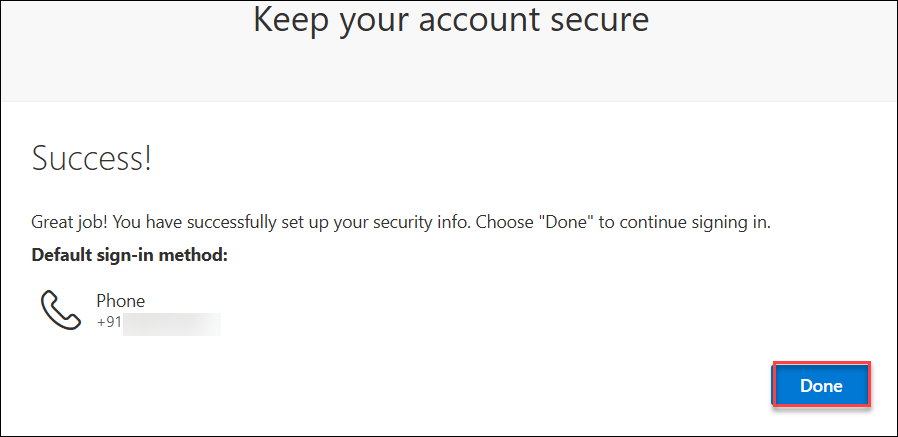

# Demo : M365 Labs

## Overview
This lab environment includes a Windows Virtual Machine, an M365 tenant with Global admin privileges, and a Microsoft 365 E5 license assigned to the lab user.

## Getting started

## Instructions

1. Once the environment is provisioned, a **virtual machine** (JumpVM) on the left and a lab guide on the right will get loaded in your browser. Use this virtual machine throughout to perform the lab tasks.

   

2. To get the lab environment details, you can select the **Environment** tab, you can locate the **Environment** tab in the upper right corner.
   
   

3. You can view the **duration** for the lab evironment from the top right corner

   

4. You can **start(1)** or **stop(2)** the Virtual Machine from the **Resources** tab. You can also monitor the **uptime(3)** for your VM from here.

   

5. You can also open the Lab Guide on a separate full window by selecting the **+** button on the top right corner.

    

6. You can further use the Virtual machine and tools as required.

## Accessing Microsoft 365 Admin Center

1. You can directly access the Microsoft 365 Admin Center by navigating to: https://admin.microsoft.com

2. Sign in with your Global admin credentials:

   * **Username/Email**:  <inject key="AzureAdUserEmail"></inject> 
   * **Password**:  <inject key="AzureAdUserPassword"></inject>

3. Once logged in, you’ll have access to the M365 Admin Center, where you can manage users, licenses, and other M365 services.

   

## Getting started with the Azure Portal (Optional)

1. In the browser that you already opened, open a new tab, and sign in to the **Azure Portal** (<http://portal.azure.com>).

1. On the **Sign in to Microsoft Azure** blade, you will see a login screen, in which enter the following email/username and then click on **Next**.  

   * **Azure Username/Email**:  <inject key="AzureAdUserEmail"></inject> 
   * **Azure Password**:  <inject key="AzureAdUserPassword"></inject>

        **Note**: Refer to the **Environment** tab for any other lab credentials/details.
        
    
  
    
  
1. If you see the pop-up **Stay Signed in?** click **Yes**.

    

1. If you see the pop-up like below, click **Skip for now(14 days until this is required)**.

    

1. If you are prompted with **"More information required"**, click **`Next`**.

    

    Follow these steps to secure your Microsoft Azure account using multi-factor authentication via phone. These steps are applicable **only if you are prompted** to set up additional security information during login.

1. You may be asked to set up the **Microsoft Authenticator**.

1. Click **"I want to set up a different method"** at the bottom of the screen.

   

1. In the popup, select **Phone** from the list.

   

1. Choose your country code (e.g., India +91), enter your mobile number, then select **Receive a code** and click **Next**.

   

1. A 6-digit verification code will be sent to your phone. Enter the code and click **Next**.

    

1. Once verification is complete and your phone number is registered, click **Next** to continue.

    

1. You will see a **Success** message confirming that your MFA method is configured. Click **Done**.

    

1. If a **Welcome to Microsoft Azure** popup window appears, click **Cancel** to skip the tour.

1. Once you're logged into Azure, you can start creating the required resources.

