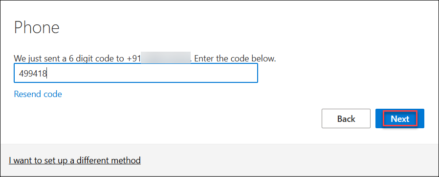
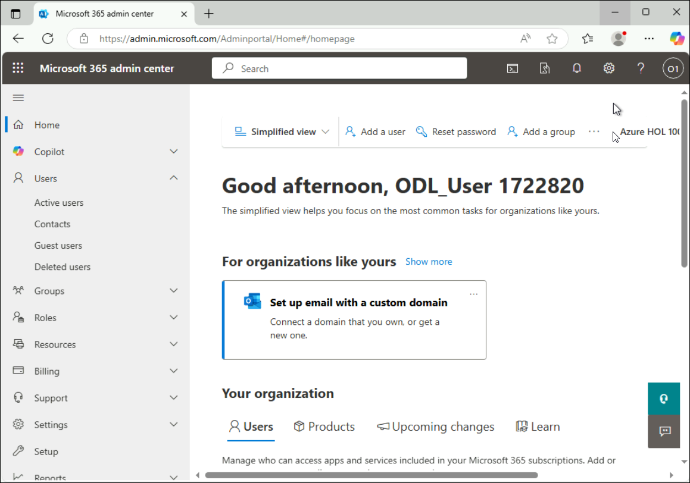

# Demo : M365 Labs

## Overview
This lab environment includes an M365 tenant with Global admin privileges, and a Microsoft 365 Business Premium license assigned to the lab user.

## Instructions

1. To get the lab environment details, you can select the **Environment** tab, you can locate the **Environment** tab in the upper right corner.
   
   

2. You can view the **duration** for the lab evironment from the top right corner

   

## Accessing Microsoft 365 Admin Center

1. You can directly access the Microsoft 365 Admin Center by navigating to: https://admin.microsoft.com

2. Sign in with your Global admin credentials:

   * **Username/Email**:  <inject key="AzureAdUserEmail"></inject> 
   * **Password**:  <inject key="AzureAdUserPassword"></inject>

Follow these steps to secure your Microsoftaccount using multi-factor authentication via phone. These steps are applicable **only if you are prompted** to set up additional security information during login.

1. You may be asked to set up the **Microsoft Authenticator**.

1. Click **"Set up a different way to sign in"** at the bottom of the screen.

   

1. In the Add a sign-in method popup, select **Phone** from the list.

   

1. Choose your country code (e.g., United States +1), enter your mobile number, then select **Text a code** and click **Next**.

   

1. A 6-digit verification code will be sent to your phone. Enter the code and click **Next**.

    

1. Once verification is complete and your phone number is registered, click **Done** to continue.

    

1. If you see the pop-up **Stay Signed in?** click **Yes**.

    
   
3. Once logged in, you’ll have access to the M365 Admin Center, where you can manage users, licenses, and other M365 services.

   

