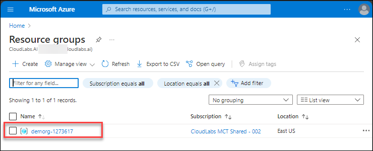

# CloudLabs Demo : Azure environment 

## Overview
This lab environment has a Azure account and a resource group assigned with required permissions.

## Getting started with the Azure Portal

1. In the browser, open a new tab, and sign in to the **Azure Portal** (<http://portal.azure.com>).

1. On the **Sign in to Microsoft Azure** blade, you will see a login screen, in which enter the following email/username and then click on **Next**.  

   * **Azure Username/Email**:  <inject key="AzureAdUserEmail"></inject> 
   * **Azure Password**:  <inject key="AzureAdUserPassword"></inject>

        **Note**: Refer to the **Environment Details** tab for any other lab credentials/details.
        
    
  
    
  
1. If you see the pop-up like below, click **Skip for now(14 days until this is required)**.

    

1. If you see the pop-up **Stay Signed in?** click **No**.

    

1. If you see the pop-up **You have free Azure Advisor recommendations!** close the window to continue the lab. 

1. If a **Welcome to Microsoft Azure** popup window appears, click **Maybe Later** to skip the tour.

    

1. Navigate to the **Resource groups** and click on the provided resource group.

       

1. You can now deploy the azure resources required for your lab in the provided resource group

