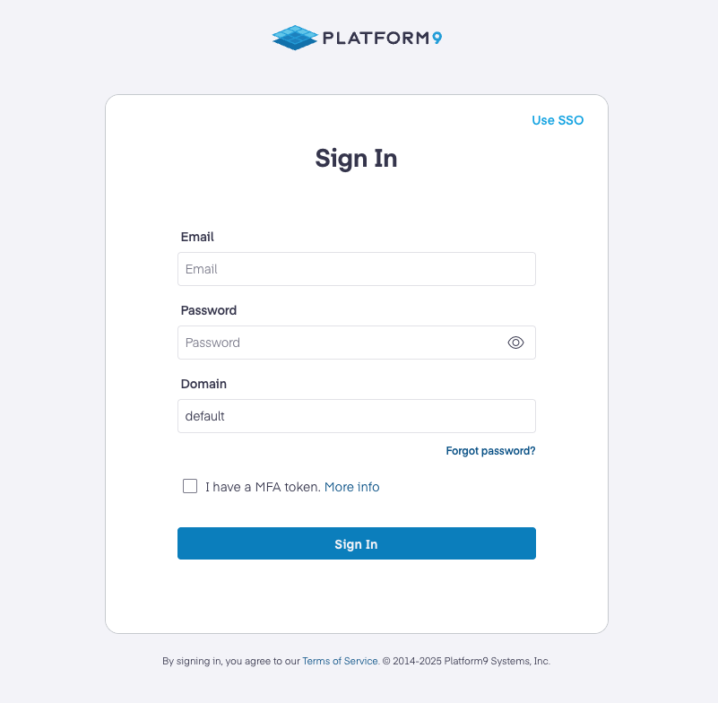

# Demo Lab : Platform9

## Overview
This lab environment includes a Windows host virtual machine with two Ubuntu VMs running on Hyper-V: Ubuntu-PCD, where Platform9 Private Cloud Director (PCD) is deployed, and Ubuntu, which is onboarded as the hypervisor host

## Getting started

## Instructions

1. Once the environment is provisioned, a **virtual machine** (JumpVM) on the left and a lab guide on the right will get loaded in your browser. Use this virtual machine throughout to perform the lab tasks.

   

2. To get the lab environment details, you can select the **Environment** tab, you can locate the **Environment** tab in the upper right corner.
   
   

3. You can view the **duration** for the lab evironment from the top right corner

   

4. You can **start(1)** or **stop(2)** the Virtual Machine from the **Resources** tab. You can also monitor the **uptime(3)** for your VM from here.

   

5. You can also open the Lab Guide on a separate full window by selecting the **+** button on the top right corner.

    

6. You can further use the Virtual machine and tools as required.

## Login to the Platform 9's User Interface

1. Before accessing Platform9, open Hyper-V Manager on the Windows VM.
   Turn on both Ubuntu virtual machines:
   **Ubuntu** (hypervisor host)
   **Ubuntu-PCD** (PCD controller node)

2. Navigate to the UI FQDN https://pcd-community.pf9.io in a web browser from the Windows Host Machine.

   

   Note: Once both machines are up and running, the pcd.community portal may take up to 20 minutes to fully load

3. Login using the credentials

   * **Username/Email**: admin@airctl.localnet
   * **Password**: qEkzDDGCaHFRsOBJ

4. After logging in, navigate through the Platform9 dashboard to explore key components such as Clusters, Hosts, Images, and VM provisioning options
