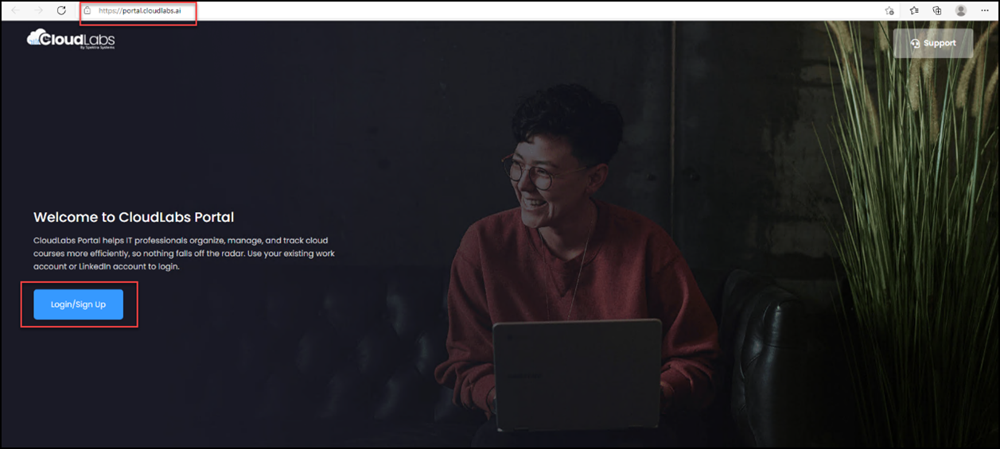
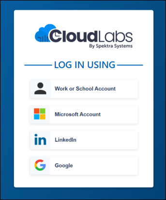
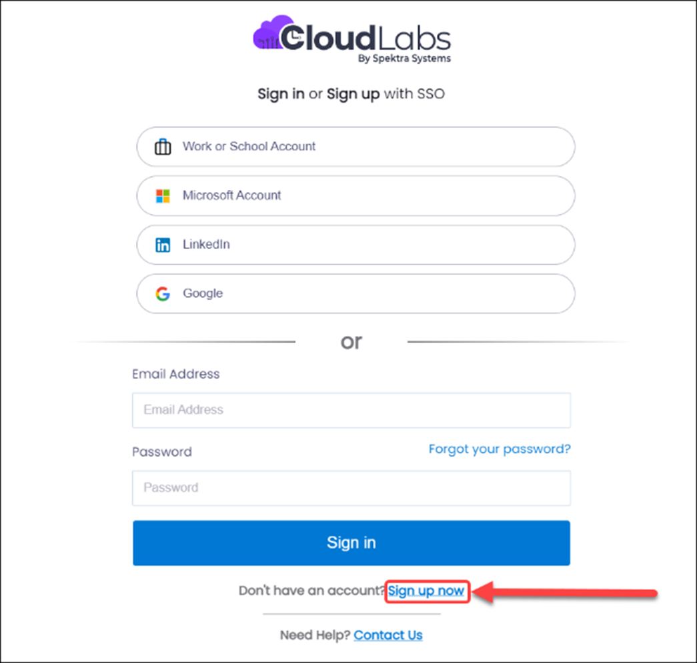
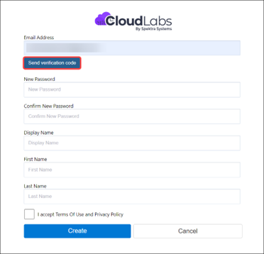
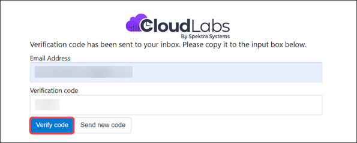
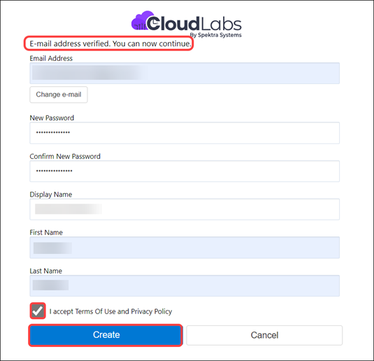
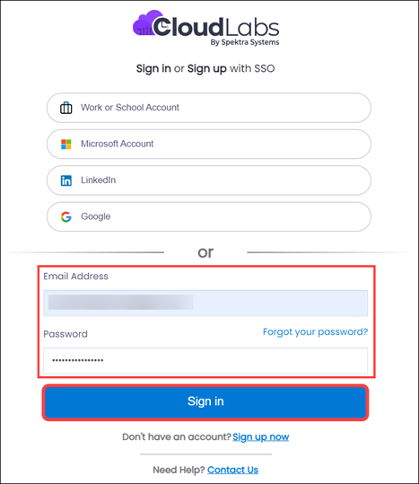

#  How to access CloudLabs? 

The CloudLabs portal is accessible at https://portal.cloudlabs.ai and it is your one-stop destination for accessing your VM Labs or managing or creating new labs. The same portal is used by all roles, such as learners, end users, administrators, instructors, etc.

CloudLabs supports native authentication with an email ID and password or using SSO providers (Single Sign On) listed below:
1.	Azure AD (also known as Entra ID/O365/Work or School Account)
2.	LinkedIn
3.	Google
4.	Microsoft Account (also known as Live ID)

## Steps to login/signup:

1.	Visit https://portal.cloudlabs.ai

2.	Click on **Sign up or log in** button.

  	

3. You can use any of the available options, including work, school, LinkedIn, or Gmail account for login/signup.

   
 
   **If you do not have one of the above accounts, you can sign up with CloudLabs in order to continue.**

4. Click on the **Sign up now** option available in the end of the login page to get account   created.

                                      

5.	Enter an **Email Address** now, click **Send verification code**. Other fields are not required to be filled in; they will be filled after you receive the verification code.

    
 

6.	Provide the verification code you received over the email and click **Verify code**.

  	
 

7.	After the verification process is successful, you can create this account by entering the necessary details, choosing a password, and clicking the **Create** button.

    
 

8.	Sign in with the email address and password you created in the previous step and click **Sign in**.

    
 
    You will be now able to access CloudLabs Portal

 

 

