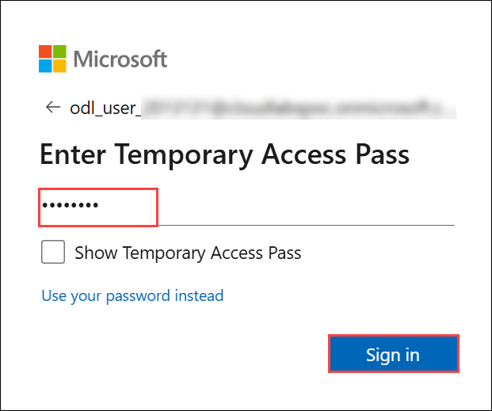
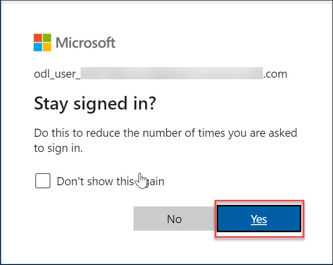
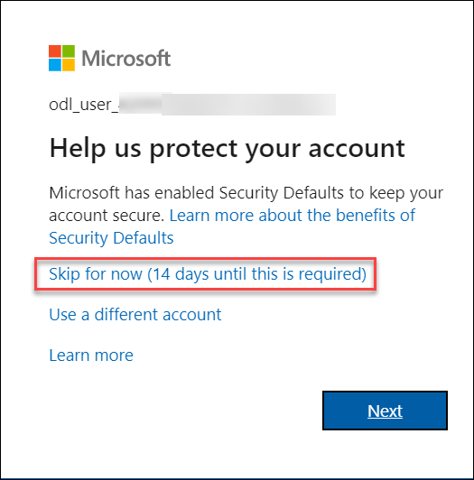

# Azure Sandbox environment 

## Getting started with the Azure Portal

1. In the browser that you already opened, open a new tab, and sign in to the **Azure Portal** (<http://portal.azure.com>).

1. On the **Sign in to Microsoft Azure** blade, you will see a login screen, in which enter the following email/username and then click on **Next**.  

   * **Azure Username/Email**:  <inject key="AzureAdUserEmail"></inject> 
   * **Azure Password**:  <inject key="AzureAdUserPassword"></inject>

        **Note**: Refer to the **Environment** tab for any other lab credentials/details.
        
    
  
    
  
1. If you see the pop-up **Stay Signed in?** click **Yes**.

    

1. If you see the pop-up like below, click **Skip for now(14 days until this is required)**.

    

1. If a **Welcome to Microsoft Azure** popup window appears, click **Cancel** to skip the tour.

1. Once you're logged into Azure, you can start creating the required resources.

1. Now you will see Azure Portal Dashboard, click on **Resource groups** from the Navigate panel to see the resource groups.

   

1. Confirm you have a resource group **Sandbox** present. You need to use the **Sandbox** resource group throughout the learning.

