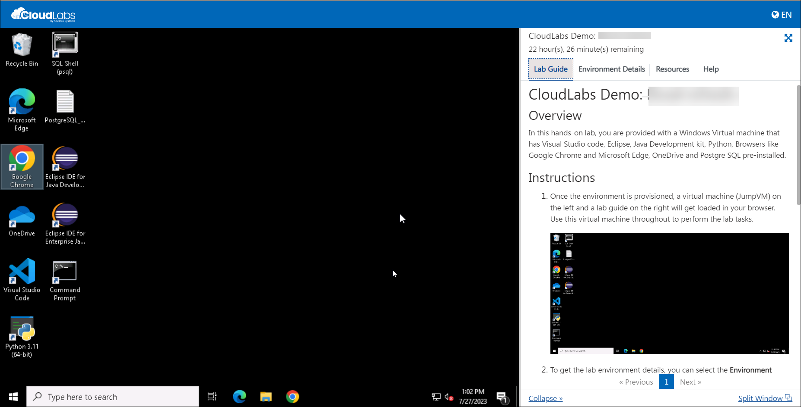
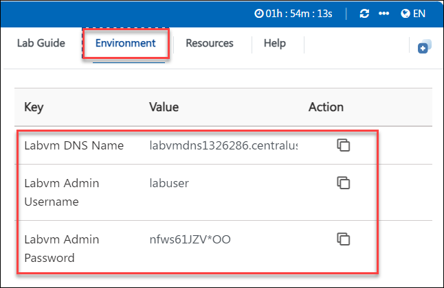
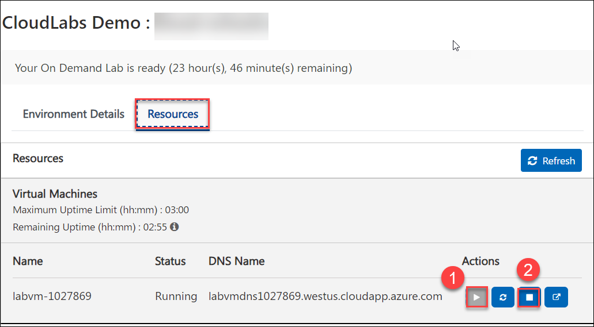

# CloudLabs Demo : Azure environment with Windows machine

## Overview
Azure virtual machines are one of several types of on-demand, scalable computing resourcesLinks to an external site. that Azure offers. Typically, you choose a virtual machine when you need more control over the computing environment than the other choices offer. This article gives you information about what you should consider before you create a virtual machine, how you create it, and how you manage it.

An Azure virtual machine gives you the flexibility of virtualization without having to buy and maintain the physical hardware that runs it. However, you still need to maintain the virtual machine by performing tasks, such as configuring, patching, and installing the software that runs on it.

Azure virtual machines can be used in various ways. Some examples are:

Development and test – Azure virtual machines offer a quick and easy way to create a computer with specific configurations required to code and test an application.
Applications in the cloud – Because demand for your application can fluctuate, it might make economic sense to run it on a virtual machine in Azure. You pay for extra virtual machines when you need them and shut them down when you don’t.
Extended datacenter – virtual machines in an Azure virtual network can easily be connected to your organization’s network.
The number of virtual machines that your application uses can scale up and out to whatever is required to meet your needs.

## Getting started

This lab environment includes a Windows Virtual machine

## Instructions

1. Once the environment is provisioned, a **virtual machine** (JumpVM) on the left and a lab guide on the right will get loaded in your browser. Use this virtual machine throughout to perform the lab tasks.

   

2. To get the lab environment details, you can select the **Environment** tab, you can locate the Environment tab in the upper right corner.
   
   

3. You can also open the Lab Guide on a separate full window by selecting the **Split Window** button on the bottom right corner.
   
4. You can **start(1)** or **stop(2)** the Virtual Machine from the **Resources** tab. You can also monitor the uptime remaining for your VM from here.

   
    
5. You can perform the required tasks using the applications provided.
   
