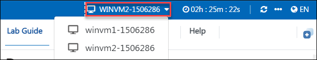

# Demo : Two VM's

## Overview
This lab environment has two Windows Virtual machines with PowerBI Desktop and Visual Studio Code installed.

## Getting started

## Instructions

1. Once the environment is provisioned, a **virtual machine** (JumpVM) on the left and a lab guide on the right will get loaded in your browser. Use this virtual machine throughout to perform the lab tasks.

   

2. To get the lab environment details, you can select the **Environment** tab, you can locate the **Environment** tab in the upper right corner.
   
   

3. You can switch between the virtual machines from top right corner.

   

4. You can view the **duration** for the lab evironment from the top right corner

   

5. You can **start(1)** or **stop(2)** the Virtual Machine from the **Resources** tab. You can also monitor the **uptime(3)** for your VM from here.

   

6. You can also open the Lab Guide on a separate full window by selecting the **+** button on the top right corner.

    

7. You can further use the Virtual machine and tools as required.

## Getting started with the Azure Portal

1. In the browser that you already opened, open a new tab, and sign in to the **Azure Portal** (<http://portal.azure.com>).

1. On the **Sign in to Microsoft Azure** blade, you will see a login screen, in which enter the following email/username and then click on **Next**.  

   * **Azure Username/Email**:  <inject key="AzureAdUserEmail"></inject> 
   * **Azure Password**:  <inject key="AzureAdUserPassword"></inject>

        **Note**: Refer to the **Environment Details** tab for any other lab credentials/details.
        
    
  
    
  
1. If you see the pop-up like below, click **Skip for now(14 days until this is required)**.

    

1. If you see the pop-up **Stay Signed in?** click **No**.

    

1. If you see the pop-up **You have free Azure Advisor recommendations!** close the window to continue the lab. 

1. If a **Welcome to Microsoft Azure** popup window appears, click **Maybe Later** to skip the tour.

    

1. You can now deploy the azure resources required for your lab

