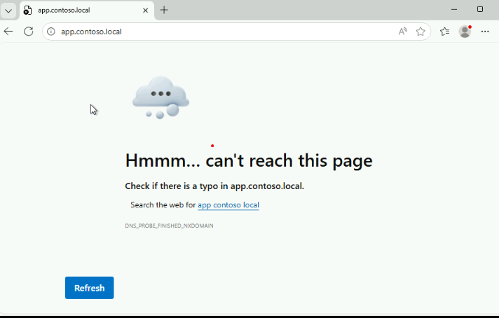

# Challenge 2: Resolving a Network Resource Access Error

## Objective

Diagnose and resolve a network connectivity issue preventing access to an internal web application, and validate successful access from the Client VM.

## Scenario

**HELPDESK TICKET #HD-2851 | Priority: CRITICAL | Status: ASSIGNED TO YOU**

---
**From:** enduser1 (enduser1@contoso.local)  
**Subject:** CRITICAL - Cannot access internal application for order processing  
**Time Reported:** Monday, 9:30 AM
---

**Issue Description:**

"I'm trying to access our internal order management system at https://app.contoso.local but it's completely unreachable from my workstation. I keep getting connection timeout errors when I try to open it in my browser.

This is blocking my entire team from processing customer orders! We have dozens of orders waiting to be fulfilled, and every minute of downtime is costing us money. The application was working fine on Friday, but now nothing loads.

I can access other websites and internal resources just fine, so my internet connection is working. It's specifically this application that won't load. Please help urgently!"

 

**Your Mission:**

As the on-call network support technician at Contoso Corporation, you must immediately investigate this critical service disruption. You need to:

- Investigate why the internal application at https://app.contoso.local is unreachable from the Client VM
- Diagnose the root cause of the connectivity failure using the Technician VM
- Identify and resolve any network or firewall configuration issues
- Validate that the application is fully accessible from the Client VM

**Important:** This is a critical business application affecting order processing for the entire department. Multiple users are blocked from their work, and revenue is at stake. You must resolve this quickly while following proper troubleshooting procedures.

## Lab Environment
When the lab is launched, CloudLabs automatically provisions:

- Client VM

   - Domain-joined to CONTOSO

   - User workstation experiencing the connectivity issue

   - Used for initial problem verification and final validation

- Technician VM

   - Domain-joined to CONTOSO

   - Logged in using a technician account

   - Used for investigation and remediation

   - Has RDP access to the application server (APP01)

- APP01 Server

   - Hosts the internal web application at https://app.contoso.local

   - Running IIS with HTTPS on port 443

**Note:** A firewall misconfiguration is preventing access to the application

## Lab Credentials

**APP01 Server (via RDP from Technician VM)**
- User Name: CONTOSO\helpdesk1
- Password: Password.1!!
  
## Challenge Workflow
Learners must complete the following tasks using the CloudLabs environment. No commands or step-by-step instructions are provided.

## Task 1: Verify and Diagnose the Problem
Using the Client VM:

- Confirm that the application at https://app.contoso.local is unreachable

- Test network connectivity to the application server

- Determine whether the issue is DNS-related, network-related, or port-specific

- Identify which layer of connectivity is failing (ping vs. port connectivity)

## Task 2: Investigate the Application Server
Using the Technician VM:

- Connect to the APP01 server to investigate the server-side configuration

- Check the Windows Firewall configuration on APP01

- Identify any firewall rules that might be blocking HTTPS traffic (port 443)

- Determine the specific rule or configuration causing the connectivity failure

## Task 3: Remediate the Issue
On the APP01 server:

- Resolve the firewall configuration issue preventing access to port 443

- Ensure the application remains accessible without compromising security

- Do not disable the entire Windows Firewall—only address the specific blocking rule

## Task 4: Validate Application Access
From the Client VM:

- Re-test network connectivity to confirm port 443 is now accessible

- Open a web browser and navigate to https://app.contoso.local

- Confirm the application loads successfully (you may see a certificate warning—this is expected in the lab environment)

- Verify the "Lab App" welcome page is displayed

## Success Criteria
The challenge is considered successfully completed when:

- Network connectivity to app.contoso.local on port 443 is confirmed (TcpTestSucceeded = True)

- The firewall blocking rule has been properly disabled

- The web application at https://app.contoso.local is accessible from the Client VM

- The "Lab App" welcome page loads successfully in a browser

No unnecessary firewall rules were disabled (only the specific blocking rule was addressed)

Congratulations on completing the Challenge! Now, it's time to validate it. Here are the steps:

Hit the Validate button for the corresponding Challenge. If you receive a success message, you can proceed to the next Challenge.
If not, carefully read the error message and retry the step, following the instructions in the lab guide.

# Validation 2: Resolving a Network Resource Access Error

<validation step="237f79e4-a7b7-4c59-8d51-f96fe008f5f6" />

Now, click Next to continue to Challenge 03.