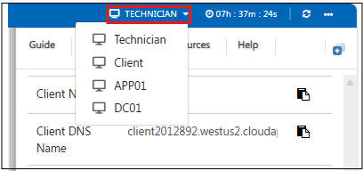

# Challenge Labs demo

## Overview
This lab provides a set of real-world troubleshooting challenges designed to simulate common IT support and administration scenarios. Participants will investigate issues, identify root causes, and apply fixes using a controlled lab environment.

The lab includes the following challenges:
- Challenge 1: Resolving a Windows Domain Account Lockout
- Challenge 2: Resolving a Network Resource Access Error
- Challenge 3: Resolving a Network Printer Access Issue
- Challenge 4: Resolving Azure Portal Access Failure

## Getting started

## Instructions

1. Once the environment is provisioned, a **virtual machine** (JumpVM) on the left and a lab guide on the right will get loaded in your browser. Use this virtual machine throughout to perform the lab tasks.

   

2. To get the lab environment details, you can select the **Environment** tab, you can locate the **Environment** tab in the upper right corner.
   
   

3. Some challenges may require access to multiple virtual machines.

   Use the VM switcher in the top-right corner to move between available VMs

   

4. You can view the **duration** for the lab evironment from the top right corner

   

5. You can **start(1)** or **stop(2)** the Virtual Machine from the **Resources** tab. You can also monitor the **uptime(3)** for your VM from here.

   

6. You can also open the Lab Guide on a separate full window by selecting the **+** button on the top right corner.

    

7. Click Next to begin Challenge 1: Resolving a Windows Domain Account Lockout

   
