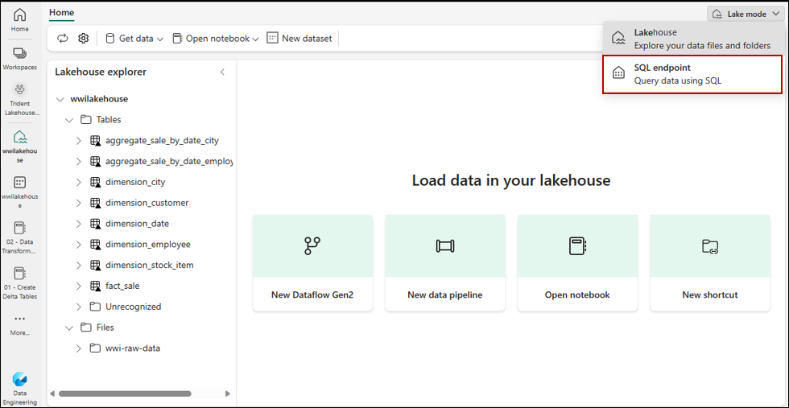
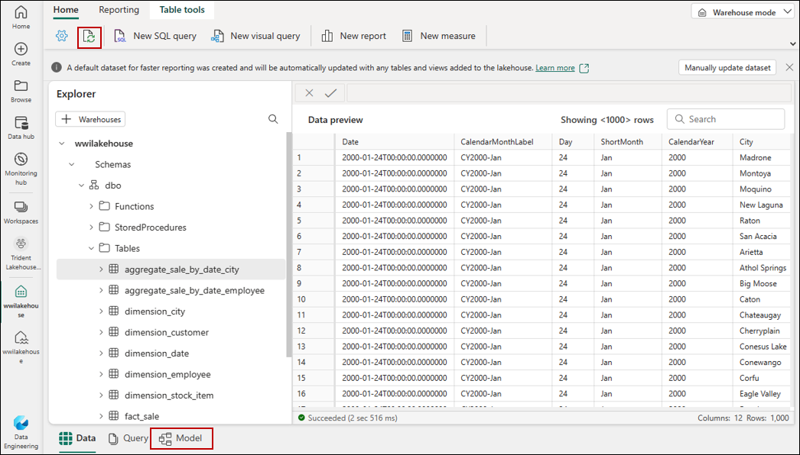
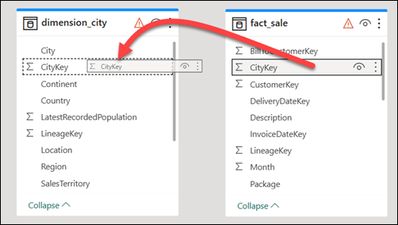
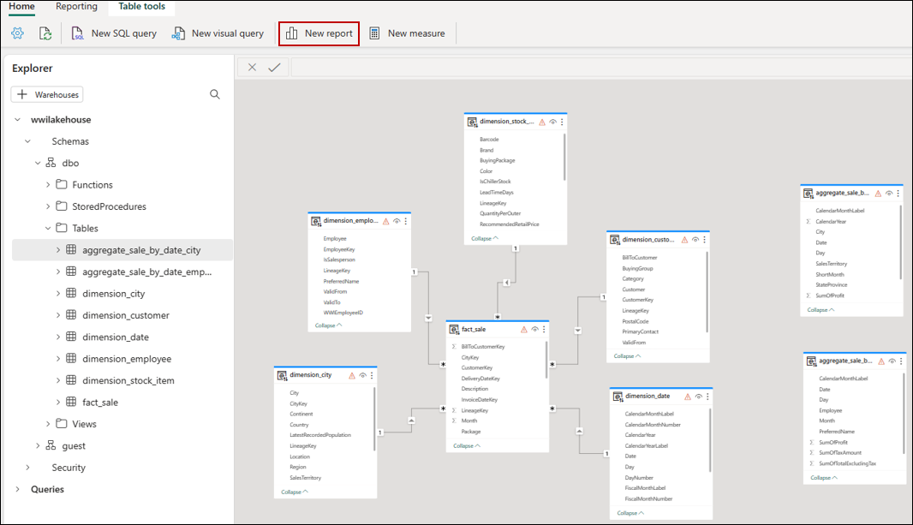
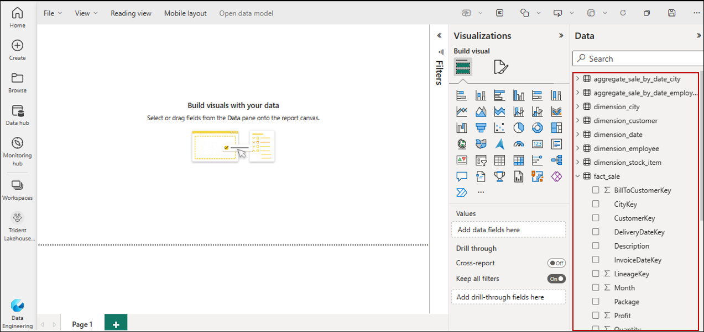
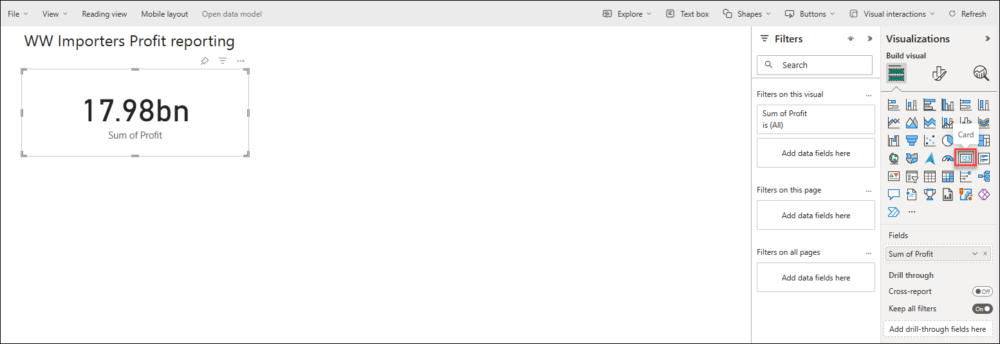
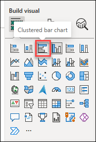
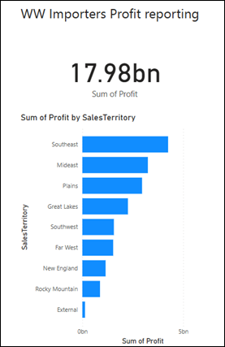

# Building reports in Microsoft Fabric
In this task, you will create a Power BI data model and create a report from scratch.

## Build a report
Power BI is natively integrated in the whole Fabric experience. This native integration brings a unique mode, called DirectLake, of accessing the data from the lakehouse to provide the most performant query and reporting experience. DirectLake mode is a groundbreaking new engine capability to analyze very large datasets in Power BI. The technology is based on the idea of loading parquet-formatted files directly from a data lake without having to query a data warehouse or lakehouse endpoint, and without having to import or duplicate data into a Power BI dataset. DirectLake is a fast path to load the data from the data lake straight into the Power BI engine, ready for analysis.

1. From your **wwilakehouse** lakehouse, select **SQL endpoint** from the **Lakehouse** drop-down menu at the top right of the screen.

   

2. From the SQL endpoint pane, you should be able to see all the tables you created. If you don't see them yet, select the **Refresh** icon at the top. Next, select the **Model** tab at the bottom to open the default Power BI dataset.

   

3. For this data model, you need to define the relationship between different tables so that you can create reports and visualizations based on data coming across different tables. From the **fact_sale** table, drag the **CityKey** field and drop it on the **CityKey** field in the **dimension_city** table to **create a relationship**. The Create Relationship dialog box appears.

   

4. In the **Create Relationship** dialog box:

  - Table 1 is populated with **fact_sale** and the column of CityKey.

  - Table 2 is populated with **dimension_city** and the column of CityKey.

  - Cardinality: **Many to one (*:1)**

  - Cross filter direction: **Single**

  - Leave the box next to **Make this relationship active selected**.

  - Select the box next to **Assume referential integrity**.

  - Select **Confirm**.

   

5. Next, add these relationships with the same **Create Relationship** settings as shown above but with the following tables and columns:

   StockItemKey(fact_sale) - StockItemKey(dimension_stock_item)
   Salespersonkey(fact_sale) - EmployeeKey(dimension_employee)
   CustomerKey(fact_sale) - CustomerKey(dimension_customer)
   InvoiceDateKey(fact_sale) - Date(dimension_date)

   After you add these relationships, your data model is ready for reporting as shown in the following image:

   

6. Select **New report** to start creating reports/dashboards in Power BI. On the Power BI report canvas, you can create reports to meet your business requirements by dragging required columns from the **Data** pane to the canvas and using one or more of available visualizations.

   

7. Add a title:

- In the Ribbon, select **Text box**.

- Type in **WW Importers Profit Reporting**.

- Highlight the text and increase size to 20 and place in the upper left of the report page.

8. Add a Card:

- On the **Data** pane, expand **fact_sales** and check the box next to **Profit**. This selection creates a column chart and adds the field to the Y-axis.

- With the bar chart selected, select the **Card** visual in the visualization pane. This selection converts the visual to a card.

- Place the card under the title.

 

9. Add a Bar chart:

- On the **Data** pane, expand **fact_sales** and check the box next to **Profit**. This selection creates a column chart and adds the field to the Y-axis.

- On the **Data** pane, expand **dimension_city** and check the box for **SalesTerritory**. This selection adds the field to the Y-axis.

- With the bar chart selected, select the **Clustered bar chart** visual in the visualization pane. This selection converts the column chart into a bar chart.

 

- Resize the Bar chart to fill in the area under the title and Card.

10. Click anywhere on the blank canvas (or press the Esc key) so the bar chart is no longer selected.

11. Build a stacked area chart visual:

On the Visualizations pane, select the Stacked area chart visual.

Screenshot of the visualizations pane, showing where to select Stacked area chart.

Reposition and resize the stacked area chart to the right of the card and bar chart visuals created in the previous steps.

On the Data pane, expand fact_sales and check the box next to Profit. Expand dimension_date and check the box next to FiscalMonthNumber. This selection creates a filled line chart showing profit by fiscal month.

On the Data pane, expand dimension_stock_item and drag BuyingPackage into the Legend field well. This selection adds a line for each of the Buying Packages.

Screenshot of the data pane showing how to add lines to the chart.

Click anywhere on the blank canvas (or press the Esc key) so the stacked area chart is no longer selected.

Build a column chart:

On the Visualizations pane, select the Stacked column chart visual.

Screenshot showing where to select Stacked column chart.

On the Data pane, expand fact_sales and check the box next to Profit. This selection adds the field to the Y-axis.

On the Data pane, expand dimension_employee and check the box next to Employee. This selection adds the field to the X-axis.

Screenshot showing how to add a field to the x axis.

Click anywhere on the blank canvas (or press the Esc key) so the chart is no longer selected.

From the ribbon, select File > Save.

Enter the name of your report as Profit Reporting.

Select Save.

Screenshot showing the Save your report dialog.
