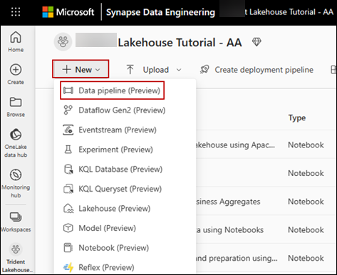
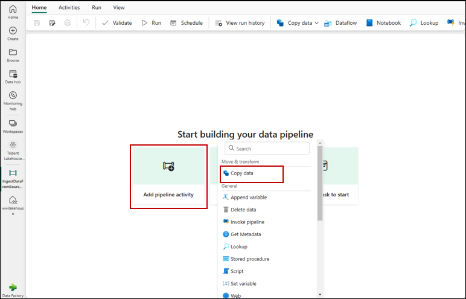
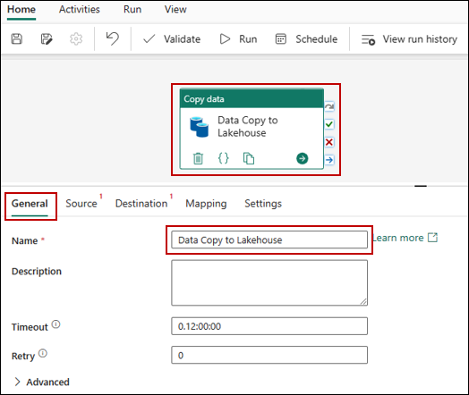
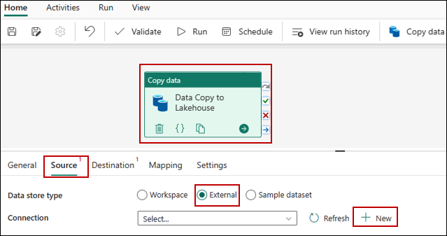
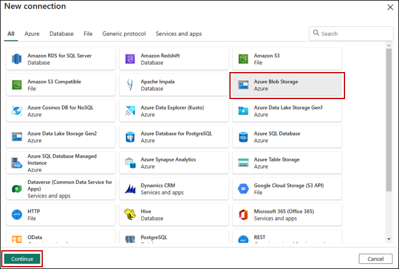
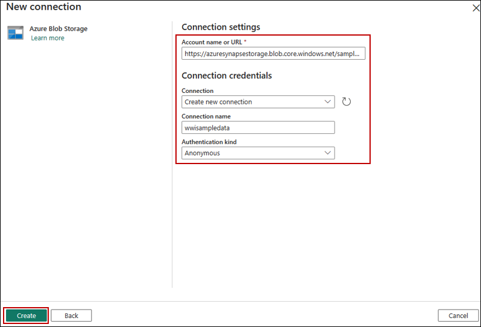
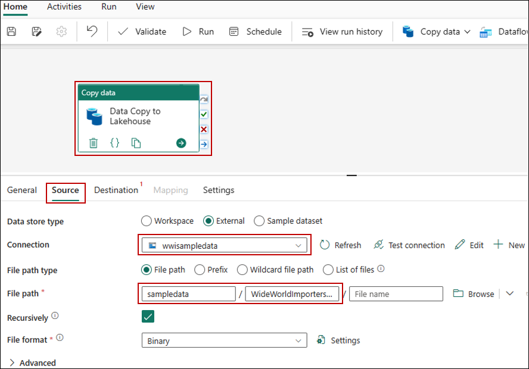
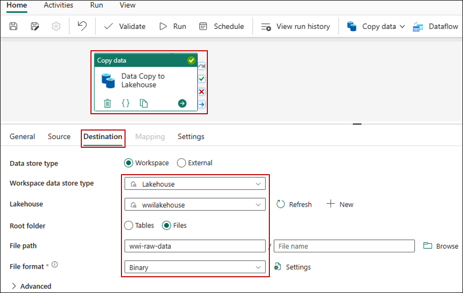
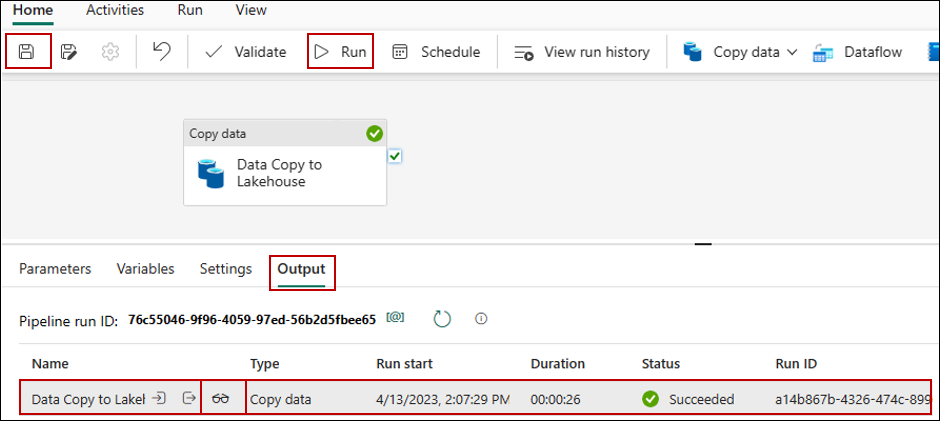

# Ingest data into the lakehouse
In this task, you ingest additional dimensional and fact tables from the Wide World Importers (WWI) into the lakehouse.
Here, you will use the **Copy data activity** of the Data Factory pipeline to ingest sample data from an Azure storage account to the **Files** section of the lakehouse you created earlier.

1. Select **Workspaces** in the left navigation pane, and then select your new workspace from the **Workspaces** menu.

2. From the **+New** button in the workspace page, select **Data pipeline**

   

3. In the **New pipeline** dialog box, specify the name as **IngestDataFromSourceToLakehouse** and select **Create**. A new data factory pipeline is created and opened.
  
4. On your newly created data factory pipeline, select **Add pipeline activity** to add an activity to the pipeline and select **Copy data**. This action adds copy data activity to the pipeline canvas.

   

5. Select the newly added copy data activity from the canvas. Activity properties appear in a pane below the canvas (you may need to expand the pane upwards by dragging the top edge). Under the **General** tab in the properties pane, specify the name for the copy data activity **Data Copy to Lakehouse**

   

6. Under the **Source** tab of the selected copy data activity, select **External** as **Data store type** and then select **+ New** to create a new connection to the data source.
   
   
   
7. For this lab, all the sample data is available in a public container of Azure blob storage. You connect to this container to copy data from it. On the **New connection** wizard, select **Azure Blob Storage** and then select **Continue**.

   

8. On the next screen of the **New Connection** wizard, enter the following details and select **Create** to create the connection to the data source.
   - Account name or URI : **https://azuresynapsestorage.blob.core.windows.net/sampledata**
   - Connection	: **Create new connection**
   - Connection name:	**wwisampledata**
   - Authentication kind:	**Anonymous**
     
    

9. Once the new connection is created, return to the **Source** tab of the copy data activity, and the newly created connection is selected by default. Specify the following properties before moving to the destination settings.
- Data store type:**External**
- Connection: **wwisampledata**
- File path type:File path
- File path	Container name (first text box): sampledata
- Directory name (second text box): WideWorldImportersDW/parquet
- Recursively	: Check this field
- File Format	: **Binary**

 

10. Under the Destination tab of the selected copy data activity, specify the following properties:

- Data store type: **Workspace**
- Workspace data store type: **Lakehouse**
- Lakehouse: **wwilakehouse**
- Root Folder: **Files**
- File path	Directory name (first text box): **wwi-raw-data**
- File Format: **Binary**

 

11. You have finished configuring the copy data activity. Select the **Save** button on the top ribbon (under **Home**) to save your changes, and select **Run** to execute your pipeline and its activity. You can also schedule pipelines to refresh data at defined intervals to meet your business requirements. For this lab, we run the pipeline only once by clicking on **Run** button.

    

    This action triggers data copy from the underlying data source to the specified lakehouse and might take up to a minute to complete. You can monitor the execution of the pipeline and its activity under the **Output** tab, which appears when you click anywhere on the canvas. Optionally, you can select the glasses icon, which appears when you hover over the name, to look at the details of the data transfer.

12. Once the data is copied, go to the items view of the workspace and select your new lakehouse (**wwilakehouse**) to launch the **Lakehouse explorer**

    

13. Validate that in the **Lakehouse explorer** view, a new folder **wwi-raw-data** has been created and data for all the tables have been copied there.

    
